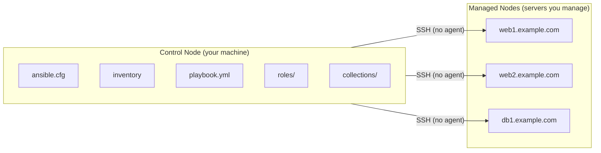

---
tags:
  - ansible
  - ansible/getting-started
topic: Getting Started
---

# Core Concepts

## What is Ansible?

Ansible is an **agentless** automation tool. Unlike Chef or Puppet, you don't install anything on the machines you manage — Ansible connects over SSH (or WinRM for Windows), pushes small programs called **modules** to the target, runs them, and removes them. Everything is coordinated from a single **control node** (your workstation or a CI server).

## Key Mental Model



## Terminology

| Term | What it means |
|---|---|
| **Control node** | The machine where Ansible runs (your laptop, a jump host, CI runner) |
| **Managed node** | A remote system Ansible manages (also called a "host") |
| **Inventory** | The list of managed nodes, organized into groups |
| **Module** | A unit of work Ansible can execute (install a package, copy a file, start a service) |
| **Task** | A single call to a module with specific arguments |
| **Play** | A set of tasks targeting a group of hosts |
| **Playbook** | A YAML file containing one or more plays |
| **Role** | A reusable package of tasks, handlers, variables, files, and templates |
| **Collection** | A distribution format that bundles roles, modules, plugins, and playbooks under a namespace |
| **Facts** | System information Ansible gathers from managed nodes (OS, IP addresses, memory, etc.) |
| **Handler** | A task that runs only when notified by another task that something changed |
| **Idempotent** | Running the same thing twice produces the same result — Ansible only makes changes when needed |

## Idempotency

This is the most important concept in Ansible. Modules are designed to be **idempotent** — they check the current state before acting. If a package is already installed, `yum` won't reinstall it. If a file already has the right content, `template` won't rewrite it. This means you can safely run the same playbook repeatedly.

The exceptions are `command`, `shell`, `raw`, and `script` — these always report "changed" unless you explicitly set `changed_when` or `creates`/`removes` guards.

## Declarative vs Imperative

Ansible is mostly **declarative** — you describe the desired state ("nginx should be installed and running") and Ansible figures out what to do. You don't write "run yum install nginx" — you write `state: present`. This is what makes idempotency work.

```yaml
# Declarative (preferred) — describes desired state
- name: Ensure nginx is installed and running
  ansible.builtin.yum:
    name: nginx
    state: present

- name: Ensure nginx is running
  ansible.builtin.service:
    name: nginx
    state: started
    enabled: true

# Imperative (avoid when possible) — describes actions
- name: Install nginx
  ansible.builtin.command: yum install -y nginx
```

## How Ansible Connects

By default, Ansible uses **OpenSSH** to connect to managed nodes. The connection flow:

1. Ansible reads your inventory to find target hosts
2. Connects via SSH using your configured user/key
3. Creates a temporary directory on the target
4. Copies the module code to the target
5. Executes the module
6. Reads the JSON result
7. Cleans up the temporary files

You can change the connection method per-host with `ansible_connection`:

| Connection | Use case |
|---|---|
| `ssh` (default) | Linux/Unix hosts |
| `local` | Run on the control node itself |
| `docker` | Target a Docker container |
| `winrm` | Windows hosts |
| `network_cli` | Network devices (routers, switches) |
| `httpapi` | REST API-based network devices |
