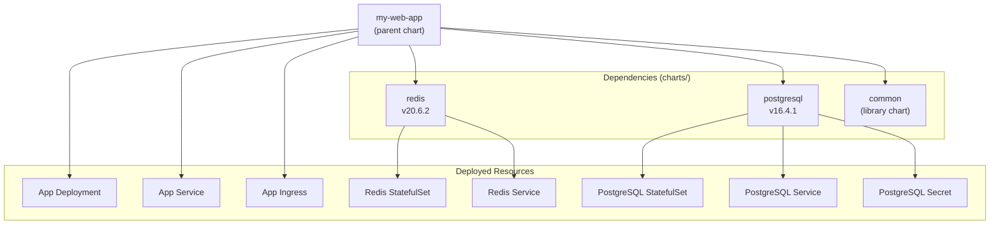

---
tags:
  - helm
  - helm/charts
topic: Charts
---

# Dependencies

## Overview

Most real-world applications depend on other services — a web app needs a database, a cache, maybe a message queue. Rather than embedding those manifests directly, Helm lets you declare other charts as **dependencies**. Helm resolves, downloads, and installs them alongside your application chart automatically.



## Declaring Dependencies in Chart.yaml

Dependencies are listed under the `dependencies` key in `Chart.yaml`:

```yaml
apiVersion: v2
name: my-web-app
version: 1.0.0

dependencies:
  - name: postgresql
    version: "~16.4.0"       # SemVer constraint — any 16.4.x
    repository: https://charts.bitnami.com/bitnami
  - name: redis
    version: ">=20.0.0 <21.0.0"
    repository: https://charts.bitnami.com/bitnami
    condition: redis.enabled
  - name: common
    version: "2.x.x"
    repository: https://charts.bitnami.com/bitnami
    tags:
      - bitnami-common
```

## Dependency Fields

| Field            | Required | Description                                                                                     |
| ---------------- | -------- | ----------------------------------------------------------------------------------------------- |
| `name`           | Yes      | The chart name as it appears in the repository                                                   |
| `version`        | Yes      | SemVer version constraint (`1.2.3`, `~1.2.0`, `^1.0.0`, `>=1.0.0 <2.0.0`)                      |
| `repository`     | Yes      | URL of the chart repository, OCI registry, or `file://` path to a local chart                    |
| `condition`      | No       | A dot-path to a boolean value in the parent's values — if `false`, the dependency is skipped      |
| `tags`           | No       | A list of tags — dependencies can be enabled/disabled by tag group                                |
| `import-values`  | No       | Import subchart values into the parent scope                                                      |
| `alias`          | No       | An alternate name for the dependency — allows installing the same chart multiple times            |

## helm dependency update vs helm dependency build

Two commands manage the `charts/` directory:

```bash
# helm dependency update — resolves dependencies from Chart.yaml, downloads them,
# and regenerates Chart.lock
helm dependency update ./my-chart
# Hang tight while we grab the latest from your chart repositories...
# Saving 3 charts
# Downloading postgresql from repo https://charts.bitnami.com/bitnami
# Downloading redis from repo https://charts.bitnami.com/bitnami
# Downloading common from repo https://charts.bitnami.com/bitnami
# Deleting outdated charts

# helm dependency build — downloads dependencies using the existing Chart.lock
# (does NOT re-resolve versions — uses the exact locked versions)
helm dependency build ./my-chart

# List current dependencies
helm dependency list ./my-chart
# NAME          VERSION   REPOSITORY                               STATUS
# postgresql    16.4.1    https://charts.bitnami.com/bitnami       ok
# redis         20.6.2    https://charts.bitnami.com/bitnami       ok
# common        2.27.0    https://charts.bitnami.com/bitnami       ok
```

| Command                    | Resolves versions | Updates Chart.lock | Use case                                           |
| -------------------------- | ----------------- | ------------------ | -------------------------------------------------- |
| `helm dependency update`   | Yes               | Yes                | Adding/changing dependencies, getting latest versions |
| `helm dependency build`    | No                | No                 | CI/CD pipelines — reproducible builds from lock file  |

## Condition and Tags

### condition — Toggle Individual Dependencies

The `condition` field points to a value path in the parent chart's values. If that path evaluates to `false`, the dependency is not installed:

```yaml
# Chart.yaml
dependencies:
  - name: redis
    version: "~20.x"
    repository: https://charts.bitnami.com/bitnami
    condition: redis.enabled    # Looks for .Values.redis.enabled

  - name: memcached
    version: "~7.x"
    repository: https://charts.bitnami.com/bitnami
    condition: memcached.enabled
```

```yaml
# values.yaml
redis:
  enabled: true     # Redis WILL be installed
memcached:
  enabled: false    # Memcached will NOT be installed
```

```bash
# Override at install time
helm install my-app ./my-chart --set redis.enabled=false,memcached.enabled=true
```

The condition field supports comma-separated paths (`condition: cache.redis.enabled,redis.enabled`). Helm checks them left to right and uses the first one it finds.

### tags — Toggle Groups of Dependencies

Tags let you enable or disable groups of dependencies at once:

```yaml
# Chart.yaml
dependencies:
  - name: redis
    version: "~20.x"
    repository: https://charts.bitnami.com/bitnami
    tags:
      - caching
  - name: memcached
    version: "~7.x"
    repository: https://charts.bitnami.com/bitnami
    tags:
      - caching
  - name: elasticsearch
    version: "~21.x"
    repository: https://charts.bitnami.com/bitnami
    tags:
      - search
```

```yaml
# values.yaml
tags:
  caching: true     # Both redis and memcached are installed
  search: false     # Elasticsearch is not installed
```

When both `condition` and `tags` are set, `condition` takes precedence.

## Overriding Subchart Values from Parent

The parent chart configures its subcharts by nesting values under the dependency name:

```yaml
# Parent values.yaml

# These values are passed to the 'postgresql' subchart
postgresql:
  auth:
    username: myapp
    password: secret123
    database: myapp_db
  primary:
    persistence:
      size: 50Gi
    resources:
      requests:
        cpu: 250m
        memory: 256Mi

# These values are passed to the 'redis' subchart
redis:
  enabled: true
  architecture: standalone
  auth:
    enabled: true
    password: redis-secret
  master:
    persistence:
      size: 8Gi
```

This scoping ensures that a value like `auth.password` goes to the correct subchart and does not collide between dependencies.

## Global Values

Values under the `global` key are merged into every chart and subchart in the dependency tree. This is the standard mechanism for sharing configuration:

```yaml
# Parent values.yaml
global:
  imageRegistry: registry.example.com
  imagePullSecrets:
    - name: corp-registry
  storageClass: premium-ssd
  environment: production

# In any subchart template, these are available as:
# {{ .Values.global.imageRegistry }}
# {{ .Values.global.storageClass }}
```

Global values are commonly used for:
- Private image registry URLs
- Image pull secrets shared across all charts
- Storage class names
- Environment identifiers (dev/staging/prod)
- Common labels or annotations

## import-values

The `import-values` field lets you import values from a subchart into the parent's values scope. This avoids deeply nested access patterns:

```yaml
# Chart.yaml
dependencies:
  - name: redis
    version: "~20.x"
    repository: https://charts.bitnami.com/bitnami
    import-values:
      - child: master.service     # Source path in the subchart's values
        parent: redisService       # Destination path in parent's values
```

After resolution, `.Values.redisService.port` in the parent chart refers to the same value as `.Values.master.service.port` inside the redis subchart.

You can also use the shorthand for importing exported values:

```yaml
# In the subchart's values.yaml
exports:
  connectionString: "redis://redis:6379"

# In the parent Chart.yaml
dependencies:
  - name: redis
    version: "~20.x"
    repository: https://charts.bitnami.com/bitnami
    import-values:
      - connectionString       # Imports redis.exports.connectionString into parent scope
```

## Alias

The `alias` field lets you install the same chart multiple times under different names. Each alias is treated as a separate dependency with its own values scope:

```yaml
# Chart.yaml — install two separate PostgreSQL instances
dependencies:
  - name: postgresql
    version: "~16.x"
    repository: https://charts.bitnami.com/bitnami
    alias: primary-db
  - name: postgresql
    version: "~16.x"
    repository: https://charts.bitnami.com/bitnami
    alias: analytics-db
```

```yaml
# values.yaml — configure each instance independently
primary-db:
  auth:
    database: myapp_primary
  primary:
    persistence:
      size: 100Gi

analytics-db:
  auth:
    database: myapp_analytics
  primary:
    persistence:
      size: 500Gi
    resources:
      requests:
        cpu: "2"
        memory: 4Gi
```

When using an alias, the values scope uses the alias name, not the original chart name.

## Repository Sources

The `repository` field supports three types of sources:

```yaml
dependencies:
  # HTTPS chart repository
  - name: nginx
    version: "18.x.x"
    repository: https://charts.bitnami.com/bitnami

  # OCI registry (Helm 3.8+)
  - name: nginx
    version: "18.x.x"
    repository: oci://registry-1.docker.io/bitnamicharts

  # Local chart on the filesystem (useful during development)
  - name: my-library
    version: "1.0.0"
    repository: "file://../my-library"
```

The `file://` protocol is particularly useful for mono-repo setups where multiple charts live in the same repository and you want to develop them together without publishing to a registry.

## Chart.lock and Reproducible Builds

When you run `helm dependency update`, Helm writes `Chart.lock` alongside `Chart.yaml`. The lock file records the **exact resolved versions** and content digests:

```yaml
# Chart.lock (auto-generated — do not edit)
dependencies:
  - name: postgresql
    repository: https://charts.bitnami.com/bitnami
    version: 16.4.1
  - name: redis
    repository: https://charts.bitnami.com/bitnami
    version: 20.6.2
  - name: common
    repository: https://charts.bitnami.com/bitnami
    version: 2.27.0
digest: sha256:abc123def456...
generated: "2026-03-15T10:30:00Z"
```

The workflow mirrors `package.json` / `package-lock.json` in the Node.js ecosystem:

| File          | Role                                                    | Commit to Git? |
| ------------- | ------------------------------------------------------- | -------------- |
| `Chart.yaml`  | Declares dependencies with version ranges               | Yes            |
| `Chart.lock`  | Records exact resolved versions for reproducibility      | Yes            |
| `charts/`     | Contains downloaded dependency archives                  | Usually no     |

```bash
# Development — resolve latest matching versions
helm dependency update ./my-chart
# Updates Chart.lock and downloads to charts/

# CI/CD — use locked versions for reproducibility
helm dependency build ./my-chart
# Downloads exact versions from Chart.lock, fails if lock is stale
```

Commit `Chart.lock` to version control. Add `charts/*.tgz` to `.gitignore` — they are downloaded artifacts that can be reconstructed from the lock file. The exception is vendored or local charts that are not available from a remote repository.
