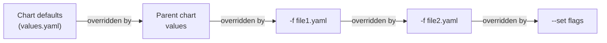

---
tags:
  - helm
  - helm/charts
topic: Charts
---

# Values

## What values.yaml Is

The `values.yaml` file provides the **default configuration** for a chart. Every configurable aspect of a chart — replica count, image tag, resource limits, feature flags, ingress rules — should be exposed through values. When users install the chart, they override these defaults with their own values via `-f` files or `--set` flags.

Think of `values.yaml` as the chart's API: it defines what the user can configure, and the templates consume these values to produce Kubernetes manifests.

## Values Hierarchy and Override Order

When multiple value sources exist, Helm merges them in a well-defined order. Later sources override earlier ones:



In concrete terms:

1. **Chart's `values.yaml`** — the base defaults shipped with the chart
2. **Parent chart's values** — if this chart is a subchart, the parent can override its values
3. **User-supplied files (`-f` / `--values`)** — each file overrides the previous; if you pass `-f a.yaml -f b.yaml`, values in `b.yaml` win
4. **`--set` and `--set-string` flags** — always win over everything else

```bash
# Override order demonstration
helm install my-app ./my-chart \
  -f base-values.yaml \      # overrides chart defaults
  -f prod-values.yaml \      # overrides base-values.yaml
  --set replicaCount=5        # overrides everything above
```

## Accessing Values in Templates

Values are accessed through the `.Values` object using dot notation:

```yaml
# values.yaml
replicaCount: 3
image:
  repository: nginx
  tag: "1.27"
  pullPolicy: IfNotPresent
service:
  type: ClusterIP
  port: 80

# In a template
spec:
  replicas: {{ .Values.replicaCount }}
  template:
    spec:
      containers:
        - name: app
          image: "{{ .Values.image.repository }}:{{ .Values.image.tag }}"
          imagePullPolicy: {{ .Values.image.pullPolicy }}
          ports:
            - containerPort: {{ .Values.service.port }}
```

Accessing a non-existent key returns `nil`, which renders as `<no value>` in the output. Use `default` to provide fallback values:

```yaml
# Safe access with defaults
replicas: {{ .Values.replicaCount | default 1 }}
image: "{{ .Values.image.repository }}:{{ .Values.image.tag | default .Chart.AppVersion }}"
```

## --set Syntax

The `--set` flag lets you override values from the command line. The syntax supports dotted paths, arrays, and special characters.

### Basic Usage

```bash
# Set a simple value
helm install my-app ./my-chart --set replicaCount=5

# Set a nested value (dots indicate nesting)
helm install my-app ./my-chart --set image.tag=1.28

# Set multiple values
helm install my-app ./my-chart --set replicaCount=5,image.tag=1.28

# Equivalent to this values file:
# replicaCount: 5
# image:
#   tag: 1.28
```

### Arrays and Complex Values

```bash
# Set a list item by index
--set servers[0].host=server1.example.com
--set servers[0].port=8080
# servers:
#   - host: server1.example.com
#     port: 8080

# Set a list of simple values
--set tags="{web,frontend,production}"
# tags:
#   - web
#   - frontend
#   - production
```

### Special Characters and Escaping

```bash
# Values with commas — escape with backslash
--set nodeSelector."kubernetes\.io/os"=linux

# Values with dots in keys — use backslash escaping
--set data."my\.key"=value

# Force string type (prevents YAML type coercion)
--set-string isEnabled=true
# Without --set-string, "true" becomes boolean true
# With --set-string, it remains the string "true"
```

### --set Variants

| Flag             | Purpose                                                      | Example                                           |
| ---------------- | ------------------------------------------------------------ | ------------------------------------------------- |
| `--set`          | Set a value (YAML type coercion applies)                      | `--set replicas=3` (becomes integer 3)             |
| `--set-string`   | Set a value as a string (no type coercion)                    | `--set-string version=1.0` (stays string "1.0")    |
| `--set-file`     | Set a value to the contents of a file                         | `--set-file config=./app.conf`                     |
| `--set-json`     | Set a value using JSON syntax                                 | `--set-json 'env=[{"name":"A","value":"1"}]'`      |

```bash
# --set-file: embed a file's contents as a value
helm install my-app ./my-chart --set-file sslCert=./tls.crt

# --set-json: pass complex structures as JSON
helm install my-app ./my-chart \
  --set-json 'tolerations=[{"key":"dedicated","operator":"Equal","value":"gpu","effect":"NoSchedule"}]'
```

## Using -f / --values with Multiple Files

The `-f` flag loads a YAML file of values. You can pass multiple files, and they are merged left to right (last wins):

```bash
# Common pattern: base + environment overlay
helm install my-app ./my-chart \
  -f values.yaml \
  -f values-production.yaml
```

```yaml
# values.yaml (base)
replicaCount: 1
image:
  repository: myapp
  tag: latest
resources:
  requests:
    cpu: 100m
    memory: 128Mi

# values-production.yaml (overlay — only override what changes)
replicaCount: 5
image:
  tag: "4.3.1"
resources:
  requests:
    cpu: 500m
    memory: 512Mi
  limits:
    cpu: "1"
    memory: 1Gi
ingress:
  enabled: true
  hosts:
    - host: app.example.com
      paths:
        - path: /
          pathType: Prefix
```

## Subchart Values

When a chart has dependencies, you can configure subchart values from the parent chart's values file by nesting them under the subchart's name.

```yaml
# Parent chart values.yaml
# Configure the 'redis' subchart
redis:
  architecture: standalone
  auth:
    enabled: true
    password: "my-redis-password"
  master:
    resources:
      requests:
        cpu: 100m
        memory: 128Mi

# Configure the 'postgresql' subchart
postgresql:
  auth:
    username: myapp
    password: "my-db-password"
    database: myapp_production
  primary:
    persistence:
      size: 20Gi
```

### Global Values

The `global` key is special — values under `global` are accessible from **any chart and subchart** in the dependency tree. This is the mechanism for sharing common configuration:

```yaml
# Parent chart values.yaml
global:
  imageRegistry: registry.example.com   # All subcharts can read this
  imagePullSecrets:
    - name: registry-creds
  storageClass: fast-ssd

# In any template (parent or subchart):
image: {{ .Values.global.imageRegistry }}/{{ .Values.image.repository }}:{{ .Values.image.tag }}
```

Global values are merged with the subchart's own values. If a subchart defines `global.imageRegistry` in its own `values.yaml`, the parent chart's value takes precedence.

## Best Practices

### Document Every Value

Include comments above every value in `values.yaml` explaining what it does, its type, and any constraints:

```yaml
# -- Number of pod replicas to deploy
# @type: integer
replicaCount: 1

# -- Container image configuration
image:
  # -- Image registry and repository
  repository: nginx
  # -- Image tag (defaults to Chart.AppVersion if not set)
  tag: ""
  # -- Image pull policy
  # @allowed: Always, IfNotPresent, Never
  pullPolicy: IfNotPresent
```

### Use Sensible Defaults

A chart should install successfully with zero overrides using only the default `values.yaml`. Development-friendly defaults (1 replica, no Ingress, small resource requests) are typical:

```yaml
replicaCount: 1
ingress:
  enabled: false
resources:
  requests:
    cpu: 100m
    memory: 128Mi
autoscaling:
  enabled: false
```

### Prefer Flat Over Deeply Nested

Deeply nested values are harder to override with `--set` and harder to document. Keep nesting to 2–3 levels when possible:

```yaml
# Okay — 2 levels
image:
  repository: nginx
  tag: "1.27"

# Avoid — 4+ levels
deployment:
  spec:
    template:
      containers:
        image: nginx
```

### Type Consistency

Do not change a value's type between defaults and documentation. If a value is a string in `values.yaml`, it should always be treated as a string. Use `--set-string` or quote values in templates to prevent type coercion issues:

```yaml
# values.yaml — quote numeric-looking strings
appVersion: "1.0"   # String, not float
port: 8080           # Integer
enabled: true        # Boolean
```

## Complete Example values.yaml

```yaml
# -- Number of application replicas
replicaCount: 1

# -- Container image configuration
image:
  # -- Image registry (override for private registries)
  registry: docker.io
  # -- Image repository
  repository: myorg/my-web-app
  # -- Image tag (defaults to Chart appVersion)
  tag: ""
  # -- Image pull policy
  pullPolicy: IfNotPresent

# -- Image pull secrets for private registries
imagePullSecrets: []
#  - name: registry-creds

# -- Override the chart name used in resource names
nameOverride: ""
# -- Override the full resource name prefix
fullnameOverride: ""

# -- Service account configuration
serviceAccount:
  # -- Create a ServiceAccount
  create: true
  # -- Annotations for the ServiceAccount (e.g., IAM role)
  annotations: {}
  # -- ServiceAccount name (auto-generated if empty)
  name: ""

# -- Pod-level annotations
podAnnotations: {}

# -- Pod-level security context
podSecurityContext:
  fsGroup: 1000
  runAsNonRoot: true

# -- Container-level security context
securityContext:
  readOnlyRootFilesystem: true
  runAsNonRoot: true
  runAsUser: 1000
  allowPrivilegeEscalation: false
  capabilities:
    drop:
      - ALL

# -- Service configuration
service:
  # -- Service type (ClusterIP, NodePort, LoadBalancer)
  type: ClusterIP
  # -- Service port
  port: 80

# -- Ingress configuration
ingress:
  # -- Enable Ingress resource creation
  enabled: false
  # -- Ingress class name
  className: nginx
  # -- Ingress annotations
  annotations: {}
    # cert-manager.io/cluster-issuer: letsencrypt-prod
  # -- Ingress hosts and paths
  hosts:
    - host: app.example.com
      paths:
        - path: /
          pathType: Prefix
  # -- TLS configuration
  tls: []
  #  - secretName: app-tls
  #    hosts:
  #      - app.example.com

# -- Resource requests and limits
resources:
  requests:
    cpu: 100m
    memory: 128Mi
  limits:
    cpu: 500m
    memory: 256Mi

# -- Horizontal Pod Autoscaler configuration
autoscaling:
  # -- Enable HPA
  enabled: false
  # -- Minimum replicas
  minReplicas: 1
  # -- Maximum replicas
  maxReplicas: 10
  # -- Target CPU utilization percentage
  targetCPUUtilizationPercentage: 80
  # -- Target memory utilization percentage (optional)
  # targetMemoryUtilizationPercentage: 80

# -- Node selector labels
nodeSelector: {}

# -- Tolerations for pod scheduling
tolerations: []

# -- Affinity rules for pod scheduling
affinity: {}

# -- Application environment variables
env:
  LOG_LEVEL: info

# -- Environment variables from Secrets
envFromSecrets: []
#  - name: DATABASE_URL
#    secretName: app-secrets
#    secretKey: database-url

# -- Extra volumes to attach to the pod
extraVolumes: []
# -- Extra volume mounts for the application container
extraVolumeMounts: []

# -- Liveness probe configuration
livenessProbe:
  httpGet:
    path: /healthz
    port: http
  initialDelaySeconds: 10
  periodSeconds: 10

# -- Readiness probe configuration
readinessProbe:
  httpGet:
    path: /readyz
    port: http
  initialDelaySeconds: 5
  periodSeconds: 5
```

## JSON Schema Validation (values.schema.json)

A `values.schema.json` file in the chart root enables validation of user-supplied values at install and upgrade time. Helm will reject values that do not conform to the schema, catching configuration errors early.

```json
{
  "$schema": "https://json-schema.org/draft/2020-12/schema",
  "type": "object",
  "required": ["replicaCount", "image"],
  "properties": {
    "replicaCount": {
      "type": "integer",
      "minimum": 1,
      "description": "Number of pod replicas"
    },
    "image": {
      "type": "object",
      "required": ["repository"],
      "properties": {
        "repository": {
          "type": "string",
          "description": "Container image repository"
        },
        "tag": {
          "type": "string",
          "description": "Container image tag"
        },
        "pullPolicy": {
          "type": "string",
          "enum": ["Always", "IfNotPresent", "Never"],
          "description": "Image pull policy"
        }
      }
    },
    "service": {
      "type": "object",
      "properties": {
        "type": {
          "type": "string",
          "enum": ["ClusterIP", "NodePort", "LoadBalancer"],
          "description": "Kubernetes Service type"
        },
        "port": {
          "type": "integer",
          "minimum": 1,
          "maximum": 65535,
          "description": "Service port number"
        }
      }
    },
    "ingress": {
      "type": "object",
      "properties": {
        "enabled": {
          "type": "boolean"
        }
      }
    }
  }
}
```

```bash
# Schema validation in action
helm install my-app ./my-chart --set replicaCount=-1
# Error: values don't meet the specifications of the schema(s) in the following chart(s):
# my-chart:
# - replicaCount: Must be greater than or equal to 1

helm install my-app ./my-chart --set service.type=ExternalName
# Error: values don't meet the specifications of the schema(s) in the following chart(s):
# my-chart:
# - service.type: service.type must be one of the following: "ClusterIP", "NodePort", "LoadBalancer"
```

Schema validation also applies to subcharts — each subchart can have its own `values.schema.json`.
