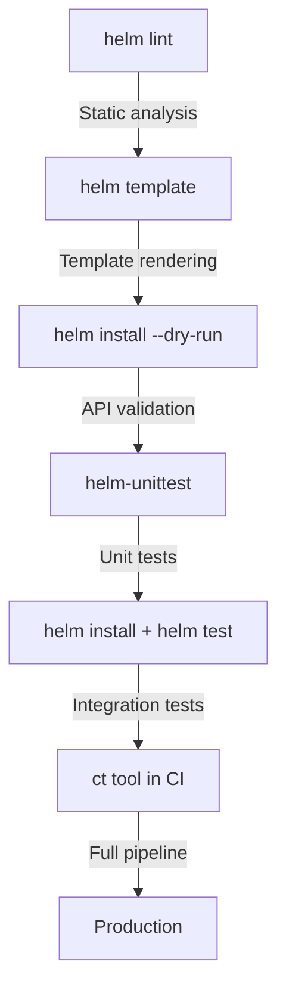

---
tags:
  - helm
  - helm/development
topic: Development
---

# Testing

## Testing Layers

Helm charts benefit from multiple testing layers, each catching different classes of errors at different stages.



| Layer | What It Catches | Speed | Cluster Required |
|---|---|---|---|
| `helm lint` | Malformed YAML, missing fields, deprecated APIs | Instant | No |
| `helm template` | Template rendering errors, logic bugs | Instant | No |
| `--dry-run` | Invalid resource specs, missing CRDs, quota violations | Fast | Yes |
| `helm-unittest` | Incorrect template output, regressions | Fast | No |
| `helm test` | Runtime failures, connectivity, service availability | Slow | Yes |
| `ct` (chart-testing) | Lint + install + test across changed charts | Slow | Yes |

## helm lint

Static analysis that validates chart structure without rendering templates.

```bash
# Basic lint
helm lint ./my-chart
# ==> Linting ./my-chart
# [INFO] Chart.yaml: icon is recommended
# 1 chart(s) linted, 0 chart(s) failed

# Strict mode: warnings become errors
helm lint ./my-chart --strict

# Lint with specific values to test different configurations
helm lint ./my-chart -f values-production.yaml
helm lint ./my-chart --set ingress.enabled=true
```

`helm lint` catches issues like missing `Chart.yaml` fields, malformed template syntax, and deprecated Kubernetes API versions. It does not catch logical errors in your templates.

## helm template

Renders templates locally and outputs the resulting Kubernetes manifests. Invaluable for reviewing what Helm will actually send to the cluster.

```bash
# Render all templates
helm template my-release ./my-chart

# Render a single template for focused debugging
helm template my-release ./my-chart --show-only templates/deployment.yaml

# Pipe to kubectl for offline validation
helm template my-release ./my-chart | kubectl apply --dry-run=client -f -

# Compare output between value sets
diff \
  <(helm template my-release ./my-chart -f values-staging.yaml) \
  <(helm template my-release ./my-chart -f values-production.yaml)
```

## helm install --dry-run

Server-side validation that sends the rendered manifests to the Kubernetes API for validation without persisting them. This catches issues that `helm template` cannot, such as unknown CRDs, invalid field values, and resource quota violations.

```bash
# Dry run against a real cluster
helm install my-release ./my-chart --dry-run --debug

# Dry run with specific values
helm install my-release ./my-chart --dry-run -f production-values.yaml

# Server-side dry run (more accurate, requires K8s 1.18+)
helm install my-release ./my-chart --dry-run=server
```

The `--debug` flag adds template rendering details and computed values to the output, which is useful for diagnosing value merging issues.

## helm test

Runs test Pods defined in the `templates/tests/` directory. Tests are Pods annotated with `helm.sh/hook: test` that execute assertions against the deployed release.

```bash
# Run tests for a release
helm test my-release

# Run tests with a timeout
helm test my-release --timeout 5m

# Run with logs on failure
helm test my-release --logs
```

### Writing Test Pods

Test Pods are regular Pod manifests with the `helm.sh/hook: test` annotation. A test passes if the container exits with code 0 and fails on any non-zero exit code.

```yaml
# templates/tests/test-connection.yaml
apiVersion: v1
kind: Pod
metadata:
  name: {{ include "webapp.fullname" . }}-test-connection
  labels:
    {{- include "webapp.labels" . | nindent 4 }}
  annotations:
    "helm.sh/hook": test
    "helm.sh/hook-delete-policy": before-hook-creation,hook-succeeded
spec:
  restartPolicy: Never
  containers:
    - name: wget
      image: busybox:1.36
      command:
        - /bin/sh
        - -c
        - |
          # Test that the service responds with HTTP 200
          wget --spider --timeout=10 \
            http://{{ include "webapp.fullname" . }}:{{ .Values.service.port }}/healthz
          echo "Connection test passed"
```

### Complete Test Example: Multiple Assertions

```yaml
# templates/tests/test-api.yaml
apiVersion: v1
kind: Pod
metadata:
  name: {{ include "webapp.fullname" . }}-test-api
  annotations:
    "helm.sh/hook": test
    "helm.sh/hook-weight": "1"                     # run after connection test
    "helm.sh/hook-delete-policy": before-hook-creation,hook-succeeded
spec:
  restartPolicy: Never
  containers:
    - name: test
      image: curlimages/curl:8.5.0
      command:
        - /bin/sh
        - -c
        - |
          set -e
          BASE_URL="http://{{ include "webapp.fullname" . }}:{{ .Values.service.port }}"

          # Test health endpoint
          echo "Testing /healthz..."
          STATUS=$(curl -s -o /dev/null -w "%{http_code}" "$BASE_URL/healthz")
          [ "$STATUS" -eq 200 ] || { echo "FAIL: /healthz returned $STATUS"; exit 1; }

          # Test API endpoint
          echo "Testing /api/v1/status..."
          RESPONSE=$(curl -s "$BASE_URL/api/v1/status")
          echo "$RESPONSE" | grep -q '"status":"ok"' || { echo "FAIL: unexpected response: $RESPONSE"; exit 1; }

          echo "All tests passed"
```

## Unit Testing with helm-unittest

The `helm-unittest` plugin lets you write declarative test cases that assert on rendered template output without a cluster. It is the most effective way to catch regressions during chart development.

### Installation

```bash
helm plugin install https://github.com/helm-unittest/helm-unittest
```

### Writing Tests

Tests live in the `tests/` directory within your chart (not `templates/tests/`, which is for `helm test`).

```yaml
# tests/deployment_test.yaml
suite: Deployment tests
templates:
  - deployment.yaml
values:
  - ../values.yaml
tests:
  - it: should set the correct replica count
    set:
      replicaCount: 5
    asserts:
      - equal:
          path: spec.replicas
          value: 5

  - it: should use appVersion as image tag by default
    chart:
      appVersion: "2.0.0"
    asserts:
      - matchRegex:
          path: spec.template.spec.containers[0].image
          pattern: ".*:2\\.0\\.0$"

  - it: should override image tag when specified
    set:
      image.tag: "custom-tag"
    asserts:
      - equal:
          path: spec.template.spec.containers[0].image
          value: "myorg/webapp:custom-tag"

  - it: should set resource limits
    asserts:
      - equal:
          path: spec.template.spec.containers[0].resources.limits.cpu
          value: 500m

  - it: should include secret envFrom when existingSecret is set
    set:
      existingSecret: my-secret
    asserts:
      - contains:
          path: spec.template.spec.containers[0].envFrom
          content:
            secretRef:
              name: my-secret

  - it: should not include secret envFrom when existingSecret is empty
    set:
      existingSecret: ""
    asserts:
      - notContains:
          path: spec.template.spec.containers[0].envFrom
          content:
            secretRef:
              name: ""
```

```yaml
# tests/ingress_test.yaml
suite: Ingress tests
templates:
  - ingress.yaml
tests:
  - it: should not create Ingress when disabled
    set:
      ingress.enabled: false
    asserts:
      - hasDocuments:
          count: 0

  - it: should create Ingress when enabled
    set:
      ingress.enabled: true
      ingress.className: nginx
      ingress.hosts:
        - host: webapp.example.com
          paths:
            - path: /
              pathType: Prefix
    asserts:
      - hasDocuments:
          count: 1
      - equal:
          path: spec.ingressClassName
          value: nginx
      - equal:
          path: spec.rules[0].host
          value: webapp.example.com
```

### Running Tests

```bash
# Run all tests
helm unittest ./my-chart
# ### Chart [ my-chart ] ./my-chart
#
#  PASS  Deployment tests    tests/deployment_test.yaml
#  PASS  Ingress tests       tests/ingress_test.yaml
#
# Charts:      1 passed, 1 total
# Test Suites: 2 passed, 2 total
# Tests:       8 passed, 8 total

# Run with verbose output
helm unittest ./my-chart -v

# Output as JUnit XML (for CI systems)
helm unittest ./my-chart --output-file results.xml --output-type JUnit

# Run specific test files
helm unittest ./my-chart -f 'tests/deployment_test.yaml'
```

### Snapshot Testing

Snapshot testing captures the full rendered output of a template and compares it against a stored snapshot. Useful for detecting unintended changes.

```yaml
# tests/deployment_snapshot_test.yaml
suite: Deployment snapshot
templates:
  - deployment.yaml
tests:
  - it: should match snapshot with default values
    asserts:
      - matchSnapshot: {}

  - it: should match snapshot with production values
    values:
      - ../values-production.yaml
    asserts:
      - matchSnapshot: {}
```

```bash
# Generate snapshots (first run or after intentional changes)
helm unittest ./my-chart --update-snapshot

# Snapshots are stored in tests/__snapshot__/
```

## CT (Chart Testing) Tool

`ct` is a CLI tool designed for testing Helm charts in CI pipelines. It automatically detects changed charts in a monorepo, lints them, installs them on a real cluster, and runs `helm test`.

```bash
# Install ct
# Via Homebrew
brew install chart-testing

# Or via Go
go install github.com/helm/chart-testing/v3/ct@latest
```

### Configuration

```yaml
# ct.yaml (in repo root)
remote: origin
target-branch: main
chart-dirs:
  - charts
chart-repos:
  - bitnami=https://charts.bitnami.com/bitnami
helm-extra-args: --timeout 600s
```

### Usage

```bash
# Lint changed charts
ct lint --config ct.yaml

# Lint and install changed charts (requires a cluster)
ct lint-and-install --config ct.yaml

# List changed charts (useful for debugging CI)
ct list-changed --config ct.yaml
```

## Testing in CI/CD Pipelines

### GitHub Actions Example

```yaml
# .github/workflows/helm-test.yaml
name: Helm Chart CI

on:
  pull_request:
    paths:
      - "charts/**"

jobs:
  lint:
    runs-on: ubuntu-latest
    steps:
      - uses: actions/checkout@v4
        with:
          fetch-depth: 0                           # needed for ct to detect changes

      - uses: azure/setup-helm@v4

      - name: Install helm-unittest
        run: helm plugin install https://github.com/helm-unittest/helm-unittest

      - name: Lint charts
        run: |
          for chart in charts/*/; do
            echo "Linting $chart..."
            helm lint "$chart" --strict
          done

      - name: Run unit tests
        run: |
          for chart in charts/*/; do
            if [ -d "$chart/tests" ]; then
              echo "Testing $chart..."
              helm unittest "$chart"
            fi
          done

  integration:
    runs-on: ubuntu-latest
    needs: lint
    steps:
      - uses: actions/checkout@v4
        with:
          fetch-depth: 0

      - uses: azure/setup-helm@v4

      - name: Create kind cluster
        uses: helm/kind-action@v1

      - uses: helm/chart-testing-action@v2

      - name: Lint and install changed charts
        run: ct lint-and-install --config ct.yaml
```

This pipeline runs lint and unit tests first (fast, no cluster), then integration tests with chart-testing on a kind cluster only for changed charts.
