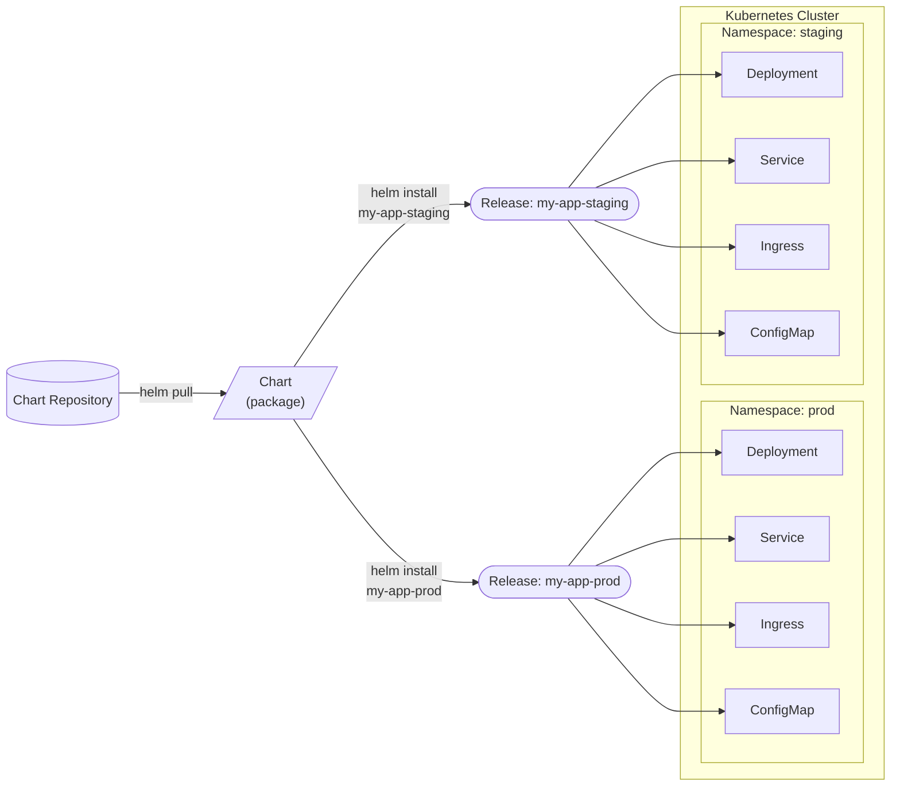
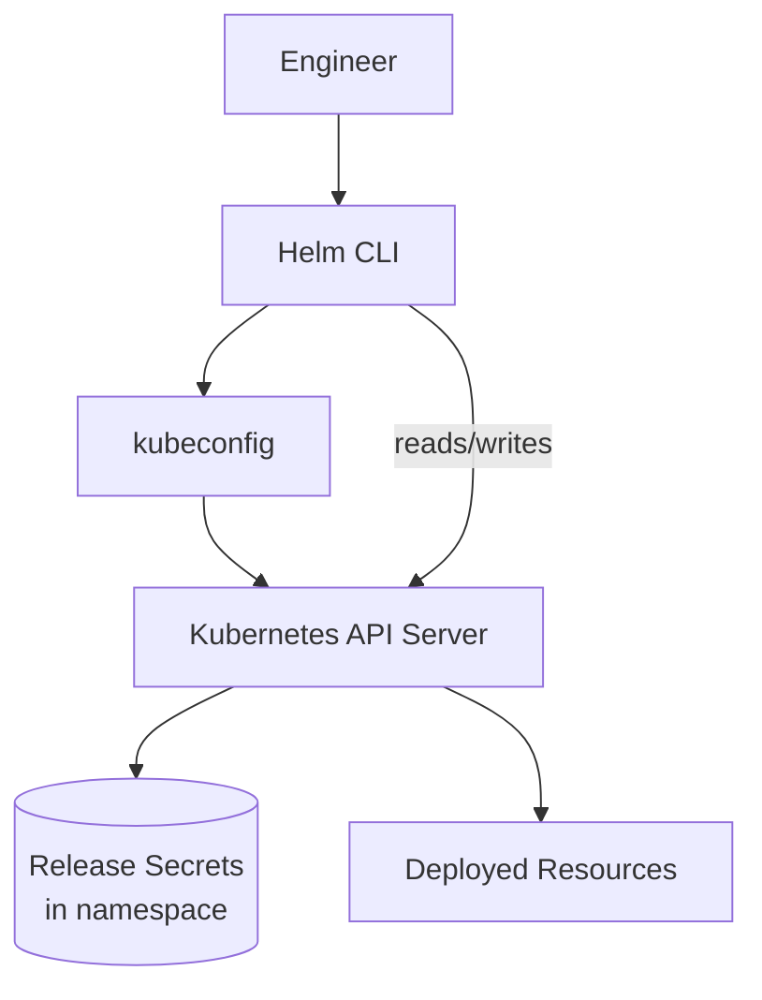

---
tags:
  - helm
  - helm/getting-started
topic: Getting Started
---

# Core Concepts

## What is Helm?

Helm is the **package manager for Kubernetes**. Just as `apt` manages packages on Debian or `brew` on macOS, Helm manages pre-configured Kubernetes resource definitions. It exists because deploying a real application to Kubernetes typically requires creating many interdependent resources — Deployments, Services, ConfigMaps, Secrets, Ingresses, ServiceAccounts, RBAC rules — and managing them as individual YAML files quickly becomes tedious and error-prone.

Helm solves this by bundling related manifests into a single versioned artifact called a **chart**, parameterizing them with template variables, and providing lifecycle commands (`install`, `upgrade`, `rollback`, `uninstall`) that operate on the bundle as a unit.

## The Three Big Concepts

Everything in Helm revolves around three ideas:

| Concept        | What it is                                                                                                  | Analogy                         |
| -------------- | ----------------------------------------------------------------------------------------------------------- | ------------------------------- |
| **Chart**      | A package of pre-configured Kubernetes resources — templates, default values, metadata, and dependencies     | A `.deb` or `.rpm` package      |
| **Release**    | A specific, running instance of a chart installed into a cluster with a particular set of configuration values | An installed package on a host  |
| **Repository** | An HTTP server (or OCI registry) that hosts a collection of packaged charts for discovery and download       | An `apt` repo or Docker registry |

The relationship between them is straightforward: you pull a chart from a repository, install it with your configuration, and that creates a release. You can install the same chart multiple times — each installation is a separate release with its own name, namespace, and configuration.



## Helm 3 Architecture

Helm 3 (released November 2019) removed the controversial **Tiller** server component that Helm 2 required. The architecture is now entirely client-side:



Key architectural decisions in Helm 3:

- **No Tiller** — Helm 2 ran a server-side component (Tiller) inside the cluster with broad RBAC permissions. This was a security risk and a deployment headache. Helm 3 communicates directly with the Kubernetes API using your existing kubeconfig credentials.
- **Release state stored as Kubernetes Secrets** — Each release revision is recorded as a Secret (or ConfigMap, depending on configuration) in the release's target namespace. This means release state lives alongside the resources it manages and benefits from Kubernetes RBAC.
- **Three-way strategic merge** — Helm 3 compares the old manifest, the new manifest, and the live cluster state when upgrading. If someone manually edited a resource, Helm detects the drift and handles it appropriately, whereas Helm 2 only did a two-way comparison and could clobber manual changes.
- **Namespace-scoped releases** — Releases are scoped to their namespace. Two releases with the same name can exist in different namespaces.

## How Helm Stores Release State

When you run `helm install`, Helm creates a Kubernetes Secret in the release namespace to record the release state. Each subsequent `helm upgrade` creates a new Secret representing that revision.

```bash
# List release secrets for a release called "my-app"
kubectl get secrets -l owner=helm,name=my-app
# NAME                           TYPE                 DATA   AGE
# sh.helm.release.v1.my-app.v1   helm.sh/release.v1   1      5d
# sh.helm.release.v1.my-app.v2   helm.sh/release.v1   1      3d
# sh.helm.release.v1.my-app.v3   helm.sh/release.v1   1      1d
```

Each secret contains:

- The rendered manifest (all Kubernetes resources that were applied)
- The chart metadata
- The values used for that revision
- The release status (deployed, superseded, failed, etc.)

This is why `helm rollback` works — Helm can retrieve the manifest from a previous revision and re-apply it. The storage driver is configurable via the `HELM_DRIVER` environment variable (`secret`, `configmap`, `sql`, or `memory`).

## Helm vs Raw Manifests vs Kustomize

| Aspect                    | Raw Manifests                          | Kustomize                                     | Helm                                              |
| ------------------------- | -------------------------------------- | ---------------------------------------------- | ------------------------------------------------- |
| **Approach**              | Plain YAML files, applied directly      | Overlay-based patching of base manifests        | Templated YAML with Go templates + values          |
| **Parameterization**      | None — copy and edit per environment    | Strategic merge patches and JSON patches        | Full Go template language with values files         |
| **Packaging**             | None — just files in a directory        | None — just files in a directory                | Versioned, distributable chart archives (.tgz)      |
| **Lifecycle management**  | Manual `kubectl apply/delete`           | Manual `kubectl apply -k`                       | `helm install/upgrade/rollback/uninstall`           |
| **Release tracking**      | None                                   | None                                           | Built-in — revision history, rollback, status       |
| **Dependency management** | None                                   | None (can compose bases)                        | Built-in dependency resolution between charts       |
| **Ecosystem**             | N/A                                    | Built into kubectl                              | Thousands of community charts on Artifact Hub       |
| **Learning curve**        | Low                                    | Low-medium                                     | Medium — Go template syntax takes time              |
| **Best for**              | Small projects, learning Kubernetes     | Customizing third-party manifests, env overlays  | Distributing apps, complex deployments, app catalog |
| **Weakness**              | No reusability, manual drift management | No lifecycle management or release tracking      | Template debugging can be opaque, complex charts    |

**When to use each:**

- **Raw manifests** — You're learning Kubernetes, have a simple app with 2–3 resources, or want maximum transparency.
- **Kustomize** — You have a base set of manifests and need per-environment variations (dev/staging/prod) without templates. Also great for customizing manifests from upstream projects.
- **Helm** — You need to package and distribute an application, manage complex deployments with many resources, leverage community charts, or need release lifecycle management (upgrade, rollback, history).

These tools are not mutually exclusive. A common pattern is to render Helm templates (`helm template`) and then apply Kustomize overlays on top.

## Chart Versioning

Helm uses two distinct version fields, both following [Semantic Versioning (SemVer)](https://semver.org/):

| Field          | Purpose                                                          | Example   |
| -------------- | ---------------------------------------------------------------- | --------- |
| `version`      | The version of the chart itself — incremented when chart files change | `1.4.2`   |
| `appVersion`   | The version of the application the chart deploys                  | `3.11.0`  |

```yaml
# Chart.yaml
apiVersion: v2
name: my-web-app
version: 1.4.2       # Chart version — this is what Helm resolves
appVersion: "3.11.0"  # App version — informational, shown in `helm list`
```

Key rules:

- The `version` field **must** be valid SemVer. Helm uses it for dependency resolution, repository indexing, and determining upgrade paths.
- The `appVersion` field is **informational only** — Helm does not use it for any logic. It is displayed in `helm list` output to help operators see which application version is deployed.
- When you change templates, values, or dependencies but not the underlying application, bump the chart `version`.
- When you update the application image tag but nothing else in the chart, bump `appVersion` (and typically bump the chart `version` too, since the chart has changed).
- Charts in a repository are indexed by `name` + `version`. You cannot push two different charts with the same name and version to the same repository.
