---
tags:
  - helm
  - helm/operations
topic: Operations
---

# Hooks

## What Are Hooks

Hooks are Kubernetes resources (typically Jobs or Pods) that Helm executes at specific points in the release lifecycle. They let you run actions like database migrations, backups, or cache warming at precisely the right moment -- before an install, after an upgrade, before a delete, and so on.

Hooks are defined as regular Kubernetes manifest files in the `templates/` directory, annotated with special Helm annotations. Helm treats them differently from normal resources: they are rendered and executed separately, outside the normal resource creation flow.

**Important**: Hook resources are **not** managed as part of the release. This means `helm uninstall` does not delete hook resources. They must be cleaned up via deletion policies or manually.

## Hook Types

The `helm.sh/hook` annotation determines when a hook fires. You can assign multiple hooks to a single resource by comma-separating them.

| Hook | Fires |
|---|---|
| `pre-install` | After templates are rendered, before any resources are created |
| `post-install` | After all resources are created |
| `pre-delete` | Before any resources are deleted during uninstall |
| `post-delete` | After all resources are deleted during uninstall |
| `pre-upgrade` | After templates are rendered, before any resources are updated |
| `post-upgrade` | After all resources are updated |
| `pre-rollback` | After templates are rendered, before any resources are rolled back |
| `post-rollback` | After all resources are rolled back |
| `test` | When `helm test` is invoked |

## Hook Lifecycle

```mermaid
sequenceDiagram
    participant User
    participant Helm
    participant K8s as Kubernetes API
    participant Hook as Hook Resource

    User->>Helm: helm upgrade my-release
    Helm->>Helm: Render templates
    Helm->>Helm: Sort hooks by weight
    
    rect rgb(50, 50, 80)
        Note over Helm,Hook: Pre-upgrade hooks
        Helm->>K8s: Create pre-upgrade hook (weight -5)
        K8s->>Hook: Run Job/Pod
        Hook-->>Helm: Complete (wait for ready)
        Helm->>K8s: Create pre-upgrade hook (weight 0)
        K8s->>Hook: Run Job/Pod
        Hook-->>Helm: Complete
    end
    
    Helm->>K8s: Apply upgraded resources
    K8s-->>Helm: Resources updated
    
    rect rgb(50, 80, 50)
        Note over Helm,Hook: Post-upgrade hooks
        Helm->>K8s: Create post-upgrade hook
        K8s->>Hook: Run Job/Pod
        Hook-->>Helm: Complete
    end
    
    Helm-->>User: Upgrade complete
```



During install, the sequence is similar:

1. Helm renders all templates
2. Pre-install hooks execute (sorted by weight)
3. Helm waits for each hook to reach `Ready` or `Complete`
4. Resources are created
5. Post-install hooks execute (sorted by weight)
6. Release is marked `deployed`

If any hook fails, the release is marked `failed` and subsequent hooks do not run.

## Hook Annotations

There are three annotations that control hook behavior.

### helm.sh/hook

Declares which lifecycle event(s) this resource hooks into.

```yaml
metadata:
  annotations:
    "helm.sh/hook": pre-upgrade,pre-install
```

### helm.sh/hook-weight

Controls execution order when multiple hooks fire at the same event. Hooks are sorted by weight in ascending order (lowest first). Weight is a string containing a number (positive or negative).

```yaml
metadata:
  annotations:
    "helm.sh/hook": pre-upgrade
    "helm.sh/hook-weight": "-5"     # runs before weight "0" or "10"
```

Hooks with the same weight are sorted by resource kind and name.

### helm.sh/hook-delete-policy

Controls when the hook resource is deleted. This is critical because hooks are not part of the release and will linger indefinitely without a deletion policy.

| Policy | Behavior |
|---|---|
| `before-hook-creation` | Delete any existing instance of this hook before creating a new one (most common) |
| `hook-succeeded` | Delete the hook after it completes successfully |
| `hook-failed` | Delete the hook if it fails |

You can combine policies:

```yaml
metadata:
  annotations:
    "helm.sh/hook-delete-policy": before-hook-creation,hook-succeeded
```

## Complete Example: Database Migration Hook

This is the most common hook pattern -- running a database migration Job before an upgrade so the schema is ready when the new application version starts.

```yaml
# templates/pre-upgrade-migration.yaml
apiVersion: batch/v1
kind: Job
metadata:
  name: {{ include "myapp.fullname" . }}-db-migrate
  labels:
    {{- include "myapp.labels" . | nindent 4 }}
  annotations:
    "helm.sh/hook": pre-upgrade,pre-install      # run before both install and upgrade
    "helm.sh/hook-weight": "-5"                   # run before other hooks
    "helm.sh/hook-delete-policy": before-hook-creation,hook-succeeded
spec:
  backoffLimit: 3                                  # retry up to 3 times on failure
  activeDeadlineSeconds: 300                       # fail the Job after 5 minutes
  template:
    metadata:
      labels:
        {{- include "myapp.selectorLabels" . | nindent 8 }}
        app.kubernetes.io/component: migration
    spec:
      restartPolicy: Never                         # required for Jobs
      containers:
        - name: migrate
          image: "{{ .Values.image.repository }}:{{ .Values.image.tag }}"
          command: ["./migrate", "--direction", "up"]
          env:
            - name: DATABASE_URL
              valueFrom:
                secretKeyRef:
                  name: {{ .Values.database.existingSecret }}
                  key: url
          resources:
            requests:
              cpu: 100m
              memory: 128Mi
            limits:
              cpu: 500m
              memory: 256Mi
```

## Common Use Cases

### Backup Before Upgrade

```yaml
# templates/pre-upgrade-backup.yaml
apiVersion: batch/v1
kind: Job
metadata:
  name: {{ include "myapp.fullname" . }}-backup
  annotations:
    "helm.sh/hook": pre-upgrade
    "helm.sh/hook-weight": "-10"                   # runs before migration hook
    "helm.sh/hook-delete-policy": before-hook-creation,hook-succeeded
spec:
  template:
    spec:
      restartPolicy: Never
      containers:
        - name: backup
          image: postgres:16
          command:
            - /bin/sh
            - -c
            - |
              pg_dump "$DATABASE_URL" | gzip > /backup/dump-$(date +%s).sql.gz
          env:
            - name: DATABASE_URL
              valueFrom:
                secretKeyRef:
                  name: {{ .Values.database.existingSecret }}
                  key: url
          volumeMounts:
            - name: backup-volume
              mountPath: /backup
      volumes:
        - name: backup-volume
          persistentVolumeClaim:
            claimName: {{ .Values.backup.pvcName }}
```

### Load Initial Data on Install

```yaml
# templates/post-install-seed.yaml
apiVersion: batch/v1
kind: Job
metadata:
  name: {{ include "myapp.fullname" . }}-seed-data
  annotations:
    "helm.sh/hook": post-install                   # only on first install, not upgrades
    "helm.sh/hook-weight": "0"
    "helm.sh/hook-delete-policy": before-hook-creation,hook-succeeded
spec:
  template:
    spec:
      restartPolicy: Never
      containers:
        - name: seed
          image: "{{ .Values.image.repository }}:{{ .Values.image.tag }}"
          command: ["./seed", "--environment", "{{ .Values.environment }}"]
```

### Cleanup on Delete

```yaml
# templates/pre-delete-cleanup.yaml
apiVersion: batch/v1
kind: Job
metadata:
  name: {{ include "myapp.fullname" . }}-cleanup
  annotations:
    "helm.sh/hook": pre-delete
    "helm.sh/hook-delete-policy": before-hook-creation,hook-succeeded
spec:
  template:
    spec:
      restartPolicy: Never
      containers:
        - name: cleanup
          image: "{{ .Values.image.repository }}:{{ .Values.image.tag }}"
          command: ["./cleanup", "--confirm"]
```

## Hook Execution Order

When multiple hooks fire at the same lifecycle event, Helm sorts them by:

1. **Weight** (ascending): `-10` runs before `-5`, which runs before `0`
2. **Resource kind**: Alphabetically by kind (e.g., ConfigMap before Job)
3. **Name**: Alphabetically by name

```yaml
# Hook A: runs first (weight -10)
metadata:
  annotations:
    "helm.sh/hook": pre-upgrade
    "helm.sh/hook-weight": "-10"

# Hook B: runs second (weight -5)
metadata:
  annotations:
    "helm.sh/hook": pre-upgrade
    "helm.sh/hook-weight": "-5"

# Hook C: runs third (weight 0, the default if unspecified)
metadata:
  annotations:
    "helm.sh/hook": pre-upgrade
    "helm.sh/hook-weight": "0"
```

## Gotchas and Best Practices

| Issue | Details |
|---|---|
| Hooks are not part of the release | `helm uninstall` does not delete hook resources. Always set a `hook-delete-policy`. |
| Hook resources can linger | Without `before-hook-creation`, a failed hook Job will block future hooks with the same name. |
| Hooks block the release | If a hook never completes (e.g., a Job hangs), the release will stay in `pending-*` state indefinitely. Use `activeDeadlineSeconds` on Jobs. |
| Hook failures fail the release | A failed hook marks the entire release as `failed`. Use `backoffLimit` to allow retries. |
| No rollback for hooks | If a pre-upgrade hook succeeds but the upgrade itself fails, Helm does not automatically undo the hook's effects (e.g., a migration). Design hooks to be idempotent. |
| `--wait` does not apply to hooks | Helm always waits for hooks to complete, regardless of the `--wait` flag. |
| Hook resources are not diffed | Helm does not track hook resources across revisions. Each invocation creates a fresh resource (after deleting the old one, if `before-hook-creation` is set). |
