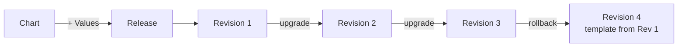
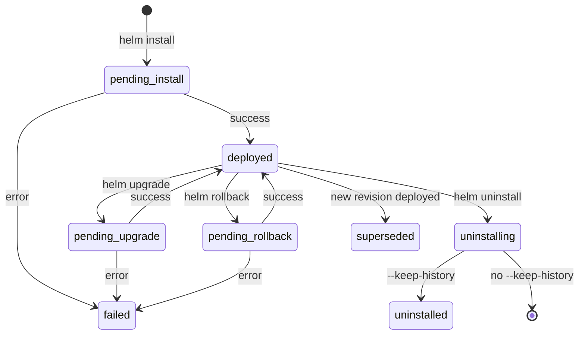
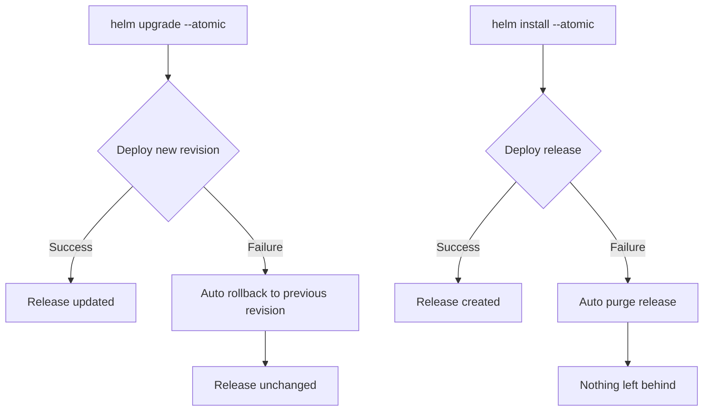

---
tags:
  - helm
  - helm/operations
topic: Operations
---

# Releases

## What Is a Release

A **release** is a running instance of a chart combined with a specific configuration. Every time you `helm install` a chart, Helm creates a new release. Each release has a unique name within its namespace and tracks its own revision history, allowing independent upgrades and rollbacks.

Think of it this way: a chart is the blueprint, values are the configuration, and a release is the deployed instance.



## Release Lifecycle

A release progresses through a well-defined lifecycle. Understanding these states is critical for debugging failed deployments.



### Release States

| State | Meaning |
|---|---|
| `deployed` | The current active revision of the release |
| `superseded` | A previous revision that has been replaced by a newer one |
| `failed` | The release operation (install, upgrade, rollback) did not complete successfully |
| `pending-install` | Install is in progress |
| `pending-upgrade` | Upgrade is in progress |
| `pending-rollback` | Rollback is in progress |
| `uninstalling` | Uninstall is in progress |
| `uninstalled` | Release has been uninstalled but history was kept with `--keep-history` |

## helm install

The `helm install` command creates a new release from a chart. It renders the templates with the provided values, sends the resulting manifests to the Kubernetes API, and records the release in the cluster.

```bash
# Basic install from a repo chart
helm install my-release bitnami/nginx --namespace web --create-namespace

# Install from a local chart directory
helm install my-release ./my-chart

# Install from a .tgz archive
helm install my-release my-chart-1.0.0.tgz

# Install from an OCI registry
helm install my-release oci://registry.example.com/charts/my-chart --version 1.0.0

# Install with custom values file
helm install my-release bitnami/nginx -f production-values.yaml

# Install with inline value overrides
helm install my-release bitnami/nginx --set replicaCount=3 --set service.type=LoadBalancer
```

### Key Flags

| Flag | Purpose |
|---|---|
| `--namespace` / `-n` | Target Kubernetes namespace for the release |
| `--create-namespace` | Create the namespace if it doesn't exist |
| `--wait` | Wait until all Pods, Services, and minimum Deployments/StatefulSets are ready |
| `--timeout` | How long `--wait` waits before giving up (default `5m0s`) |
| `--dry-run` | Render templates and validate against the API server without actually installing |
| `--generate-name` | Auto-generate a release name (e.g., `nginx-1680012345`) |
| `--atomic` | If install fails, automatically purge the release (implies `--wait`) |
| `-f` / `--values` | Path to a YAML values file (can be specified multiple times; last wins) |
| `--set` | Override individual values on the command line |
| `--version` | Specify the chart version to install |

```bash
# Dry run to preview what will be installed
helm install my-release bitnami/nginx --dry-run --debug

# Atomic install: auto-cleanup on failure
helm install my-release bitnami/nginx \
  --namespace production \
  --create-namespace \
  --atomic \
  --timeout 10m

# Generate a unique release name
helm install bitnami/nginx --generate-name
# NAME: nginx-1680012345
```

## helm upgrade

`helm upgrade` updates an existing release to a new chart version, new values, or both. Each upgrade creates a new revision in the release history.

```bash
# Upgrade to a new chart version
helm upgrade my-release bitnami/nginx --version 15.0.0

# Upgrade with new values
helm upgrade my-release bitnami/nginx -f production-values.yaml

# Install-or-upgrade (idempotent: installs if missing, upgrades if present)
helm upgrade --install my-release bitnami/nginx -f values.yaml
```

### --reuse-values vs --reset-values

This is one of the most common sources of confusion in Helm.

| Flag | Behavior |
|---|---|
| `--reuse-values` | Merges the previous release's values with any new `--set` or `-f` overrides. Values not re-specified are carried forward. |
| `--reset-values` | Starts from the chart's default `values.yaml` and applies only the explicitly provided `--set` or `-f` overrides. Previous values are discarded. |
| *(neither)* | Default behavior: uses the chart's defaults merged with any provided overrides. **Does not** carry forward previous values. |

```bash
# Reuse previous values but override one setting
helm upgrade my-release bitnami/nginx --reuse-values --set replicaCount=5

# Reset to chart defaults, provide only what you need
helm upgrade my-release bitnami/nginx --reset-values -f minimal-values.yaml

# Force resource updates even if manifests haven't changed
helm upgrade my-release bitnami/nginx --force
```

The `--force` flag deletes and recreates resources that cannot be patched (e.g., immutable fields on a Job). Use with caution as it causes brief downtime for affected resources.

### Practical Upgrade Patterns

```bash
# The idempotent CI/CD pattern (most common in pipelines)
helm upgrade --install my-release bitnami/nginx \
  --namespace production \
  --create-namespace \
  --values production-values.yaml \
  --set image.tag="${IMAGE_TAG}" \
  --atomic \
  --timeout 10m

# Upgrade with --wait to block until rollout completes
helm upgrade my-release bitnami/nginx \
  --values values.yaml \
  --wait \
  --timeout 5m
```

## helm rollback

Rollback reverts a release to a previous revision. Helm re-deploys the chart and values from that revision, creating a new revision entry in the history.

```bash
# Rollback to the previous revision
helm rollback my-release

# Rollback to a specific revision number
helm rollback my-release 3

# Rollback and wait for pods to stabilize
helm rollback my-release 3 --wait --timeout 5m
```

Check the revision number you want to target using `helm history` before rolling back.

## helm uninstall

Removes all Kubernetes resources associated with a release and deletes the release record.

```bash
# Uninstall a release
helm uninstall my-release --namespace production

# Uninstall but keep the release history (allows rollback later)
helm uninstall my-release --keep-history
```

With `--keep-history`, the release moves to the `uninstalled` state. You can still query it with `helm list --uninstalled` and view its history, but you cannot roll it back -- you would need to install it again.

## helm list

Lists releases. By default, shows only `deployed` releases in the current namespace.

```bash
# List releases in the current namespace
helm list
# NAME        NAMESPACE  REVISION  STATUS    CHART            APP VERSION
# my-release  default    3         deployed  nginx-15.0.0     1.25.0

# List across all namespaces
helm list --all-namespaces

# Filter by name pattern (regex)
helm list --filter "nginx.*"

# Filter by state
helm list --deployed        # only deployed (default)
helm list --failed          # only failed releases
helm list --pending         # pending-install, pending-upgrade, pending-rollback
helm list --superseded      # superseded revisions
helm list --uninstalled     # uninstalled releases (requires --keep-history)
helm list --all             # all states
```

## helm status

Shows the current state of a release, including the status, revision number, and any notes the chart provided.

```bash
helm status my-release --namespace production
# NAME: my-release
# LAST DEPLOYED: Mon Mar 30 10:15:00 2026
# NAMESPACE: production
# STATUS: deployed
# REVISION: 3
# NOTES:
#   ...chart-provided notes...

# Show status for a specific revision
helm status my-release --revision 2
```

## helm get

Retrieves detailed information about a release. Useful for debugging or understanding exactly what was deployed.

```bash
# Get the computed values (user-supplied merged with defaults)
helm get values my-release
# Returns YAML of all values used for the current revision

# Get only user-supplied values (overrides only)
helm get values my-release --all
# Shows all computed values including chart defaults

# Get the rendered Kubernetes manifests
helm get manifest my-release
# Outputs all YAML manifests that Helm sent to the cluster

# Get the chart's NOTES.txt output
helm get notes my-release

# Get hook manifests
helm get hooks my-release

# Get everything at once
helm get all my-release

# Get data for a specific revision
helm get values my-release --revision 2
helm get manifest my-release --revision 2
```

## helm history

Shows the revision history of a release, including when each revision was deployed and its status.

```bash
helm history my-release
# REVISION  UPDATED                   STATUS      CHART          APP VERSION  DESCRIPTION
# 1         Mon Mar 28 10:00:00 2026  superseded  nginx-14.0.0   1.24.0       Install complete
# 2         Mon Mar 29 14:30:00 2026  superseded  nginx-15.0.0   1.25.0       Upgrade complete
# 3         Mon Mar 30 10:15:00 2026  deployed    nginx-15.0.0   1.25.0       Upgrade complete

# Limit the number of revisions shown
helm history my-release --max 5
```

The `DESCRIPTION` column shows `Install complete`, `Upgrade complete`, `Rollback to N`, or error messages for failed operations. This is your audit trail for what happened to a release.

## --atomic Flag Behavior

The `--atomic` flag (available on `install` and `upgrade`) provides an automatic safety net. If the operation fails, Helm automatically rolls back to the previous state.



Key details:
- `--atomic` implies `--wait` (it must wait to know if the deploy succeeded)
- On `install`, a failure results in a full purge (equivalent to `helm uninstall`)
- On `upgrade`, a failure results in a rollback to the previous revision
- Combine with `--timeout` to control how long Helm waits before declaring failure

## --wait Flag Behavior

The `--wait` flag makes Helm block until the release is considered "ready":

- **Deployments**: all replicas are available (`.status.availableReplicas >= .spec.replicas`)
- **StatefulSets**: all replicas are ready and updated
- **DaemonSets**: all desired pods are scheduled and ready
- **Jobs**: completed successfully

```bash
# Wait up to 10 minutes for everything to be ready
helm install my-release bitnami/nginx --wait --timeout 10m
```

Without `--wait`, Helm marks the release as `deployed` as soon as the manifests are submitted to the API server, regardless of whether the Pods actually start successfully. This means a release can be `deployed` even if every Pod is in CrashLoopBackOff.
