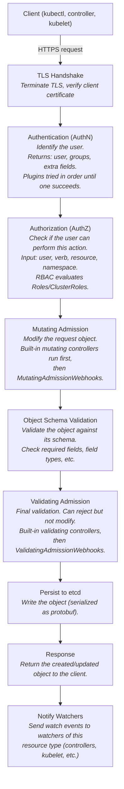
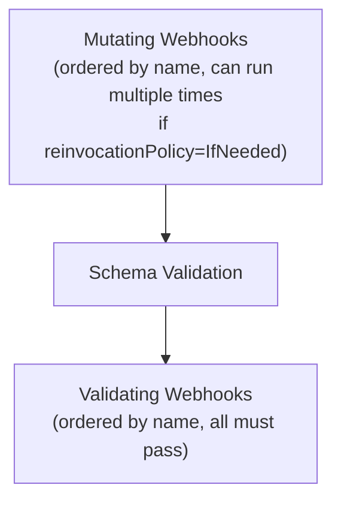
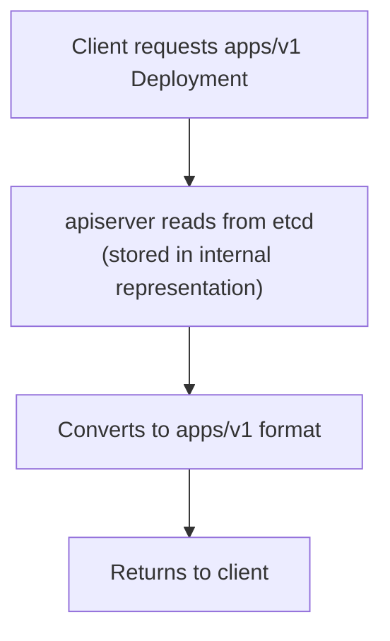
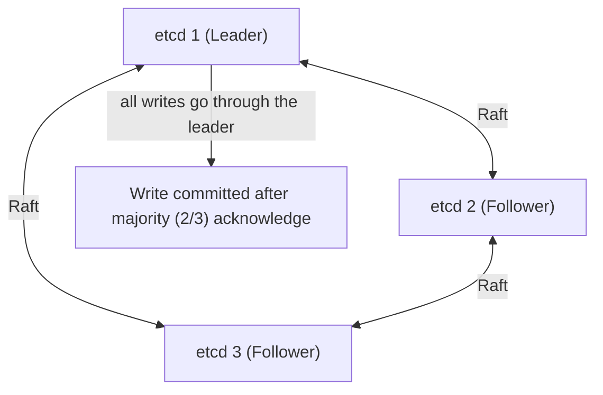
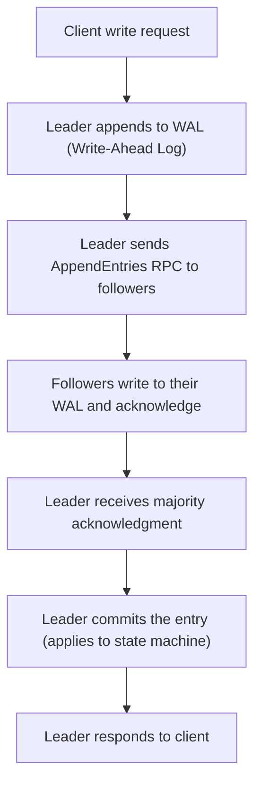
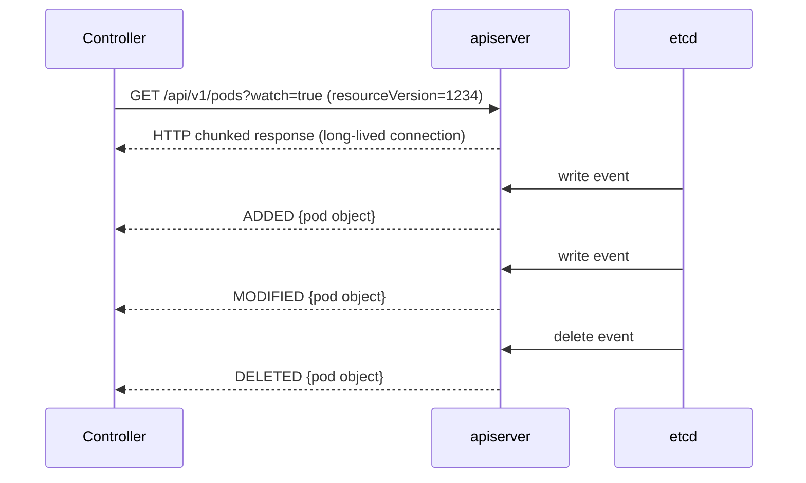
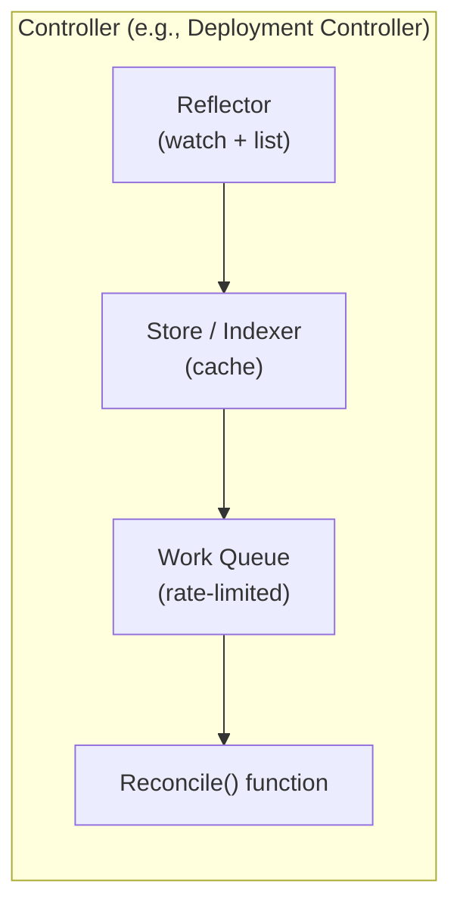

---
tags:
  - kubernetes
  - kubernetes/architecture
topic: Architecture
---

# API Server and etcd

This note provides a deep dive into the Kubernetes API structure, the request lifecycle, API versioning, etcd internals, and the watch mechanism that powers the entire controller model.

## Kubernetes API Structure

The API is organized into **groups**, **versions**, and **resources**.

### API Groups

| Group | Path | Contains |
|---|---|---|
| Core (legacy) | `/api/v1` | Pods, Services, ConfigMaps, Secrets, Namespaces, Nodes, PersistentVolumes |
| `apps` | `/apis/apps/v1` | Deployments, StatefulSets, DaemonSets, ReplicaSets |
| `batch` | `/apis/batch/v1` | Jobs, CronJobs |
| `networking.k8s.io` | `/apis/networking.k8s.io/v1` | Ingress, NetworkPolicy, IngressClass |
| `rbac.authorization.k8s.io` | `/apis/rbac.authorization.k8s.io/v1` | Roles, ClusterRoles, RoleBindings |
| `storage.k8s.io` | `/apis/storage.k8s.io/v1` | StorageClasses, CSIDrivers, VolumeAttachments |
| `autoscaling` | `/apis/autoscaling/v2` | HorizontalPodAutoscaler |
| `policy` | `/apis/policy/v1` | PodDisruptionBudget |
| `apiextensions.k8s.io` | `/apis/apiextensions.k8s.io/v1` | CustomResourceDefinitions |

### URL Structure

```
/apis/{group}/{version}/namespaces/{namespace}/{resource}/{name}

Examples:
  /api/v1/namespaces/default/pods/nginx
  /apis/apps/v1/namespaces/default/deployments/web
  /apis/batch/v1/namespaces/default/jobs/data-import

Cluster-scoped resources omit the namespace:
  /api/v1/nodes/worker-1
  /apis/rbac.authorization.k8s.io/v1/clusterroles/admin
```

### Subresources

Some resources have subresources accessible at nested paths:

| Subresource | Path | Purpose |
|---|---|---|
| `status` | `.../pods/nginx/status` | Read/update status independently |
| `log` | `.../pods/nginx/log` | Stream container logs |
| `exec` | `.../pods/nginx/exec` | Execute commands in a container |
| `portforward` | `.../pods/nginx/portforward` | Port forwarding |
| `scale` | `.../deployments/web/scale` | Read/update replica count |
| `binding` | `.../pods/nginx/binding` | Scheduler binds Pod to a node |

---

## API Request Lifecycle

Every request to the apiserver passes through a strict pipeline. Understanding this pipeline is essential for debugging admission failures, RBAC issues, and webhook behavior.



### Key Details

- **AuthN plugins** are tried in order. The first to return a valid identity wins. If none succeed, the request is rejected with 401.
- **AuthZ** returns allow, deny, or no-opinion. The chain continues until a module returns allow or deny. If all return no-opinion, the request is denied.
- **Mutating admission** runs before validation so that defaults can be applied (e.g., adding a default ServiceAccount, injecting resource limits).
- **Schema validation** catches structural errors like missing required fields, wrong types, or unknown fields (in strict mode).
- **Validating admission** runs last and can reject the request based on policy (e.g., PodSecurity standards, OPA/Gatekeeper policies, Kyverno rules).

### Webhook Ordering



Webhooks have a `failurePolicy` setting:
- `Fail` -- Reject the request if the webhook is unavailable.
- `Ignore` -- Allow the request to proceed if the webhook is unavailable.

---

## API Versioning

Kubernetes uses a deliberate versioning scheme to signal API stability.

### Version Levels

| Level | Format | Stability | Default Enabled | May Be Removed |
|---|---|---|---|---|
| **Alpha** | `v1alpha1` | Experimental, may change without notice | No (must opt-in via feature gate) | Yes, in any release |
| **Beta** | `v1beta1` | Feature is mostly stable, schema may change | Yes (since 1.22: no, must opt-in) | Yes, but with deprecation period |
| **Stable (GA)** | `v1`, `v2` | Fully stable, backward-compatible | Yes | No (only the whole API group can be removed) |

### Deprecation Policy

Kubernetes follows strict rules:

- **GA APIs** must be supported for at least 12 months or 3 releases (whichever is longer) after a replacement is available.
- **Beta APIs** must be supported for 9 months or 3 releases after deprecation.
- **Alpha APIs** can be removed in any release without notice.

### Multiple Versions of the Same Resource

The apiserver can serve the same resource at multiple versions simultaneously. Internally, it stores objects in a single **storage version** and converts on the fly.



```bash
# See all API versions available
kubectl api-versions

# See all resources and their API group/version
kubectl api-resources -o wide
```

---

## etcd Internals

### Architecture

etcd is a distributed key-value store using the **Raft consensus algorithm** to ensure all nodes agree on the same data.



### Raft Consensus

Raft ensures consistency through three mechanisms:

1. **Leader Election** -- One member is elected leader. All writes are proposed by the leader. If the leader fails, a new election starts (typically completes in milliseconds).

2. **Log Replication** -- The leader appends each write to its log and replicates it to followers. Once a majority confirms, the write is committed.

3. **Safety** -- Once committed, a log entry is permanent. No conflicting entries can be committed at the same index.



### Data Model

etcd stores data as flat key-value pairs. Kubernetes uses a key hierarchy:

```
/registry/{resource-type}/{namespace}/{name}

Examples:
  /registry/pods/default/nginx
  /registry/deployments/kube-system/coredns
  /registry/services/specs/default/kubernetes
  /registry/secrets/default/my-secret
  /registry/clusterroles/admin
```

Values are serialized Kubernetes objects, typically in protobuf format for efficiency (JSON is used as a fallback).

### Revisions and MVCC

etcd uses **Multi-Version Concurrency Control (MVCC)**. Every write increments a global revision number. Old versions are retained until compacted.

```
  Revision 1:  /registry/pods/default/nginx  ->  {v1, status: Pending}
  Revision 5:  /registry/pods/default/nginx  ->  {v1, status: Running}
  Revision 12: /registry/pods/default/nginx  ->  {v1, status: Running, conditions updated}
```

This is what enables the watch mechanism -- a client can say "give me all changes since revision 5."

### Compaction

Over time, old revisions accumulate. etcd **compaction** removes revisions older than a threshold. The apiserver configures this automatically.

```bash
# Check current etcd database size
ETCDCTL_API=3 etcdctl endpoint status --write-out=table
```

---

## Backing Up and Restoring etcd

### Why Backups Are Critical

etcd contains the entire cluster state. Without it, you lose:
- All resource definitions (Pods, Deployments, Services, etc.)
- RBAC configuration
- Secrets and ConfigMaps
- Custom resources
- Namespace structure

### Creating a Backup

```bash
# Snapshot the database
ETCDCTL_API=3 etcdctl snapshot save /backup/etcd-$(date +%Y%m%d-%H%M%S).db \
  --endpoints=https://127.0.0.1:2379 \
  --cacert=/etc/kubernetes/pki/etcd/ca.crt \
  --cert=/etc/kubernetes/pki/etcd/server.crt \
  --key=/etc/kubernetes/pki/etcd/server.key

# Verify integrity
ETCDCTL_API=3 etcdctl snapshot status /backup/etcd-20260326-120000.db \
  --write-out=table

# Expected output:
# +----------+----------+------------+------------+
# |   HASH   | REVISION | TOTAL KEYS | TOTAL SIZE |
# +----------+----------+------------+------------+
# | abc123   |   45678  |    1523    |   4.2 MB   |
# +----------+----------+------------+------------+
```

### Restoring from Backup

```bash
# Stop the apiserver and etcd (if running as static Pods, move manifests out)
mv /etc/kubernetes/manifests/kube-apiserver.yaml /tmp/
mv /etc/kubernetes/manifests/etcd.yaml /tmp/

# Restore the snapshot to a new data directory
ETCDCTL_API=3 etcdctl snapshot restore /backup/etcd-20260326-120000.db \
  --data-dir=/var/lib/etcd-restored \
  --name=controlplane \
  --initial-cluster=controlplane=https://127.0.0.1:2380 \
  --initial-advertise-peer-urls=https://127.0.0.1:2380

# Update the etcd manifest to use the new data directory
# In /tmp/etcd.yaml, change --data-dir=/var/lib/etcd to --data-dir=/var/lib/etcd-restored

# Move manifests back
mv /tmp/etcd.yaml /etc/kubernetes/manifests/
mv /tmp/kube-apiserver.yaml /etc/kubernetes/manifests/

# Wait for etcd and apiserver to come back up
```

### Backup Best Practices

| Practice | Recommendation |
|---|---|
| Frequency | At least hourly for production clusters |
| Storage | Off-cluster (S3, GCS, NFS) -- not on the etcd node itself |
| Retention | Keep at least 7 days of backups |
| Testing | Regularly test restores in a non-production environment |
| Encryption | Encrypt backups at rest (they contain Secrets) |

---

## Watch Mechanism

The watch mechanism is the foundation of Kubernetes' event-driven architecture. Controllers do not poll -- they establish long-lived watch connections to the apiserver and receive events as they happen.

### How Watch Works



### Watch Event Types

| Event Type | Meaning |
|---|---|
| `ADDED` | A new object was created |
| `MODIFIED` | An existing object was updated |
| `DELETED` | An object was deleted |
| `BOOKMARK` | A synthetic event indicating the current resourceVersion (no object change) |
| `ERROR` | An error occurred (often means the watch must be restarted) |

### resourceVersion and Watch Bookmarks

Every Kubernetes object and list has a `resourceVersion` field (mapped to an etcd revision). When establishing a watch, the client specifies a `resourceVersion` to resume from. This avoids missing events.

**Bookmarks** are periodic events the apiserver sends to update the client's known `resourceVersion` without an actual object change. This allows the client to resume the watch from a more recent point if the connection is lost.

### How Controllers Use Watch

Controllers follow the **Informer pattern** (from `client-go`):



1. **Reflector** -- Lists all objects on startup, then watches for changes. Puts events into the store.
2. **Store/Indexer** -- An in-memory cache of all objects. Controllers read from the cache instead of hitting the apiserver, reducing load.
3. **Work Queue** -- Events trigger the object's key to be added to a rate-limited work queue.
4. **Reconcile** -- A worker processes items from the queue and reconciles the desired state with the actual state.

This is why controllers are eventually consistent: they process events asynchronously through the work queue.

### Watch Cache (apiserver side)

The apiserver maintains a **watch cache** in memory for each resource type. When a client starts a watch, the apiserver serves events from this cache rather than proxying every watch to etcd. This dramatically reduces etcd load.

---

## API Discovery and OpenAPI Spec

### API Discovery

The apiserver exposes endpoints that let clients discover what APIs are available:

```bash
# List all API groups
kubectl get --raw /apis | jq '.groups[].name'

# List resources in the core group
kubectl get --raw /api/v1 | jq '.resources[].name'

# List resources in the apps group
kubectl get --raw /apis/apps/v1 | jq '.resources[].name'
```

These discovery endpoints are what `kubectl api-resources` and `kubectl api-versions` use under the hood.

### Aggregated Discovery (v2)

Since Kubernetes 1.26, the apiserver supports **aggregated discovery** at `/apis` and `/api`, which returns all resource information in a single request instead of requiring one request per group. This significantly speeds up client startup.

### OpenAPI Specification

The apiserver publishes a full OpenAPI v2 (and v3) specification of the entire API surface:

```bash
# OpenAPI v2 spec
kubectl get --raw /openapi/v2 | head -c 500

# OpenAPI v3 (per group)
kubectl get --raw /openapi/v3/apis/apps/v1

# List available OpenAPI v3 paths
kubectl get --raw /openapi/v3
```

This spec is used by:
- **kubectl** for client-side validation (`kubectl apply --validate=true`)
- **kubectl explain** to show field documentation
- **IDE plugins** for autocompletion
- **Code generators** to build typed clients in various languages

```bash
# kubectl explain uses the OpenAPI spec to describe fields
kubectl explain pod.spec.containers.livenessProbe

# Show the full resource schema
kubectl explain deployment --recursive
```
