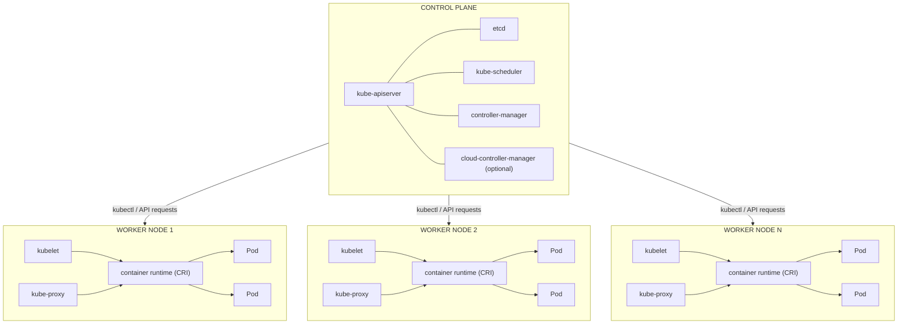
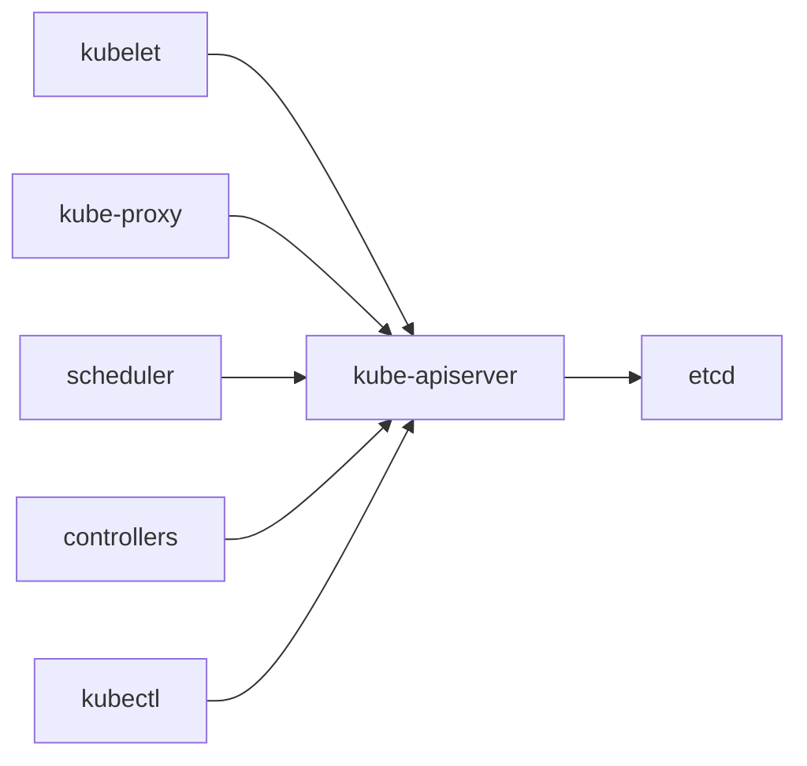
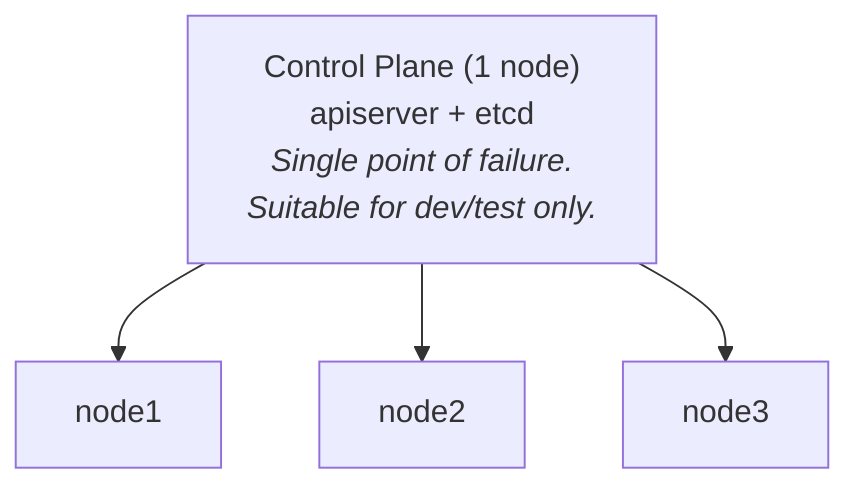
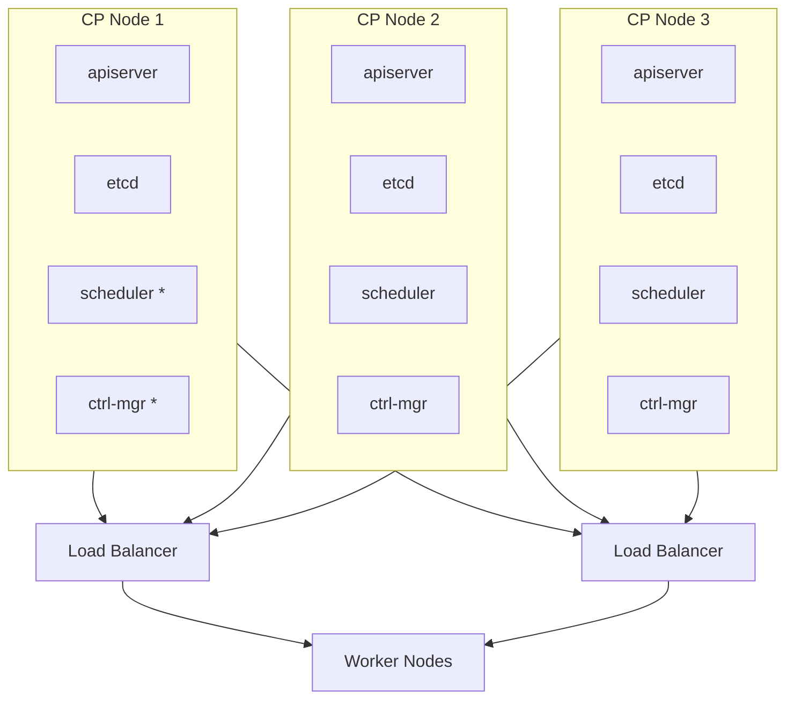
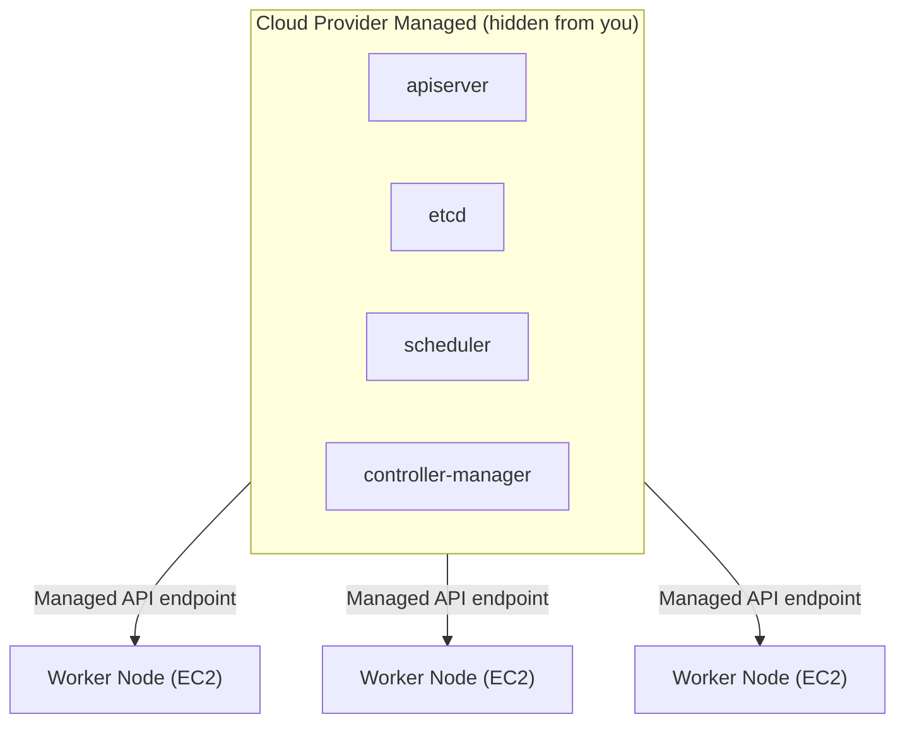

---
tags:
  - kubernetes
  - kubernetes/architecture
topic: Architecture
---

# Cluster Architecture

## High-Level Overview

A Kubernetes cluster is divided into two logical layers: the **control plane** (manages the cluster) and the **data plane** (runs the workloads). Every cluster has at least one control plane node and one or more worker nodes.

## Control Plane vs Data Plane

| Aspect | Control Plane | Data Plane |
|---|---|---|
| **Purpose** | Make global decisions about the cluster (scheduling, responding to events) | Run application workloads |
| **Components** | apiserver, etcd, scheduler, controller-manager | kubelet, kube-proxy, container runtime |
| **Runs on** | Control plane nodes (often called "masters") | Worker nodes |
| **Failure impact** | New scheduling stops, API unavailable, but existing Pods keep running | Pods on that node become unavailable |
| **Scaling** | Replicate for HA (odd numbers: 3 or 5) | Add more worker nodes as needed |

An important nuance: if the control plane goes down, already-running Pods continue to serve traffic. The kubelet and kube-proxy keep working locally. However, no new Pods can be scheduled, no self-healing occurs, and `kubectl` commands fail.

## How Components Communicate

All communication flows through the **kube-apiserver** as a central hub. No component talks directly to another.

**Key communication patterns:**

1. **kubelet to apiserver** -- The kubelet watches the apiserver for PodSpecs assigned to its node, reports back node and Pod status. Uses TLS client certificates for authentication.
2. **Scheduler to apiserver** -- The scheduler watches for unscheduled Pods (`.spec.nodeName` is empty), then writes back the scheduling decision.
3. **Controllers to apiserver** -- Controllers watch for resource changes via the watch API, then make API calls to reconcile desired vs actual state.
4. **apiserver to etcd** -- Only the apiserver communicates directly with etcd. This is a critical design decision that protects data consistency.
5. **apiserver to kubelet** -- The apiserver initiates connections to kubelets for log fetching, `kubectl exec`, and `kubectl port-forward`.

All communication uses **mutual TLS** (mTLS). The apiserver validates client certificates, and clients validate the apiserver's certificate.

## Single vs Multi-Master Setups

### Single Master

- Simple to set up and maintain.
- If the control plane node fails, the entire cluster management is lost.
- etcd data lives on a single machine -- data loss is possible.

### Multi-Master (HA)

> \* = active leader (scheduler and controller-manager use leader election)

- **apiserver** runs active-active behind a load balancer. All instances serve requests.
- **scheduler** and **controller-manager** use leader election. Only one is active; others are on standby.
- **etcd** forms a Raft consensus cluster. Requires a quorum (majority) to operate.

## High Availability Considerations

### etcd Quorum

etcd requires a majority of nodes to agree on writes. Use **odd numbers** for the cluster size.

| etcd Nodes | Quorum | Tolerated Failures |
|---|---|---|
| 1 | 1 | 0 |
| 3 | 2 | 1 |
| 5 | 3 | 2 |
| 7 | 4 | 3 |

Three nodes is the most common HA setup. Five nodes provides more resilience but adds latency to writes due to the larger quorum requirement.

### Stacked vs External etcd

| Topology | Description | Trade-off |
|---|---|---|
| **Stacked** | etcd runs on the same nodes as the control plane components | Simpler to manage, fewer machines needed; a node failure loses both a control plane member and an etcd member |
| **External** | etcd runs on its own dedicated nodes | More resilient, but more infrastructure to manage |

### Load Balancer for apiserver

In HA setups, a load balancer sits in front of all apiserver instances. Options include:

- Hardware load balancer
- HAProxy or Nginx
- Cloud provider load balancer (ELB, ALB, etc.)
- kube-vip (virtual IP for bare-metal)

### Anti-Affinity

Spread control plane nodes across **failure domains** (different racks, availability zones, or data centers) to survive localized failures.

## Cloud vs Bare-Metal Architecture Differences

| Aspect | Cloud (Managed: EKS, GKE, AKS) | Cloud (Self-managed) | Bare-Metal |
|---|---|---|---|
| **Control plane** | Fully managed by provider, invisible to user | You manage it on VMs | You manage it on physical servers |
| **etcd** | Managed, backed up automatically | You manage it | You manage it, including disk I/O tuning |
| **Networking** | Cloud CNI plugin (VPC-native) | Choice of CNI | Choice of CNI; may need BGP (Calico, Cilium) |
| **Load balancing** | Cloud LB (NLB, ALB) with `Service type: LoadBalancer` | Cloud LB | MetalLB, kube-vip, or external LB |
| **Storage** | Cloud CSI drivers (EBS, PD, Azure Disk) | Cloud CSI drivers | Local storage, Ceph, Longhorn, or SAN |
| **Node scaling** | Cluster Autoscaler / Karpenter integration | Cluster Autoscaler | Manual or custom automation |
| **Upgrades** | Provider handles control plane upgrades | You handle upgrades | You handle upgrades |
| **Cost model** | Per-cluster fee + compute | Compute only | Hardware CapEx + operational overhead |

### Managed Kubernetes Architecture (e.g., EKS)

In managed Kubernetes, you never see or SSH into control plane nodes. The provider guarantees HA for the control plane, handles etcd backups, and exposes only the apiserver endpoint.

### Bare-Metal Considerations

- **No cloud load balancer**: Use MetalLB (Layer 2 or BGP mode) or kube-vip to provide `LoadBalancer`-type Services.
- **Storage**: No automatic provisioning. Use local-path provisioner for simple setups, or run a distributed storage system (Ceph/Rook, Longhorn).
- **Networking**: Typically use Calico or Cilium with BGP peering into your physical network.
- **Node provisioning**: Tools like MAAS, Tinkerbell, or PXE boot for automated bare-metal provisioning.
- **etcd performance**: Use SSDs for etcd. Spinning disks cause latency that degrades the entire cluster.
