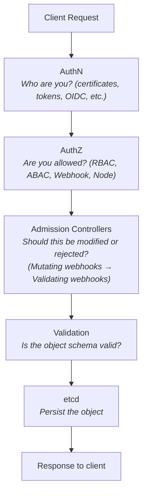
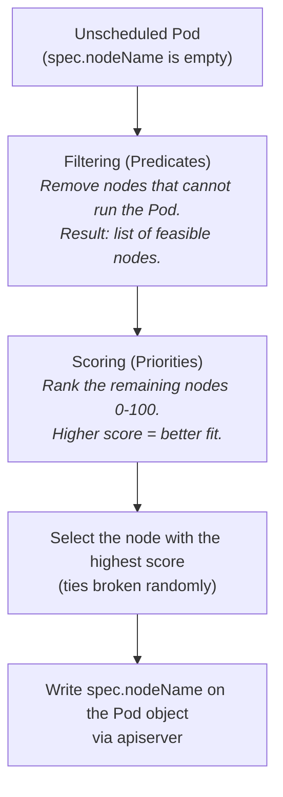
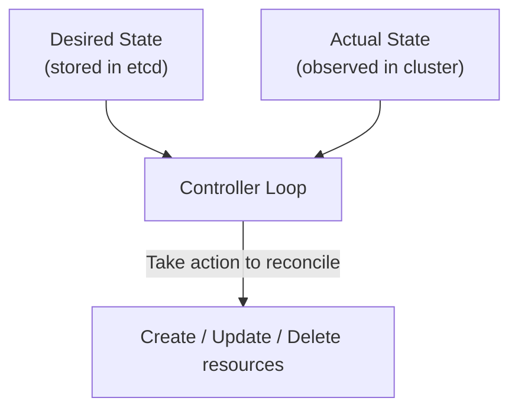
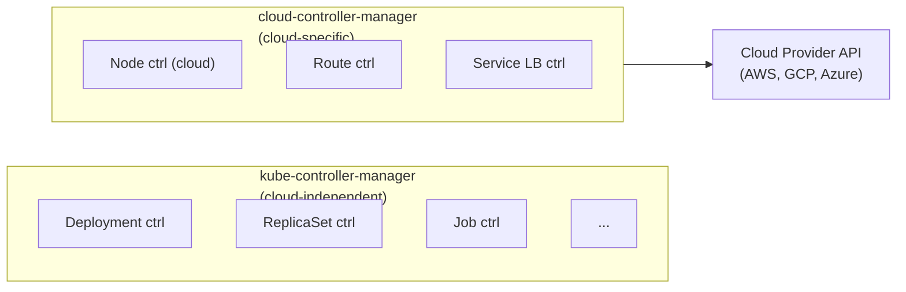

---
tags:
  - kubernetes
  - kubernetes/architecture
topic: Architecture
---

# Control Plane Components

The control plane is the brain of the cluster. Its components make global decisions (scheduling, detecting and responding to events) and maintain the desired state of all resources.

## kube-apiserver

The API server is the **front door** to the cluster. Every interaction -- `kubectl`, controllers, kubelets, external tools -- goes through it.

### What It Does

- Exposes the Kubernetes API over HTTPS (default port 6443).
- Validates and processes RESTful requests (CRUD operations on resources).
- Serves as the only component that reads from and writes to etcd.
- Handles authentication, authorization, and admission control for every request.
- Supports the watch mechanism that enables controllers to react to changes.

### REST API Structure

```
/api/v1/namespaces/{namespace}/pods/{name}
 |    |      |           |        |     |
 |    |      |           |        |     └── resource name
 |    |      |           |        └── resource type
 |    |      |           └── namespace
 |    |      └── resource category
 |    └── API version
 └── core API group

/apis/apps/v1/namespaces/{namespace}/deployments/{name}
  |    |    |
  |    |    └── version
  |    └── API group
  └── named API groups
```

Common operations map to HTTP methods:

| Operation | HTTP Method | Example |
|---|---|---|
| Create | POST | `POST /api/v1/namespaces/default/pods` |
| Read | GET | `GET /api/v1/namespaces/default/pods/my-pod` |
| List | GET | `GET /api/v1/namespaces/default/pods` |
| Update | PUT | `PUT /api/v1/namespaces/default/pods/my-pod` |
| Patch | PATCH | `PATCH /api/v1/namespaces/default/pods/my-pod` |
| Delete | DELETE | `DELETE /api/v1/namespaces/default/pods/my-pod` |
| Watch | GET (streaming) | `GET /api/v1/pods?watch=true` |

### Request Lifecycle

Every request passes through a well-defined pipeline:



### Authentication Methods

| Method | Description | Use Case |
|---|---|---|
| X.509 Client Certificates | CN = username, O = group | Service accounts, kubelets |
| Bearer Tokens | Static token file or ServiceAccount tokens | Automated tools, in-cluster Pods |
| OIDC (OpenID Connect) | Integrates with identity providers (Okta, Google, Azure AD) | Human users in enterprise setups |
| Webhook Token Auth | Delegates to external service | Custom auth systems |
| Bootstrap Tokens | Short-lived tokens for node joining | kubeadm node bootstrap |

### Authorization Modes

Evaluated in order until one grants or denies:

1. **Node** -- Authorizes kubelet API requests based on the Pods scheduled to that node.
2. **RBAC** (Role-Based Access Control) -- Most common. Uses Roles, ClusterRoles, RoleBindings, and ClusterRoleBindings.
3. **ABAC** (Attribute-Based Access Control) -- Policy file on disk. Rarely used in practice.
4. **Webhook** -- Delegates to an external HTTP service.

### Admission Controllers

Admission controllers intercept requests **after** authentication and authorization but **before** persistence. Two types:

- **Mutating** -- Can modify the object (e.g., inject sidecar containers, add default resource limits). Runs first.
- **Validating** -- Can accept or reject the object but cannot modify it. Runs second.

Common built-in admission controllers:

| Controller | Type | Purpose |
|---|---|---|
| `NamespaceLifecycle` | Validating | Prevents operations in terminating or non-existent namespaces |
| `LimitRanger` | Mutating | Applies default resource limits from LimitRange objects |
| `ServiceAccount` | Mutating | Auto-mounts ServiceAccount tokens into Pods |
| `DefaultStorageClass` | Mutating | Assigns default StorageClass to PVCs |
| `ResourceQuota` | Validating | Enforces namespace resource quotas |
| `PodSecurity` | Validating | Enforces Pod Security Standards (replaced PodSecurityPolicy) |
| `MutatingAdmissionWebhook` | Mutating | Calls external mutating webhooks |
| `ValidatingAdmissionWebhook` | Validating | Calls external validating webhooks |

### HA Behavior

Multiple apiserver instances run active-active behind a load balancer. Every instance can serve every request since the state lives in etcd, not in the apiserver.

---

## etcd

etcd is a **distributed, consistent key-value store** that serves as the cluster's single source of truth.

### What It Stores

Every Kubernetes object is stored in etcd as a serialized protobuf (or JSON) blob under a key path:

```
/registry/pods/default/my-pod
/registry/deployments/kube-system/coredns
/registry/services/specs/default/kubernetes
/registry/secrets/default/my-secret
/registry/configmaps/default/my-config
```

etcd stores **desired state** and **observed state** for all resources. Nothing else in the cluster stores persistent state.

### Consistency Model

- Uses the **Raft consensus algorithm** for strong consistency.
- Every write must be committed by a majority (quorum) of etcd members before it's acknowledged.
- Reads can be served by any member (for linearizable reads, the leader confirms it's still the leader first).

### Performance Characteristics

| Metric | Recommendation |
|---|---|
| Disk type | SSD required; etcd is latency-sensitive |
| Network latency between members | < 10ms round-trip |
| Max database size | Default 2 GB, configurable up to 8 GB |
| WAL (Write-Ahead Log) | Sequential I/O -- benefits from fast disks |

### Backup Importance

etcd is the **only stateful component** in the control plane. Losing etcd without a backup means losing the entire cluster's state -- all Pods, Deployments, Services, Secrets, ConfigMaps, RBAC rules, and custom resources.

```bash
# Create a snapshot backup
ETCDCTL_API=3 etcdctl snapshot save /backup/etcd-snapshot.db \
  --endpoints=https://127.0.0.1:2379 \
  --cacert=/etc/kubernetes/pki/etcd/ca.crt \
  --cert=/etc/kubernetes/pki/etcd/server.crt \
  --key=/etc/kubernetes/pki/etcd/server.key

# Verify the snapshot
ETCDCTL_API=3 etcdctl snapshot status /backup/etcd-snapshot.db --write-out=table

# Restore from snapshot
ETCDCTL_API=3 etcdctl snapshot restore /backup/etcd-snapshot.db \
  --data-dir=/var/lib/etcd-restored
```

Automate etcd backups on a schedule (e.g., every hour) and store them off-cluster.

---

## kube-scheduler

The scheduler watches for newly created Pods with no assigned node and selects the best node for each one.

### How Scheduling Works



### Filtering Phase (Predicates)

These checks eliminate nodes that cannot run the Pod:

| Filter | Checks |
|---|---|
| `PodFitsResources` | Does the node have enough CPU and memory? |
| `PodFitsHostPorts` | Are the requested host ports available? |
| `NodeSelector` | Does the node match the Pod's `nodeSelector`? |
| `NodeAffinity` | Does the node satisfy affinity rules? |
| `TaintToleration` | Does the Pod tolerate the node's taints? |
| `PodTopologySpread` | Would placing here violate topology constraints? |
| `VolumeBinding` | Can the requested PVs be bound on this node? |

### Scoring Phase (Priorities)

Remaining nodes are scored to find the best fit:

| Priority | Favors |
|---|---|
| `LeastRequestedPriority` | Nodes with more available resources |
| `BalancedResourceAllocation` | Nodes where CPU and memory usage are balanced |
| `ImageLocality` | Nodes that already have the container image cached |
| `NodeAffinityPriority` | Nodes that match preferred (soft) affinity rules |
| `InterPodAffinityPriority` | Nodes that satisfy inter-pod affinity preferences |
| `TaintTolerationPriority` | Nodes with fewer untolerated taints |

### Scheduler Profiles and Plugins

Since Kubernetes 1.19, the scheduler uses a **plugin-based framework**. You can configure multiple scheduler profiles or write custom plugins for specialized scheduling needs.

```yaml
apiVersion: kubescheduler.config.k8s.io/v1
kind: KubeSchedulerConfiguration
profiles:
  - schedulerName: default-scheduler
    plugins:
      score:
        enabled:
          - name: NodeResourcesFit
            weight: 2
          - name: ImageLocality
            weight: 1
```

### Preemption

If no node can fit a Pod, the scheduler may **preempt** (evict) lower-priority Pods to make room, provided the pending Pod has a higher PriorityClass.

---

## kube-controller-manager

The controller manager is a single binary that bundles dozens of **controllers**. Each controller is a reconciliation loop that watches the actual state of the cluster and works to make it match the desired state.

### Core Reconciliation Pattern



### Key Controllers

| Controller | Watches | Reconciles |
|---|---|---|
| **Node Controller** | Node objects | Detects when nodes go down; sets node conditions; evicts Pods from unreachable nodes after a timeout |
| **Replication Controller** | ReplicationSets | Ensures the correct number of Pod replicas are running |
| **Deployment Controller** | Deployments | Manages ReplicaSets for rolling updates and rollbacks |
| **StatefulSet Controller** | StatefulSets | Manages ordered, sticky-identity Pods |
| **DaemonSet Controller** | DaemonSets | Ensures a Pod runs on every (or selected) node |
| **Job Controller** | Jobs | Manages run-to-completion Pods |
| **CronJob Controller** | CronJobs | Creates Jobs on a schedule |
| **Endpoints Controller** | Services, Pods | Populates Endpoints objects that map Services to Pod IPs |
| **EndpointSlice Controller** | Services, Pods | Scalable alternative to Endpoints (default since 1.21) |
| **ServiceAccount Controller** | Namespaces | Creates a default ServiceAccount in new namespaces |
| **Namespace Controller** | Namespaces | Cleans up resources when a namespace is deleted |
| **PV/PVC Controller** | PersistentVolumes, Claims | Binds PVCs to PVs; handles dynamic provisioning |
| **Garbage Collector** | Owner references | Deletes dependent objects when an owner is deleted (cascading delete) |

### Leader Election

In an HA setup with multiple control plane nodes, only **one** controller-manager instance is the active leader at any time. The others are on standby. Leader election uses a Lease object in `kube-system`.

```bash
# See the current leader
kubectl get lease kube-controller-manager -n kube-system -o yaml
```

---

## cloud-controller-manager

The cloud-controller-manager (CCM) separates cloud-provider-specific logic from the core Kubernetes components. It was introduced so that cloud providers can iterate on their integrations without being tightly coupled to the Kubernetes release cycle.

### When It's Used

- Only in clusters running on a cloud provider (AWS, GCP, Azure, etc.).
- Not present in bare-metal or on-premises clusters (unless you have a custom cloud provider integration).

### What It Manages

| Controller | Responsibility |
|---|---|
| **Node Controller** | Checks with the cloud API whether a node still exists; populates node metadata (instance type, region, zone) |
| **Route Controller** | Configures cloud network routes so Pods on different nodes can communicate |
| **Service Controller** | Creates and manages cloud load balancers when a Service of `type: LoadBalancer` is created |

### Architecture



### Running the CCM

When using a CCM, the kube-controller-manager is started with `--cloud-provider=external` to disable its built-in cloud controllers. The CCM then takes over those responsibilities.

```bash
# Typical CCM flags
cloud-controller-manager \
  --cloud-provider=aws \
  --leader-elect=true \
  --use-service-account-credentials=true \
  --controllers=cloud-node,cloud-route,service \
  --v=2
```

### Provider Implementations

Each cloud provider maintains their own CCM:

| Provider | Repository |
|---|---|
| AWS | `kubernetes/cloud-provider-aws` |
| GCP | `kubernetes/cloud-provider-gcp` |
| Azure | `kubernetes-sigs/cloud-provider-azure` |
| OpenStack | `kubernetes/cloud-provider-openstack` |
| vSphere | `kubernetes/cloud-provider-vsphere` |
