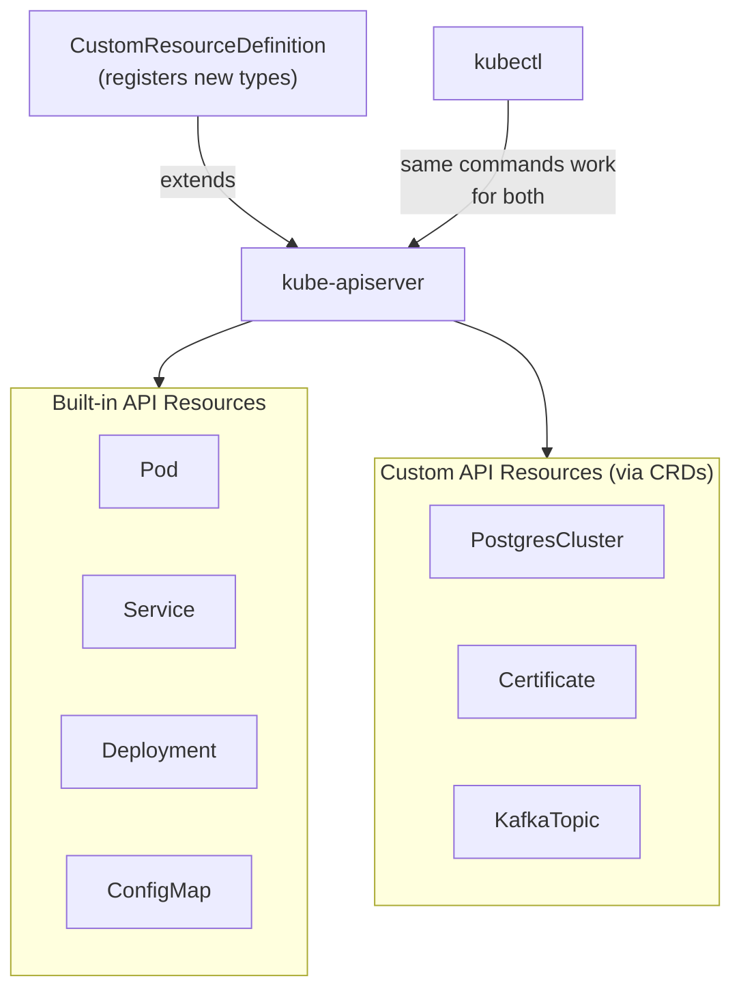
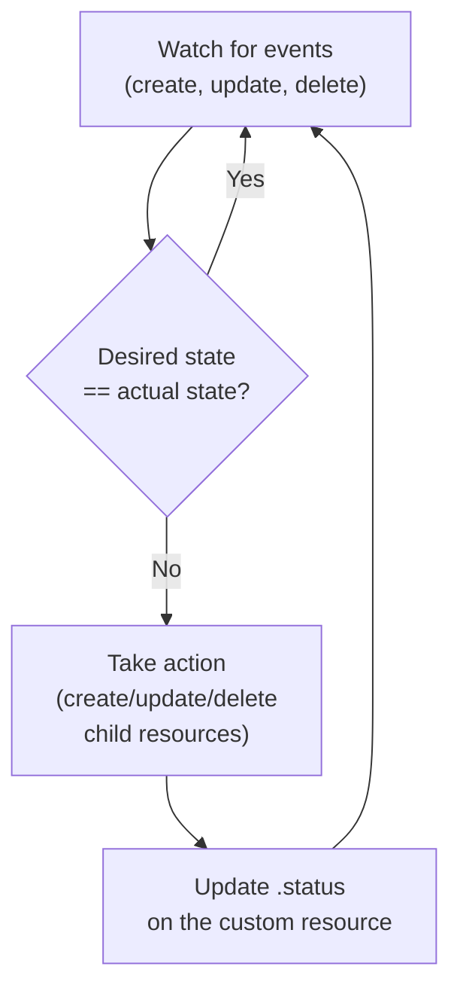

---
tags:
  - kubernetes
  - kubernetes/architecture
topic: Architecture
---

# Custom Resources and Operators

## What Custom Resources Are

Kubernetes ships with built-in resource types — Pods, Services, Deployments, and so on. A **Custom Resource (CR)** extends the Kubernetes API with your own resource types. Once registered, custom resources behave exactly like built-in resources: you can `kubectl get`, `kubectl apply`, `kubectl delete`, and watch them.

Custom resources let you model domain-specific concepts inside Kubernetes. Instead of managing a PostgreSQL database through shell scripts and ConfigMaps, you define a `PostgresCluster` resource and let a controller handle the details.



## CustomResourceDefinition (CRD)

A CRD is itself a Kubernetes resource that tells the API server about your new type. Once you apply a CRD, the API server immediately starts accepting resources of that kind.

```yaml
apiVersion: apiextensions.k8s.io/v1
kind: CustomResourceDefinition
metadata:
  name: webapps.example.com           # must be <plural>.<group>
spec:
  group: example.com                  # API group — appears in apiVersion
  scope: Namespaced                   # or Cluster for cluster-wide resources

  names:
    plural: webapps                   # URL path: /apis/example.com/v1/webapps
    singular: webapp                  # used in kubectl output and help text
    kind: WebApp                      # PascalCase — used in YAML manifests
    shortNames:                       # kubectl aliases
      - wa

  versions:
    - name: v1                        # version string — appears in apiVersion
      served: true                    # API server accepts this version
      storage: true                   # this version is stored in etcd (exactly one must be true)

      schema:
        openAPIV3Schema:              # validation schema — required in v1
          type: object
          properties:
            spec:
              type: object
              required:               # required fields within spec
                - image
                - replicas
              properties:
                image:
                  type: string
                  description: "Container image to deploy"
                replicas:
                  type: integer
                  minimum: 1
                  maximum: 100
                  default: 1          # default value if not specified
                  description: "Number of replicas"
                port:
                  type: integer
                  minimum: 1
                  maximum: 65535
                  default: 8080
                env:
                  type: array
                  items:
                    type: object
                    properties:
                      name:
                        type: string
                      value:
                        type: string
                resources:
                  type: object
                  properties:
                    cpuLimit:
                      type: string
                      pattern: "^[0-9]+m?$"   # regex validation
                    memoryLimit:
                      type: string
            status:
              type: object
              properties:
                readyReplicas:
                  type: integer
                conditions:
                  type: array
                  items:
                    type: object
                    properties:
                      type:
                        type: string
                      status:
                        type: string
                        enum: ["True", "False", "Unknown"]
                      lastTransitionTime:
                        type: string
                        format: date-time
                      reason:
                        type: string
                      message:
                        type: string

      # Additional columns shown in kubectl get output
      additionalPrinterColumns:
        - name: Image
          type: string
          jsonPath: .spec.image
        - name: Replicas
          type: integer
          jsonPath: .spec.replicas
        - name: Ready
          type: integer
          jsonPath: .status.readyReplicas
        - name: Age
          type: date
          jsonPath: .metadata.creationTimestamp

      # Enable the status subresource (/status endpoint)
      subresources:
        status: {}
        # Enable the scale subresource (optional — for kubectl scale support)
        scale:
          specReplicasPath: .spec.replicas
          statusReplicasPath: .status.readyReplicas
```

### Creating and Using Custom Resources

Once the CRD is applied, you can create instances of the custom resource:

```yaml
# my-webapp.yaml
apiVersion: example.com/v1
kind: WebApp
metadata:
  name: frontend
  namespace: default
spec:
  image: nginx:1.25
  replicas: 3
  port: 80
  env:
    - name: LOG_LEVEL
      value: info
  resources:
    cpuLimit: 500m
    memoryLimit: 256Mi
```

```bash
# Apply the CRD first
kubectl apply -f webapp-crd.yaml
# customresourcedefinition.apiextensions.k8s.io/webapps.example.com created

# Create a custom resource
kubectl apply -f my-webapp.yaml
# webapp.example.com/frontend created

# List custom resources (using the short name)
kubectl get wa
# NAME       IMAGE        REPLICAS   READY   AGE
# frontend   nginx:1.25   3          3       5m

# Describe a custom resource
kubectl describe webapp frontend

# Edit a custom resource
kubectl edit webapp frontend

# Delete a custom resource
kubectl delete webapp frontend

# Watch for changes
kubectl get wa --watch
```

### Additional Printer Columns

The `additionalPrinterColumns` field controls what `kubectl get` displays. Without it, you only see NAME and AGE.

```yaml
additionalPrinterColumns:
  - name: Image                         # column header
    type: string                        # string, integer, number, boolean, date
    jsonPath: .spec.image               # JSONPath into the custom resource
    description: "Container image"      # shown in kubectl explain
    priority: 0                         # 0 = always shown, >0 = shown with -o wide
```

### Subresources

**Status subresource** — Splits the resource into two endpoints: `/apis/.../webapps/frontend` (spec) and `/apis/.../webapps/frontend/status` (status). This lets you use RBAC to allow controllers to update status without modifying spec, and vice versa.

**Scale subresource** — Enables `kubectl scale` and HPA integration for your custom resource.

```bash
# With scale subresource enabled
kubectl scale webapp frontend --replicas=5

# HPA can also target the custom resource
kubectl autoscale webapp frontend --min=2 --max=10 --cpu-percent=80
```

### Version Conversion

When evolving a CRD, you can serve multiple versions simultaneously and define conversion between them.

```yaml
spec:
  conversion:
    strategy: Webhook                   # None (default) or Webhook
    webhook:
      conversionReviewVersions: ["v1"]
      clientConfig:
        service:
          name: webapp-conversion
          namespace: system
          path: /convert
        caBundle: <base64-encoded-CA>
  versions:
    - name: v2
      served: true
      storage: true                     # v2 is now the storage version
      # ... v2 schema
    - name: v1
      served: true                      # still served for backward compatibility
      storage: false
      # ... v1 schema
```

## The Operator Pattern

A CRD by itself is just a data store — the API server persists your custom resources in etcd, but nothing acts on them. An **Operator** adds a controller that watches your custom resources and takes action.

**CRD + Controller = Operator**

### The Reconciliation Loop

Operators follow the same pattern as built-in Kubernetes controllers: a continuous reconciliation loop that drives actual state toward desired state.



The reconciliation loop is **level-triggered**, not edge-triggered. This means:

- The controller does not just react to changes — it periodically re-checks that reality matches the desired state.
- If the controller crashes and restarts, it picks up where it left off because it compares current state against desired state.
- If someone manually deletes a child resource, the controller detects the drift and recreates it.

### What an Operator Typically Manages

Using the WebApp example, the operator would:

1. **Watch** for WebApp custom resources.
2. **Create** a Deployment with the specified image and replicas.
3. **Create** a Service to expose the Deployment.
4. **Set owner references** so child resources are garbage-collected when the WebApp is deleted.
5. **Update** the WebApp's `.status.readyReplicas` based on the Deployment's status.
6. **Handle updates** — if `.spec.replicas` changes, update the Deployment.

## Operator Frameworks

Writing a controller from scratch requires significant boilerplate. Frameworks handle the boilerplate and let you focus on business logic.

| Framework | Language | Approach | Best For |
|---|---|---|---|
| **Kubebuilder** | Go | Code generation + scaffolding | Production-grade operators; official Kubernetes SIG project |
| **Operator SDK** | Go, Ansible, Helm | Wraps Kubebuilder (Go); also supports Ansible playbooks and Helm charts as operators | Teams with existing Ansible/Helm expertise |
| **Metacontroller** | Any (webhook) | Lightweight controller runtime; you write webhook handlers in any language | Simple operators; polyglot teams |
| **KUDO** | Declarative YAML | Define operator behavior entirely in YAML | Stateful service lifecycle without coding |
| **kopf** | Python | Python framework for writing operators | Python-oriented teams; rapid prototyping |

### Kubebuilder Workflow

```bash
# Initialize a new operator project
kubebuilder init --domain example.com --repo github.com/example/webapp-operator

# Create a new API (CRD + Controller scaffolding)
kubebuilder create api --group apps --version v1 --kind WebApp
# This generates:
#   api/v1/webapp_types.go       ← define your CRD schema in Go
#   controllers/webapp_controller.go  ← implement your reconciliation logic

# Generate CRD manifests from Go types
make manifests

# Run the operator locally (connects to your current kubeconfig cluster)
make run

# Build and push the operator container image
make docker-build docker-push IMG=registry.example.com/webapp-operator:v1.0.0

# Deploy the operator to the cluster
make deploy IMG=registry.example.com/webapp-operator:v1.0.0
```

### Operator SDK Ansible-Based Operator

```bash
# Initialize an Ansible-based operator
operator-sdk init --plugins=ansible --domain example.com

# Create an API
operator-sdk create api --group apps --version v1 --kind WebApp

# This creates:
#   watches.yaml          ← maps CRDs to Ansible roles/playbooks
#   roles/webapp/         ← Ansible role that implements the reconciliation

# The operator runs Ansible whenever a WebApp CR is created/updated/deleted
```

## Operator Maturity Model

Operators range from simple installers to fully autonomous systems. The maturity model defines five levels.

| Level | Capability | Description | Example |
|---|---|---|---|
| **1 — Install** | Automated install | Operator installs the application via CRs | Helm-based operator |
| **2 — Upgrade** | Seamless upgrades | Operator handles version upgrades and migrations | Patch version upgrades |
| **3 — Lifecycle** | Full lifecycle | Backup, restore, failover, scaling | CloudNativePG backup/restore |
| **4 — Deep Insights** | Monitoring and alerting | Operator exposes metrics, creates alerts, surfaces health | Prometheus Operator |
| **5 — Auto Pilot** | Self-tuning | Operator auto-scales, auto-heals, auto-tunes configuration | Fully autonomous database operator |

## Real-World Operator Examples

### cert-manager

Automates TLS certificate management. Defines CRDs for `Issuer`, `ClusterIssuer`, `Certificate`, and `CertificateRequest`. The operator watches `Certificate` resources, requests certificates from providers (Let's Encrypt, Vault, etc.), stores them as Kubernetes Secrets, and renews them before expiry.

```yaml
apiVersion: cert-manager.io/v1
kind: Certificate
metadata:
  name: my-tls
spec:
  secretName: my-tls-secret
  issuerRef:
    name: letsencrypt-prod
    kind: ClusterIssuer
  dnsNames:
    - app.example.com
```

### Prometheus Operator

Manages Prometheus, Alertmanager, and related monitoring components. CRDs include `Prometheus`, `ServiceMonitor`, `PodMonitor`, `PrometheusRule`, and `Alertmanager`. Teams create `ServiceMonitor` resources to tell Prometheus what to scrape — no manual Prometheus config editing required.

```yaml
apiVersion: monitoring.coreos.com/v1
kind: ServiceMonitor
metadata:
  name: my-app
spec:
  selector:
    matchLabels:
      app: my-app
  endpoints:
    - port: metrics
      interval: 30s
```

### Strimzi (Kafka Operator)

Manages Apache Kafka clusters on Kubernetes. CRDs include `Kafka`, `KafkaTopic`, `KafkaUser`, `KafkaConnect`, and `KafkaMirrorMaker2`. The operator handles broker configuration, rolling upgrades, rack awareness, TLS, and authentication.

### CloudNativePG

Manages PostgreSQL clusters. Handles high availability with streaming replication, automated failover, point-in-time recovery, backup to S3/GCS/Azure, and connection pooling via PgBouncer.

## When to Write an Operator vs When It's Overkill

**Write an operator when:**

- Your application has complex lifecycle operations (failover, backup, restore, schema migration).
- Configuration requires deep domain knowledge that should be codified.
- You need to manage stateful applications that don't fit the Deployment model.
- Multiple teams need to provision the same complex application in a self-service manner.

**An operator is overkill when:**

- A Helm chart or Kustomize overlay handles the deployment.
- The application is stateless and fits neatly into a Deployment + Service.
- A CronJob or one-off Job handles operational tasks.
- You can use an existing community operator instead of writing your own.

## OperatorHub and OLM

**OperatorHub** ([operatorhub.io](https://operatorhub.io)) is a public registry of community and vendor operators. Always check here before writing your own.

**OLM (Operator Lifecycle Manager)** manages the lifecycle of operators themselves — installing, upgrading, and managing RBAC for operators running on your cluster.

```bash
# Install OLM (if not already installed, e.g., on OpenShift it's built in)
operator-sdk olm install

# List available operators from the catalog
kubectl get packagemanifests

# Install an operator via a Subscription
kubectl apply -f - <<EOF
apiVersion: operators.coreos.com/v1alpha1
kind: Subscription
metadata:
  name: my-operator
  namespace: operators
spec:
  channel: stable
  name: my-operator
  source: operatorhubio-catalog
  sourceNamespace: olm
EOF

# Check operator status
kubectl get csv -n operators
```

## CRD Best Practices

1. **Always define a validation schema.** Without `openAPIV3Schema`, any JSON is accepted. This leads to silent misconfiguration.

2. **Enable the status subresource.** This separates spec (user intent) from status (controller observations) and allows proper RBAC separation.

3. **Use short names.** `kubectl get wa` is much faster to type than `kubectl get webapps`.

4. **Version from day one.** Start with `v1alpha1` for experimental CRDs, graduate to `v1beta1`, then `v1`. Never break backward compatibility within a version.

5. **Set owner references.** When your operator creates child resources (Deployments, Services), set `ownerReferences` so they are garbage-collected when the parent CR is deleted.

6. **Use finalizers for cleanup.** If your operator creates external resources (DNS records, cloud resources), add a finalizer to ensure cleanup happens before the CR is deleted.

7. **Include printer columns.** Make `kubectl get` output useful without requiring `-o yaml`.

8. **Use conditions in status.** Follow the Kubernetes convention of `conditions` with `type`, `status`, `reason`, `message`, and `lastTransitionTime`.

## Complete Example: WebApp CRD with Status

Putting it all together — a complete CRD with validation, printer columns, status subresource, and a sample custom resource.

```yaml
# 1. Apply the CRD
apiVersion: apiextensions.k8s.io/v1
kind: CustomResourceDefinition
metadata:
  name: webapps.apps.example.com
  annotations:
    controller-gen.kubebuilder.io/version: v0.13.0
spec:
  group: apps.example.com
  scope: Namespaced
  names:
    plural: webapps
    singular: webapp
    kind: WebApp
    shortNames: [wa]
    categories: [all]              # include in "kubectl get all" output
  versions:
    - name: v1
      served: true
      storage: true
      schema:
        openAPIV3Schema:
          type: object
          properties:
            spec:
              type: object
              required: [image]
              properties:
                image:
                  type: string
                replicas:
                  type: integer
                  minimum: 0
                  maximum: 100
                  default: 1
                port:
                  type: integer
                  default: 8080
                ingress:
                  type: object
                  properties:
                    enabled:
                      type: boolean
                      default: false
                    host:
                      type: string
            status:
              type: object
              properties:
                availableReplicas:
                  type: integer
                phase:
                  type: string
                  enum: [Pending, Running, Failed]
                conditions:
                  type: array
                  items:
                    type: object
                    required: [type, status]
                    properties:
                      type: { type: string }
                      status: { type: string, enum: ["True","False","Unknown"] }
                      lastTransitionTime: { type: string, format: date-time }
                      reason: { type: string }
                      message: { type: string }
      additionalPrinterColumns:
        - { name: Image,    type: string,  jsonPath: .spec.image }
        - { name: Desired,  type: integer, jsonPath: .spec.replicas }
        - { name: Ready,    type: integer, jsonPath: .status.availableReplicas }
        - { name: Phase,    type: string,  jsonPath: .status.phase }
        - { name: Age,      type: date,    jsonPath: .metadata.creationTimestamp }
      subresources:
        status: {}
        scale:
          specReplicasPath: .spec.replicas
          statusReplicasPath: .status.availableReplicas
---
# 2. Create an instance
apiVersion: apps.example.com/v1
kind: WebApp
metadata:
  name: my-frontend
spec:
  image: nginx:1.25-alpine
  replicas: 3
  port: 80
  ingress:
    enabled: true
    host: frontend.example.com
```

```bash
kubectl apply -f webapp-crd.yaml
kubectl apply -f my-frontend.yaml
kubectl get wa
# NAME          IMAGE               DESIRED   READY   PHASE     AGE
# my-frontend   nginx:1.25-alpine   3         3       Running   2m
kubectl scale wa my-frontend --replicas=5
```
