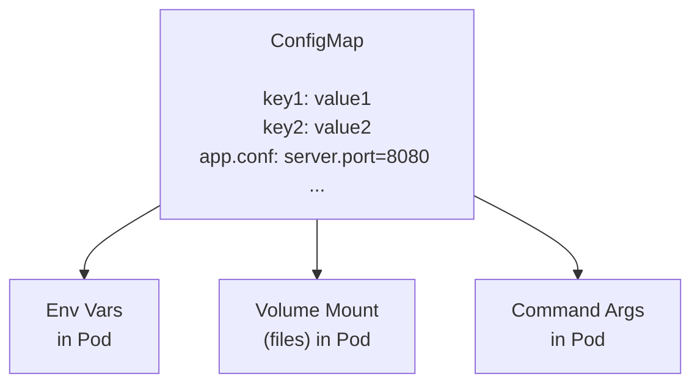

---
tags:
  - kubernetes
  - kubernetes/configuration
topic: Configuration
---

# ConfigMaps

## What is a ConfigMap?

A ConfigMap is a Kubernetes object that stores **non-sensitive configuration data** as key-value pairs. Its primary purpose is to **decouple configuration from container images** — so you can change how your application behaves without rebuilding or redeploying images. Think of it as an external configuration file that Kubernetes manages for you.

Without ConfigMaps, you'd have to bake configuration directly into your container image (hardcoded values, bundled config files) or pass everything through lengthy environment variable lists in your Pod spec. ConfigMaps solve this by letting you define configuration once and inject it into any number of Pods.



## Creating ConfigMaps

### From Literals

```bash
kubectl create configmap app-config \
  --from-literal=DATABASE_HOST=db.example.com \
  --from-literal=DATABASE_PORT=5432 \
  --from-literal=LOG_LEVEL=info
```

### From a File

```bash
# Each file becomes a key (filename) with the file contents as the value
kubectl create configmap nginx-config --from-file=nginx.conf

# Override the key name
kubectl create configmap nginx-config --from-file=my-nginx-config=nginx.conf
```

### From a Directory

```bash
# Every file in the directory becomes a key-value pair
kubectl create configmap app-configs --from-file=./config-dir/
```

### From an Env File

```bash
# .env-style file: KEY=VALUE per line
kubectl create configmap app-config --from-env-file=app.env
```

### From a YAML Manifest (Declarative)

```yaml
apiVersion: v1
kind: ConfigMap
metadata:
  name: app-config
  namespace: default
data:
  # Simple key-value pairs
  DATABASE_HOST: "db.example.com"
  DATABASE_PORT: "5432"
  LOG_LEVEL: "info"

  # Multi-line file content
  app.properties: |
    server.port=8080
    server.host=0.0.0.0
    cache.enabled=true
    cache.ttl=300

  # Another config file
  logging.yaml: |
    level: info
    format: json
    outputs:
      - stdout
      - /var/log/app.log
```

```bash
kubectl apply -f configmap.yaml
```

## ConfigMap YAML Structure

| Field | Purpose |
|---|---|
| `data` | Stores UTF-8 string key-value pairs — use this for most configuration |
| `binaryData` | Stores base64-encoded binary data (e.g., a compiled config file or certificate) |
| `immutable` | When set to `true`, prevents modifications after creation |

`data` and `binaryData` keys cannot overlap — a key can only exist in one or the other.

## Using ConfigMaps

### As Environment Variables (envFrom)

Injects **all** key-value pairs from the ConfigMap as environment variables in the container:

```yaml
apiVersion: v1
kind: Pod
metadata:
  name: app
spec:
  containers:
    - name: app
      image: myapp:1.0
      envFrom:
        - configMapRef:
            name: app-config
```

Every key in `app-config` becomes an environment variable. If a key isn't a valid environment variable name (e.g., contains dots or hyphens), it is silently skipped.

### As Individual Environment Variables (env with valueFrom)

Picks specific keys from one or more ConfigMaps:

```yaml
apiVersion: v1
kind: Pod
metadata:
  name: app
spec:
  containers:
    - name: app
      image: myapp:1.0
      env:
        - name: DB_HOST
          valueFrom:
            configMapKeyRef:
              name: app-config
              key: DATABASE_HOST
        - name: DB_PORT
          valueFrom:
            configMapKeyRef:
              name: app-config
              key: DATABASE_PORT
              optional: true  # Pod starts even if key doesn't exist
```

### As Command-Line Arguments

Combine environment variables with the `command` or `args` field to pass configuration as CLI arguments:

```yaml
apiVersion: v1
kind: Pod
metadata:
  name: app
spec:
  containers:
    - name: app
      image: myapp:1.0
      env:
        - name: LOG_LEVEL
          valueFrom:
            configMapKeyRef:
              name: app-config
              key: LOG_LEVEL
      command: ["./myapp"]
      args: ["--log-level", "$(LOG_LEVEL)"]
```

### As Mounted Volumes (Files)

Each key in the ConfigMap becomes a file in the mounted directory:

```yaml
apiVersion: v1
kind: Pod
metadata:
  name: app
spec:
  containers:
    - name: app
      image: myapp:1.0
      volumeMounts:
        - name: config-volume
          mountPath: /etc/app-config
          readOnly: true
  volumes:
    - name: config-volume
      configMap:
        name: app-config
```

With the example ConfigMap above, the container would see:

```
/etc/app-config/
├── DATABASE_HOST        # contains "db.example.com"
├── DATABASE_PORT        # contains "5432"
├── LOG_LEVEL            # contains "info"
├── app.properties       # contains the multi-line properties content
└── logging.yaml         # contains the multi-line YAML content
```

#### Mounting Specific Keys Only

```yaml
volumes:
  - name: config-volume
    configMap:
      name: app-config
      items:
        - key: app.properties
          path: application.properties  # rename the file
        - key: logging.yaml
          path: logging.yaml
```

This mounts only the two selected keys, ignoring the rest.

#### Setting File Permissions

```yaml
volumes:
  - name: config-volume
    configMap:
      name: app-config
      defaultMode: 0644  # octal file permissions
```

### Mounting to a Specific File (Without Overwriting the Directory)

Using `subPath` mounts a single key as a file without replacing the existing contents of the directory:

```yaml
volumeMounts:
  - name: config-volume
    mountPath: /etc/app-config/app.properties
    subPath: app.properties
```

**Trade-off:** `subPath` mounts do **not** receive automatic updates when the ConfigMap changes.

## Immutable ConfigMaps

```yaml
apiVersion: v1
kind: ConfigMap
metadata:
  name: app-config
immutable: true
data:
  DATABASE_HOST: "db.example.com"
```

Once `immutable: true` is set:

- The `data`, `binaryData`, and `immutable` fields can no longer be changed
- To update the configuration, you must delete and recreate the ConfigMap (or create a new one with a different name)
- Significantly reduces load on the API server because Kubernetes no longer needs to watch for changes

Use immutable ConfigMaps for configuration that should never change at runtime, like feature flags tied to a specific release.

## Size Limit

ConfigMaps are limited to **1 MiB** (1,048,576 bytes) total size for the data stored in `data` and `binaryData` combined. This limit is enforced by the API server and cannot be changed.

If you need more than 1 MiB, consider mounting a volume from a separate storage source or using an init container to fetch the configuration.

## Auto-Update Behavior

How ConfigMap changes propagate depends on how you consume them:

| Consumption Method | Auto-Updates? | Delay |
|---|---|---|
| Volume mount (default) | Yes | kubelet sync period + cache propagation delay (up to ~1 minute by default) |
| Volume mount with `subPath` | **No** | N/A — requires Pod restart |
| Environment variables | **No** | N/A — set once at container start, requires Pod restart |
| Command-line arguments | **No** | N/A — set once at container start, requires Pod restart |

When mounted as a volume (without `subPath`), Kubernetes uses symlinks to atomically swap the files when the ConfigMap is updated. Your application needs to watch for file changes or periodically re-read the config to pick up updates.

## Best Practices

1. **Use descriptive key names** — keys become filenames in volume mounts and environment variable names, so make them meaningful and consistent.

2. **Prefer volume mounts for config files** — this gives you auto-updates and keeps multi-line configurations readable. Use environment variables for simple key-value settings.

3. **Use immutable ConfigMaps when possible** — reduces API server load and prevents accidental configuration drift.

4. **Don't store secrets in ConfigMaps** — ConfigMaps are not encrypted and are visible to anyone with read access. Use Secrets for passwords, tokens, and keys.

5. **Version your ConfigMaps** — when using immutable ConfigMaps, include a version or hash in the name (e.g., `app-config-v2` or `app-config-abc123`) and update the Pod spec to reference the new name. This enables clean rollbacks.

6. **Set `optional: true` for non-critical config** — prevents Pods from failing to start when a ConfigMap key is missing.

7. **Keep ConfigMaps small** — if you're approaching the 1 MiB limit, you're likely storing too much in a single ConfigMap. Split it up or use a different storage mechanism.

8. **Use `envFrom` sparingly** — it imports all keys, which can pollute the environment namespace and make debugging harder. Prefer explicit `env` entries with `valueFrom` for clarity.
