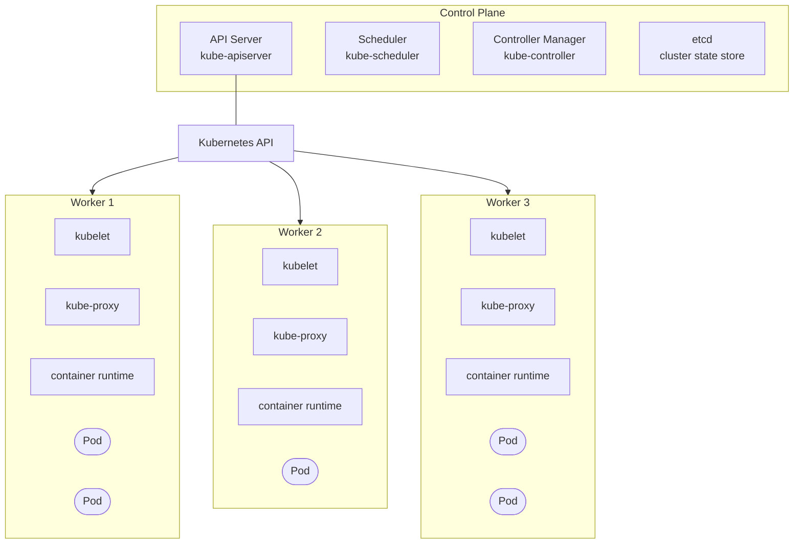
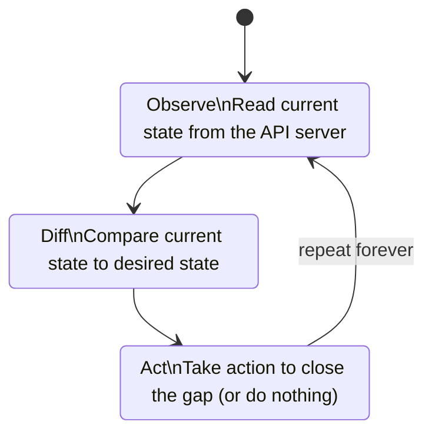

---
tags:
  - kubernetes
  - kubernetes/getting-started
topic: Getting Started
---

# Core Concepts

## What is Kubernetes?

Kubernetes (K8s) is an open-source **container orchestration platform** originally developed by Google and now maintained by the CNCF. It solves the problem of running containers at scale: when you move beyond a handful of containers on a single machine, you need something to handle scheduling, networking, scaling, health checking, and rollouts across a fleet of machines. Kubernetes is that something.

Without an orchestrator, you'd have to manually decide which server runs which container, restart failed containers yourself, configure networking between containers by hand, and coordinate deployments across machines. Kubernetes automates all of this by letting you declare what you want running and continuously working to make reality match your declaration.

## Key Mental Model



The **control plane** makes decisions about the cluster (scheduling, detecting failures, responding to events). **Worker nodes** run your actual application containers inside Pods. All communication goes through the **API Server** — it's the single source of truth.

## Terminology

| Term                   | What it means                                                                                                           |
| ---------------------- | ----------------------------------------------------------------------------------------------------------------------- |
| **Cluster**            | A set of machines (nodes) running Kubernetes — includes the control plane and worker nodes                              |
| **Node**               | A single machine (physical or virtual) in the cluster that runs workloads                                               |
| **Pod**                | The smallest deployable unit — one or more containers that share networking and storage, always co-located              |
| **Service**            | A stable network endpoint that load-balances traffic to a set of Pods (Pods are ephemeral, Services are not)            |
| **Deployment**         | Declares the desired state for a set of Pods — handles rolling updates, rollbacks, and scaling                          |
| **ReplicaSet**         | Ensures a specified number of identical Pods are running at any time (usually managed by a Deployment)                  |
| **Namespace**          | A virtual cluster within a cluster — used to isolate resources between teams or environments                            |
| **ConfigMap**          | Stores non-sensitive configuration data as key-value pairs, injected into Pods as environment variables or files        |
| **Secret**             | Like a ConfigMap but for sensitive data (passwords, tokens, keys) — base64-encoded, not encrypted by default            |
| **Volume**             | A directory accessible to containers in a Pod — decouples storage from the container lifecycle                          |
| **Ingress**            | Manages external HTTP/HTTPS access to Services, typically providing routing rules, TLS termination, and virtual hosting |
| **Label**              | A key-value pair attached to any object — used for identification and grouping (e.g., `app: nginx`, `env: prod`)        |
| **Selector**           | A query that matches objects by their labels (e.g., "give me all Pods where `app=nginx`")                               |
| **Controller**         | A control loop that watches the cluster state and makes changes to move current state toward desired state              |
| **Operator**           | A controller that encodes domain-specific operational knowledge for managing a complex application (e.g., a database)   |
| **Manifest**           | A YAML or JSON file describing a Kubernetes resource — what you `kubectl apply`                                         |
| **kubectl**            | The CLI tool for interacting with the Kubernetes API server                                                             |
| **kubelet**            | An agent on each worker node that ensures containers described in PodSpecs are running and healthy                      |
| **kube-proxy**         | A network proxy on each node that maintains network rules so Pods can communicate inside and outside the cluster        |
| **etcd**               | A distributed key-value store that holds all cluster state and configuration — the control plane's database             |
| **API Server**         | The front door to the control plane — all kubectl commands, internal components, and external integrations talk to it   |
| **Scheduler**          | Decides which node a newly created Pod should run on, based on resource requirements, constraints, and affinity rules   |
| **Controller Manager** | Runs the built-in controllers (Deployment, ReplicaSet, Node, Job, etc.) as a single process                             |
| **Container Runtime**  | The software that actually runs containers on a node (containerd, CRI-O) — Kubernetes talks to it via the CRI           |

## Declarative vs Imperative

Kubernetes strongly favors a **declarative** approach — you describe the desired state in a manifest, and Kubernetes figures out what actions to take to get there. This is the foundation that makes self-healing, scaling, and rolling updates possible.

```yaml
# Declarative (preferred) — describes desired state
# "I want 3 replicas of nginx running"
apiVersion: apps/v1
kind: Deployment
metadata:
  name: nginx
spec:
  replicas: 3
  selector:
    matchLabels:
      app: nginx
  template:
    metadata:
      labels:
        app: nginx
    spec:
      containers:
        - name: nginx
          image: nginx:1.27

# Apply it — Kubernetes determines what changes are needed
# kubectl apply -f nginx-deployment.yaml
```

```bash
# Imperative (quick tasks, not for production workflows)
# "Create this thing right now"
kubectl create deployment nginx --image=nginx:1.27
kubectl scale deployment nginx --replicas=3
```

The declarative approach is preferred because manifests can be version-controlled, reviewed in pull requests, and applied repeatedly without side effects. Imperative commands are useful for one-off debugging and exploration.

## The Reconciliation Loop

Every controller in Kubernetes runs a continuous **reconciliation loop** — also called a control loop. This is the mechanism behind Kubernetes' self-healing behavior:



For example, the Deployment controller watches for Deployment objects. If you declare `replicas: 3` and only 2 Pods exist, it creates one more. If a node dies and a Pod is lost, the controller notices the drift and creates a replacement. You never tell Kubernetes "create a Pod" — you tell it "I want 3 Pods" and it continuously ensures that's true.

## Desired State vs Current State

This distinction is central to everything in Kubernetes:

| | Desired State | Current State |
|---|---|---|
| **Where it lives** | Your manifests (YAML files) and the spec stored in etcd | Reported by kubelets, controllers, and other components |
| **Who sets it** | You (via `kubectl apply` or the API) | Kubernetes observes it from the actual cluster |
| **Example** | `replicas: 3` in a Deployment spec | 2 Pods currently running |
| **What happens on mismatch** | Controllers detect the drift and act to reconcile | A new Pod is scheduled to bring the count to 3 |

When you run `kubectl apply -f deployment.yaml`, you're updating the **desired state** in the API server. Kubernetes doesn't immediately "run" your file — it stores the desired state, and controllers asynchronously reconcile until current state matches. This asynchronous, eventually-consistent model is why Kubernetes is resilient: no single failure prevents the system from converging toward what you asked for.
