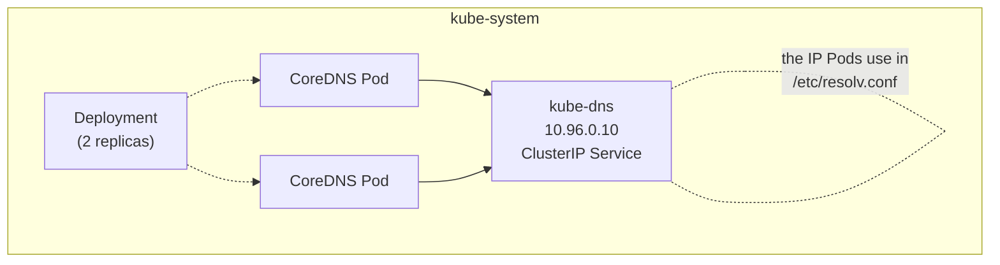

---
tags:
  - kubernetes
  - kubernetes/networking
topic: Networking
---

# DNS

## CoreDNS as the Cluster DNS

Every Kubernetes cluster runs a DNS server — **CoreDNS** — as a Deployment in the `kube-system` namespace. It watches the Kubernetes API for new Services and Pods, then automatically creates DNS records for them.



The kubelet configures each Pod's `/etc/resolv.conf` to point to the `kube-dns` Service IP so that all DNS queries from Pods flow to CoreDNS.

## DNS Records for Services

### ClusterIP Services

For a Service named `my-svc` in namespace `my-ns`:

| Record Type | Name | Value |
|---|---|---|
| A | `my-svc.my-ns.svc.cluster.local` | ClusterIP (e.g., `10.96.0.50`) |
| AAAA | `my-svc.my-ns.svc.cluster.local` | ClusterIP IPv6 (if dual-stack) |
| SRV | `_http._tcp.my-svc.my-ns.svc.cluster.local` | Port and target for each named port |

The general format:

```
<service-name>.<namespace>.svc.<cluster-domain>
```

The default cluster domain is `cluster.local`. In practice, you rarely type the full name:

```bash
# Within the same namespace — just the service name
curl http://my-svc

# Cross-namespace — service.namespace
curl http://my-svc.other-ns

# Fully qualified — needed outside the cluster's search domains
curl http://my-svc.other-ns.svc.cluster.local
```

### ExternalName Services

ExternalName Services return a CNAME record:

```
my-external.my-ns.svc.cluster.local  →  CNAME  →  db.example.com
```

## DNS Records for Pods

Kubernetes can create DNS records for individual Pods, though this is less commonly used than Service DNS.

### By IP Address

Pod DNS records use a dashed form of the Pod IP:

```
<pod-ip-with-dashes>.<namespace>.pod.cluster.local
```

For a Pod with IP `10.244.1.5` in namespace `default`:

```
10-244-1-5.default.pod.cluster.local  →  A  →  10.244.1.5
```

### With hostname and subdomain

If a Pod spec sets `hostname` and `subdomain`, it gets a more readable DNS name:

```yaml
apiVersion: v1
kind: Pod
metadata:
  name: my-pod
  namespace: default
spec:
  hostname: my-host
  subdomain: my-subdomain    # must match a Headless Service name
  containers:
    - name: app
      image: nginx
```

This produces the record:

```
my-host.my-subdomain.default.svc.cluster.local  →  A  →  <Pod IP>
```

## Headless Service DNS Records

A headless Service (`clusterIP: None`) returns **A records for each backing Pod** instead of a single ClusterIP:

```
# Query the headless Service name
cassandra.default.svc.cluster.local
  →  10.244.1.2
  →  10.244.2.5
  →  10.244.1.7
```

When used with a **StatefulSet**, each Pod gets a stable, predictable DNS name:

```
<pod-name>.<service-name>.<namespace>.svc.cluster.local
```

```
cassandra-0.cassandra.default.svc.cluster.local  →  10.244.1.2
cassandra-1.cassandra.default.svc.cluster.local  →  10.244.2.5
cassandra-2.cassandra.default.svc.cluster.local  →  10.244.1.7
```

These records persist even when Pods are rescheduled to different nodes with different IPs — the DNS name stays the same, only the IP changes.

## DNS Policies

The `dnsPolicy` field on a Pod controls how DNS resolution is configured:

| Policy | Behavior | Use case |
|---|---|---|
| **ClusterFirst** (default) | Queries go to CoreDNS first. If the name is outside the cluster domain, CoreDNS forwards to upstream nameservers. | Standard workloads |
| **Default** | Inherits DNS config from the node the Pod runs on. Does **not** use cluster DNS. | Pods that only need to resolve external names |
| **ClusterFirstWithHostNet** | Same as ClusterFirst, but for Pods with `hostNetwork: true`. Without this, host-networked Pods would use `Default`. | Host-networked Pods that need cluster DNS |
| **None** | Kubernetes does not set up DNS at all. You must provide all config via `dnsConfig`. | Full manual control |

```yaml
apiVersion: v1
kind: Pod
metadata:
  name: custom-dns
spec:
  dnsPolicy: ClusterFirst         # default
  containers:
    - name: app
      image: nginx
```

> **Common mistake:** Setting `hostNetwork: true` without changing `dnsPolicy` to `ClusterFirstWithHostNet`. The Pod will silently use node DNS and fail to resolve cluster Service names.

## Custom DNS Configuration

The `dnsConfig` field lets you add or override DNS settings regardless of `dnsPolicy`:

```yaml
apiVersion: v1
kind: Pod
metadata:
  name: custom-dns-pod
spec:
  dnsPolicy: None                       # start from scratch
  dnsConfig:
    nameservers:
      - 10.96.0.10                      # CoreDNS
      - 8.8.8.8                         # fallback
    searches:
      - my-ns.svc.cluster.local
      - svc.cluster.local
      - cluster.local
    options:
      - name: ndots
        value: "5"
      - name: timeout
        value: "3"
      - name: attempts
        value: "2"
      - name: single-request-reopen
  containers:
    - name: app
      image: nginx
```

When `dnsPolicy` is set to something other than `None`, the `dnsConfig` entries are **merged** with the auto-generated config.

## /etc/resolv.conf in Pods

The kubelet generates each Pod's `/etc/resolv.conf` based on the DNS policy. A typical Pod resolv.conf looks like:

```
nameserver 10.96.0.10
search default.svc.cluster.local svc.cluster.local cluster.local
options ndots:5
```

Understanding each line:

| Directive | Meaning |
|---|---|
| `nameserver 10.96.0.10` | The CoreDNS Service ClusterIP |
| `search ...` | Suffixes appended to short names for resolution attempts |
| `ndots:5` | If a query name has fewer than 5 dots, try appending search domains first |

## The ndots Setting and Resolution Performance

The `ndots` option is one of the most impactful — and most misunderstood — DNS settings in Kubernetes.

### How ndots Works

`ndots:5` (the default) means: if the name you are looking up has **fewer than 5 dots**, the resolver first tries appending each search domain before trying the name as-is.

For a query like `api.example.com` (2 dots, which is less than 5):

```
1. api.example.com.default.svc.cluster.local    → NXDOMAIN
2. api.example.com.svc.cluster.local             → NXDOMAIN
3. api.example.com.cluster.local                 → NXDOMAIN
4. api.example.com                               → SUCCESS (finally!)
```

That is **4 DNS queries** (including A and AAAA variants, potentially 8) to resolve a single external name.

### Performance Impact

For workloads that frequently resolve external hostnames, the default `ndots:5` can:

- **Multiply DNS query volume** by 4-8x
- **Increase latency** for external lookups
- **Overload CoreDNS** in high-throughput clusters

### Mitigations

**Option 1:** Lower ndots for Pods that primarily resolve external names:

```yaml
spec:
  dnsConfig:
    options:
      - name: ndots
        value: "2"
```

**Option 2:** Use fully qualified domain names (trailing dot) in application config:

```
# The trailing dot tells the resolver "this is absolute, don't append search domains"
api.example.com.
```

**Option 3:** Keep `ndots:5` (safest for cluster-internal resolution) and accept the overhead. For most workloads, the extra DNS queries are negligible.

> **Rule of thumb:** If your application mostly talks to other cluster Services, keep `ndots:5`. If it mostly talks to external APIs, consider lowering it to `2` or `3`.

## Debugging DNS Issues

### Quick Diagnostic Steps

Spin up a debugging Pod with DNS tools:

```bash
kubectl run dns-debug --image=busybox:1.36 --rm -it --restart=Never -- sh
# or for more tools:
kubectl run dns-debug --image=nicolaka/netshoot --rm -it --restart=Never -- bash
```

### Common Commands

```bash
# Check if CoreDNS is running
kubectl get pods -n kube-system -l k8s-app=kube-dns

# Resolve a cluster Service
nslookup my-svc.my-ns.svc.cluster.local

# Detailed DNS query
dig my-svc.my-ns.svc.cluster.local

# Check what nameserver the Pod is using
cat /etc/resolv.conf

# Test external resolution
nslookup google.com

# Check CoreDNS logs for errors
kubectl logs -n kube-system -l k8s-app=kube-dns --tail=100
```

### Common DNS Problems

| Symptom | Likely Cause | Fix |
|---|---|---|
| All DNS queries fail | CoreDNS Pods are down or `kube-dns` Service is misconfigured | Check CoreDNS Deployment and Service in `kube-system` |
| Cluster names fail, external works | Search domains or `ndots` misconfigured | Inspect Pod's `/etc/resolv.conf` |
| Intermittent failures | CoreDNS overloaded or conntrack table full | Scale CoreDNS, check `conntrack` limits |
| Slow resolution | High `ndots` causing unnecessary search domain queries | Lower `ndots` or use FQDNs with trailing dot |
| `hostNetwork: true` Pod cannot resolve Services | Using `Default` DNS policy instead of `ClusterFirstWithHostNet` | Set `dnsPolicy: ClusterFirstWithHostNet` |
| Resolution works for some namespaces but not others | NetworkPolicy blocking DNS traffic to `kube-system` | Allow egress to `kube-dns` on port 53 (TCP and UDP) |

### CoreDNS Corefile

CoreDNS is configured via a ConfigMap in `kube-system`:

```bash
kubectl get configmap coredns -n kube-system -o yaml
```

A typical Corefile:

```
.:53 {
    errors
    health {
        lameduck 5s
    }
    ready
    kubernetes cluster.local in-addr.arpa ip6.arpa {
        pods insecure
        fallthrough in-addr.arpa ip6.arpa
        ttl 30
    }
    prometheus :9153
    forward . /etc/resolv.conf {
        max_concurrent 1000
    }
    cache 30
    loop
    reload
    loadbalance
}
```

Key plugins:

| Plugin | Purpose |
|---|---|
| `kubernetes` | Serves DNS records for cluster Services and Pods |
| `forward` | Forwards non-cluster queries to upstream DNS |
| `cache` | Caches responses (default 30 seconds) |
| `loop` | Detects and breaks forwarding loops |
| `health` / `ready` | Liveness and readiness probes for the CoreDNS Pod |
| `prometheus` | Exposes DNS metrics on port 9153 |
