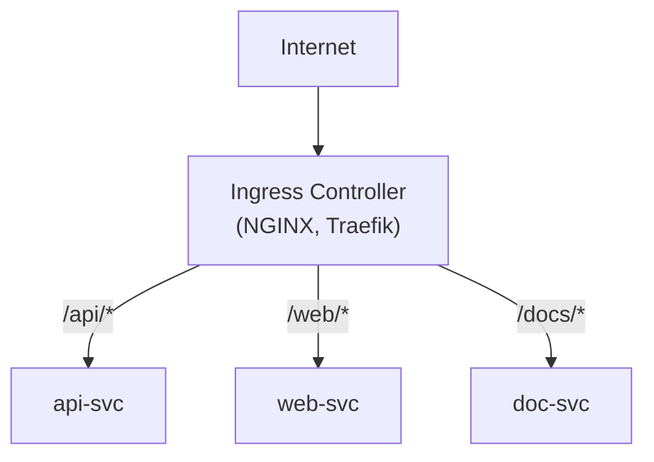
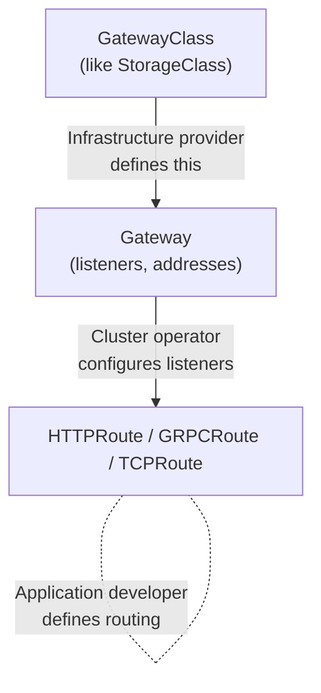

---
tags:
  - kubernetes
  - kubernetes/networking
topic: Networking
---

# Ingress

## What is Ingress?

An Ingress is a Kubernetes API object that manages **external HTTP and HTTPS access to Services** within the cluster. It provides URL-based routing, SSL/TLS termination, and name-based virtual hosting — capabilities that a plain LoadBalancer Service cannot offer.



## Ingress vs LoadBalancer Services

| Feature | LoadBalancer Service | Ingress |
|---|---|---|
| Layer | L4 (TCP/UDP) | L7 (HTTP/HTTPS) |
| Routing | One Service per LB | Many Services behind one entry point |
| TLS termination | Must handle in the app or use a sidecar | Built-in via TLS secrets |
| Path-based routing | Not supported | Supported |
| Host-based routing | Not supported | Supported |
| Cost | One cloud LB per Service | One cloud LB for many Services |
| Protocol support | Any TCP/UDP | HTTP and HTTPS |

In most production deployments, a single Ingress Controller sits behind one LoadBalancer Service and routes all HTTP traffic.

## Ingress Controllers

An Ingress resource does nothing on its own — you need an **Ingress Controller** to watch for Ingress objects and configure the underlying proxy. The controller is not installed by default.

| Controller | Maintained by | Notes |
|---|---|---|
| **ingress-nginx** | Kubernetes community | Most widely used, battle-tested |
| **Traefik** | Traefik Labs | Auto-discovery, built-in dashboard, Let's Encrypt integration |
| **HAProxy Ingress** | HAProxy | High-performance, advanced load balancing |
| **AWS ALB Ingress Controller** | AWS | Provisions AWS Application Load Balancers |
| **GCE Ingress** | Google | Default on GKE, provisions Google Cloud Load Balancers |
| **Azure Application Gateway** | Microsoft | Integrates with Azure AGIC |
| **Istio Gateway** | Istio project | Part of the Istio service mesh |
| **Contour** | VMware | Built on Envoy proxy |
| **Emissary-ingress** | Ambassador Labs | Built on Envoy, API gateway features |

## Ingress Resource YAML

A complete Ingress resource with common fields:

```yaml
apiVersion: networking.k8s.io/v1
kind: Ingress
metadata:
  name: app-ingress
  namespace: production
  annotations:
    nginx.ingress.kubernetes.io/rewrite-target: /
    nginx.ingress.kubernetes.io/ssl-redirect: "true"
spec:
  ingressClassName: nginx                  # which controller handles this
  tls:
    - hosts:
        - app.example.com
        - api.example.com
      secretName: app-tls-secret           # TLS certificate Secret
  defaultBackend:
    service:
      name: default-svc
      port:
        number: 80
  rules:
    - host: app.example.com
      http:
        paths:
          - path: /
            pathType: Prefix
            backend:
              service:
                name: frontend
                port:
                  number: 80
          - path: /api
            pathType: Prefix
            backend:
              service:
                name: api-service
                port:
                  number: 8080
    - host: api.example.com
      http:
        paths:
          - path: /
            pathType: Prefix
            backend:
              service:
                name: api-service
                port:
                  number: 8080
```

## Path Types

Every path in an Ingress rule must specify a `pathType`:

| Path Type | Matching Behavior | Example path `/foo` matches |
|---|---|---|
| **Exact** | Matches the URL path exactly (case-sensitive) | `/foo` only — not `/foo/` or `/foo/bar` |
| **Prefix** | Matches based on a URL path prefix split by `/` | `/foo`, `/foo/`, `/foo/bar` |
| **ImplementationSpecific** | Matching depends on the IngressClass/controller | Varies by controller |

Prefix matching rules:

```
Path: /aaa/bbb

/aaa/bbb        ✓  matches
/aaa/bbb/       ✓  matches
/aaa/bbb/ccc    ✓  matches
/aaa/bbbxyz     ✗  does not match (not a segment boundary)
```

When multiple paths match, the **longest matching path** takes priority. If both paths are equal length, **Exact** takes priority over **Prefix**.

## Host-Based Routing

Route traffic based on the `Host` HTTP header. Each rule can specify a different hostname:

```yaml
spec:
  rules:
    - host: shop.example.com
      http:
        paths:
          - path: /
            pathType: Prefix
            backend:
              service:
                name: shop-svc
                port:
                  number: 80
    - host: blog.example.com
      http:
        paths:
          - path: /
            pathType: Prefix
            backend:
              service:
                name: blog-svc
                port:
                  number: 80
```

Wildcard hosts are supported with a leading `*`:

```yaml
- host: "*.example.com"    # matches foo.example.com, bar.example.com
```

A rule without a `host` field matches all inbound HTTP traffic that does not match any other rule.

## Path-Based Routing

Route different URL paths to different backend Services under the same host:

```yaml
spec:
  rules:
    - host: app.example.com
      http:
        paths:
          - path: /
            pathType: Prefix
            backend:
              service:
                name: frontend
                port:
                  number: 80
          - path: /api/v1
            pathType: Prefix
            backend:
              service:
                name: api-v1
                port:
                  number: 8080
          - path: /api/v2
            pathType: Prefix
            backend:
              service:
                name: api-v2
                port:
                  number: 8080
          - path: /healthz
            pathType: Exact
            backend:
              service:
                name: health-svc
                port:
                  number: 8081
```

## TLS Termination

Ingress can terminate TLS using a Kubernetes Secret containing the certificate and private key:

```bash
# Create the TLS secret from cert files
kubectl create secret tls app-tls-secret \
  --cert=tls.crt \
  --key=tls.key \
  -n production
```

The Secret structure:

```yaml
apiVersion: v1
kind: Secret
metadata:
  name: app-tls-secret
  namespace: production
type: kubernetes.io/tls
data:
  tls.crt: <base64-encoded certificate>
  tls.key: <base64-encoded private key>
```

Reference it in the Ingress:

```yaml
spec:
  tls:
    - hosts:
        - app.example.com           # must match a host in rules
        - "*.example.com"           # can cover wildcards
      secretName: app-tls-secret
  rules:
    - host: app.example.com
      http:
        paths:
          - path: /
            pathType: Prefix
            backend:
              service:
                name: frontend
                port:
                  number: 80
```

> **Note:** TLS termination happens at the Ingress Controller. Traffic between the controller and backend Services travels unencrypted by default unless you configure backend TLS separately.

## Default Backend

The default backend handles requests that do not match any rule. It is specified at the Ingress `spec` level:

```yaml
spec:
  defaultBackend:
    service:
      name: default-404-svc
      port:
        number: 80
```

If no `defaultBackend` is set and no rule matches, the behavior depends on the Ingress Controller — most return a 404 page.

A **minimal Ingress** with only a default backend (no rules) sends all traffic to one Service:

```yaml
apiVersion: networking.k8s.io/v1
kind: Ingress
metadata:
  name: catch-all
spec:
  ingressClassName: nginx
  defaultBackend:
    service:
      name: my-service
      port:
        number: 80
```

## IngressClass

An **IngressClass** resource binds an Ingress to a specific controller. This is how clusters with multiple Ingress Controllers distinguish which controller should handle which Ingress.

```yaml
apiVersion: networking.k8s.io/v1
kind: IngressClass
metadata:
  name: nginx
  annotations:
    ingressclass.kubernetes.io/is-default-class: "true"    # mark as cluster default
spec:
  controller: k8s.io/ingress-nginx
  parameters:
    apiGroup: k8s.example.net
    kind: IngressParameters
    name: external-lb
```

Reference it in an Ingress:

```yaml
spec:
  ingressClassName: nginx
```

If a cluster has a default IngressClass (via the annotation) and the Ingress does not specify `ingressClassName`, the default controller picks it up.

## Common Annotations

Annotations are controller-specific. Below are widely used ones for **ingress-nginx**:

| Annotation | Purpose | Example value |
|---|---|---|
| `nginx.ingress.kubernetes.io/rewrite-target` | Rewrite the URL path before forwarding | `/` |
| `nginx.ingress.kubernetes.io/ssl-redirect` | Force HTTPS redirect | `"true"` |
| `nginx.ingress.kubernetes.io/proxy-body-size` | Max request body size | `"50m"` |
| `nginx.ingress.kubernetes.io/proxy-read-timeout` | Backend read timeout in seconds | `"120"` |
| `nginx.ingress.kubernetes.io/proxy-send-timeout` | Backend send timeout in seconds | `"120"` |
| `nginx.ingress.kubernetes.io/use-regex` | Enable regex in path matching | `"true"` |
| `nginx.ingress.kubernetes.io/cors-allow-origin` | CORS allowed origins | `"https://example.com"` |
| `nginx.ingress.kubernetes.io/limit-rps` | Rate limit requests per second per IP | `"10"` |
| `nginx.ingress.kubernetes.io/affinity` | Enable session affinity | `"cookie"` |
| `nginx.ingress.kubernetes.io/auth-type` | Basic or digest authentication | `"basic"` |
| `nginx.ingress.kubernetes.io/canary` | Enable canary deployment routing | `"true"` |
| `cert-manager.io/cluster-issuer` | Automatic TLS via cert-manager | `"letsencrypt-prod"` |

### Rewrite Example

Route `/api/users` to the backend as `/users`:

```yaml
metadata:
  annotations:
    nginx.ingress.kubernetes.io/rewrite-target: /$2
spec:
  rules:
    - host: app.example.com
      http:
        paths:
          - path: /api(/|$)(.*)
            pathType: ImplementationSpecific
            backend:
              service:
                name: api-svc
                port:
                  number: 80
```

## Gateway API — The Successor to Ingress

The **Gateway API** is a collection of newer Kubernetes resources (`Gateway`, `HTTPRoute`, `GRPCRoute`, `TCPRoute`, etc.) designed to replace and extend Ingress. It is now GA for HTTP routing.

### Why Gateway API Over Ingress

| Aspect | Ingress | Gateway API |
|---|---|---|
| Protocol support | HTTP/HTTPS only | HTTP, HTTPS, gRPC, TCP, UDP, TLS |
| Role separation | Single resource, one persona | Split across `GatewayClass`, `Gateway`, `*Route` for infra and app teams |
| Expressiveness | Limited — relies on annotations | Rich matching (headers, methods, query params) built into the spec |
| Portability | Controller annotations are not portable | Standardized fields across implementations |
| Traffic splitting | Not built-in | Native weighted traffic splitting |
| Header manipulation | Annotation-dependent | Built-in request/response header filters |

### Gateway API Resource Model



### Basic HTTPRoute Example

```yaml
apiVersion: gateway.networking.k8s.io/v1
kind: HTTPRoute
metadata:
  name: app-route
spec:
  parentRefs:
    - name: my-gateway
  hostnames:
    - "app.example.com"
  rules:
    - matches:
        - path:
            type: PathPrefix
            value: /api
          headers:
            - name: X-Version
              value: v2
      backendRefs:
        - name: api-v2
          port: 8080
          weight: 90
        - name: api-v3
          port: 8080
          weight: 10
    - matches:
        - path:
            type: PathPrefix
            value: /
      backendRefs:
        - name: frontend
          port: 80
```

> **Recommendation:** For new clusters and greenfield projects, prefer the Gateway API over Ingress. Existing Ingress configurations continue to work and most controllers support both.
