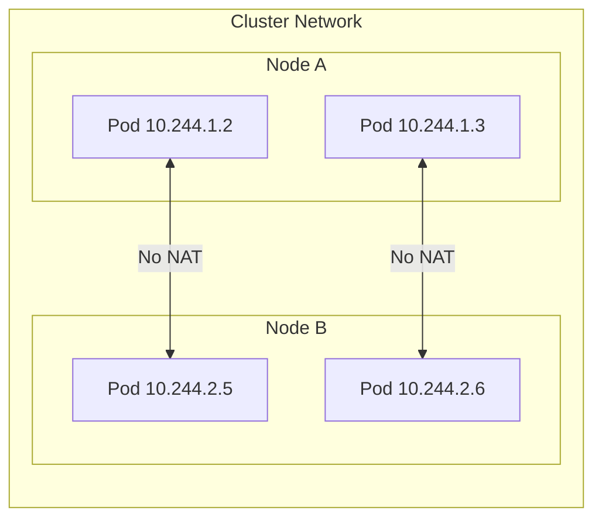
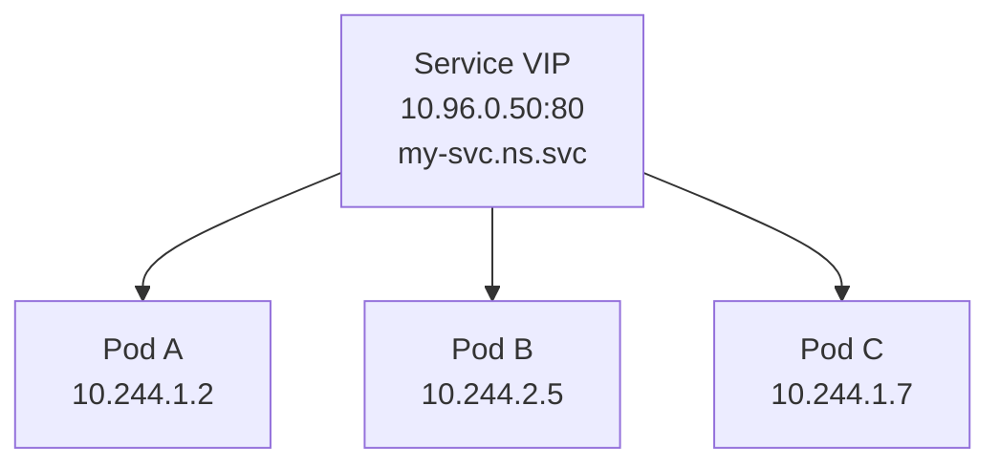

---
tags:
  - kubernetes
  - kubernetes/networking
topic: Networking
---

# Services

## The Kubernetes Networking Model

Kubernetes imposes a few fundamental rules on the cluster network:

1. **Every Pod gets its own IP address** — no need to create links between Pods or map container ports to host ports.
2. **Pods can communicate with all other Pods without NAT** — regardless of which node they land on.
3. **Agents on a node can communicate with all Pods on that node.**



This flat network is implemented by a **CNI plugin** (Calico, Cilium, Flannel, etc.). The plugin assigns IPs from a Pod CIDR range and sets up routes so traffic flows between nodes.

## Why Services Exist

Pods are **ephemeral**. A Deployment may scale up, scale down, or replace Pods at any time, and each new Pod receives a new IP address. If your frontend Pods connect to backend Pods by IP, every replacement breaks the connection.

A **Service** provides a stable virtual IP (the *ClusterIP*) and DNS name that routes traffic to a set of backing Pods. It acts as an internal load balancer that tracks which Pods are healthy and ready to serve.



## Service Types

| Type | Scope | How it works | Use case |
|---|---|---|---|
| **ClusterIP** (default) | Internal only | Assigns a virtual IP reachable only from within the cluster | Service-to-service communication |
| **NodePort** | External via node IP | Exposes the Service on a static port (30000-32767) on every node's IP | Development, simple external access |
| **LoadBalancer** | External via cloud LB | Provisions a cloud provider's load balancer that forwards to the Service | Production external traffic on cloud |
| **ExternalName** | DNS alias | Returns a CNAME record pointing to an external hostname — no proxying | Mapping to external services (RDS, SaaS) |

### ClusterIP

The default type. Kubernetes assigns a virtual IP from the Service CIDR range. Only reachable from within the cluster.

```yaml
apiVersion: v1
kind: Service
metadata:
  name: backend
  namespace: production
spec:
  type: ClusterIP          # default — can be omitted
  selector:
    app: backend
    tier: api
  ports:
    - name: http
      protocol: TCP
      port: 80              # port the Service listens on
      targetPort: 8080      # port the container listens on
    - name: grpc
      protocol: TCP
      port: 9090
      targetPort: 9090
```

### NodePort

Extends ClusterIP by opening a port on every node. External traffic hitting `<NodeIP>:<NodePort>` is forwarded to the Service.

```yaml
apiVersion: v1
kind: Service
metadata:
  name: frontend
spec:
  type: NodePort
  selector:
    app: frontend
  ports:
    - name: http
      protocol: TCP
      port: 80
      targetPort: 3000
      nodePort: 30080       # optional — Kubernetes assigns one from 30000-32767 if omitted
```

Traffic flow:

```
Client ──► NodeIP:30080 ──► ClusterIP:80 ──► Pod:3000
```

### LoadBalancer

Extends NodePort by provisioning an external load balancer through the cloud provider's controller. The LB gets a public IP and forwards traffic to the NodePorts.

```yaml
apiVersion: v1
kind: Service
metadata:
  name: web
  annotations:
    # Cloud-specific annotations control LB behavior
    service.beta.kubernetes.io/aws-load-balancer-type: "nlb"
spec:
  type: LoadBalancer
  selector:
    app: web
  ports:
    - name: http
      protocol: TCP
      port: 80
      targetPort: 8080
    - name: https
      protocol: TCP
      port: 443
      targetPort: 8443
  # Optionally restrict which IPs can reach the LB
  loadBalancerSourceRanges:
    - 203.0.113.0/24
```

Traffic flow:

```
Client ──► External LB IP:80 ──► NodeIP:NodePort ──► Pod:8080
```

### ExternalName

Maps a Service to a DNS CNAME. No proxying, no ClusterIP, no selectors — just DNS resolution.

```yaml
apiVersion: v1
kind: Service
metadata:
  name: my-database
spec:
  type: ExternalName
  externalName: db.example.com    # must be a valid DNS name, not an IP
```

When a Pod resolves `my-database.default.svc.cluster.local`, it receives a CNAME pointing to `db.example.com`. This is useful for giving an in-cluster DNS name to an external resource without hard-coding the hostname in application config.

> **Caveat:** ExternalName Services do not support ports, selectors, or endpoints. Some older clients have issues following CNAME records.

## Label Selectors and Endpoints

A Service finds its backing Pods through a **label selector**. Kubernetes watches for Pods matching the selector and automatically maintains an **Endpoints** (or **EndpointSlice**) object with their IPs.

```yaml
# Service
spec:
  selector:
    app: api
    version: v2
```

```yaml
# Matching Pod labels
metadata:
  labels:
    app: api
    version: v2
```

You can inspect the generated Endpoints:

```bash
kubectl get endpoints backend
kubectl get endpointslices -l kubernetes.io/service-name=backend
```

**Services without selectors** — you can create a Service and manage its Endpoints manually. This is useful for proxying to external IPs or resources outside the cluster:

```yaml
apiVersion: v1
kind: Service
metadata:
  name: external-db
spec:
  ports:
    - port: 5432
---
apiVersion: v1
kind: Endpoints
metadata:
  name: external-db        # must match the Service name
subsets:
  - addresses:
      - ip: 192.168.1.100
      - ip: 192.168.1.101
    ports:
      - port: 5432
```

## Service Discovery

Kubernetes offers two mechanisms for Pods to find Services.

### DNS (Recommended)

CoreDNS runs as a cluster add-on and creates DNS records for every Service:

| Record | Format | Example |
|---|---|---|
| A/AAAA record | `<service>.<namespace>.svc.cluster.local` | `backend.production.svc.cluster.local` |
| SRV record | `_<port-name>._<protocol>.<service>.<namespace>.svc.cluster.local` | `_http._tcp.backend.production.svc.cluster.local` |

Within the same namespace, you can use just the Service name:

```bash
curl http://backend        # same namespace
curl http://backend.production   # cross-namespace (short form)
curl http://backend.production.svc.cluster.local   # fully qualified
```

### Environment Variables

When a Pod starts, the kubelet injects environment variables for each active Service in the same namespace:

```bash
BACKEND_SERVICE_HOST=10.96.0.50
BACKEND_SERVICE_PORT=80
BACKEND_PORT=tcp://10.96.0.50:80
BACKEND_PORT_80_TCP=tcp://10.96.0.50:80
BACKEND_PORT_80_TCP_ADDR=10.96.0.50
BACKEND_PORT_80_TCP_PORT=80
BACKEND_PORT_80_TCP_PROTO=tcp
```

> **Limitation:** Environment variables are set at Pod creation time. If a Service is created *after* the Pod starts, the Pod will not have the variables. DNS does not have this problem.

## Headless Services

Setting `clusterIP: None` creates a **headless Service**. Kubernetes does not allocate a virtual IP and does not proxy traffic. Instead, DNS returns the individual Pod IPs directly.

```yaml
apiVersion: v1
kind: Service
metadata:
  name: cassandra
spec:
  clusterIP: None
  selector:
    app: cassandra
  ports:
    - port: 9042
```

DNS behavior for headless Services:

```
# A query for the Service returns all Pod IPs
cassandra.default.svc.cluster.local  →  10.244.1.2, 10.244.2.5, 10.244.1.7

# Each Pod in a StatefulSet also gets a stable DNS name
cassandra-0.cassandra.default.svc.cluster.local  →  10.244.1.2
cassandra-1.cassandra.default.svc.cluster.local  →  10.244.2.5
```

Headless Services are commonly used with **StatefulSets** where clients need to connect to specific Pods (databases, message brokers).

## Session Affinity

By default, kube-proxy distributes traffic randomly across endpoints. To pin a client to the same Pod, enable session affinity:

```yaml
apiVersion: v1
kind: Service
metadata:
  name: sticky-service
spec:
  selector:
    app: web
  sessionAffinity: ClientIP
  sessionAffinityConfig:
    clientIP:
      timeoutSeconds: 3600    # how long the affinity lasts (default: 10800 = 3h)
  ports:
    - port: 80
      targetPort: 8080
```

Only `ClientIP` is supported as an affinity type. All connections from the same source IP will be routed to the same Pod for the configured timeout.

## ExternalIPs

You can expose a Service on specific IPs that route to cluster nodes. Traffic arriving on any node at the external IP and Service port is routed to the endpoints.

```yaml
apiVersion: v1
kind: Service
metadata:
  name: web
spec:
  selector:
    app: web
  ports:
    - port: 80
      targetPort: 8080
  externalIPs:
    - 203.0.113.10
    - 203.0.113.11
```

> **Warning:** Kubernetes does not manage these IPs. You are responsible for ensuring traffic for those IPs actually reaches a cluster node. This is primarily useful in bare-metal environments with static IPs.

## Service Topology and Traffic Routing

### Internal and External Traffic Policies

Control how traffic is routed to endpoints:

```yaml
spec:
  # How external traffic (NodePort, LoadBalancer) is routed
  externalTrafficPolicy: Local    # or Cluster (default)

  # How internal traffic (ClusterIP) is routed
  internalTrafficPolicy: Cluster  # or Local
```

| Policy | Behavior | Trade-off |
|---|---|---|
| `Cluster` (default) | Traffic may route to Pods on any node | Even load distribution, extra network hop |
| `Local` | Traffic only routes to Pods on the receiving node | Preserves source IP, avoids cross-node hops, but uneven distribution |

### Topology Aware Routing

Topology Aware Routing (replacing the deprecated Topology Keys feature) prefers routing traffic to endpoints in the same zone to reduce latency and cross-zone costs:

```yaml
apiVersion: v1
kind: Service
metadata:
  name: backend
  annotations:
    service.kubernetes.io/topology-mode: Auto
spec:
  selector:
    app: backend
  ports:
    - port: 80
```

When set to `Auto`, kube-proxy allocates endpoints proportionally to the number of nodes in each zone. Traffic originating in a zone preferentially stays in that zone as long as capacity is sufficient.
