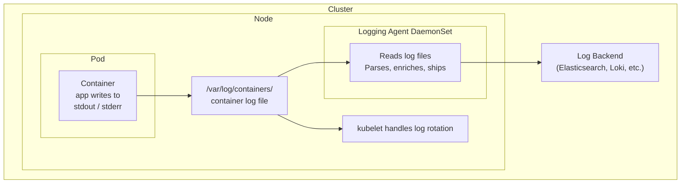
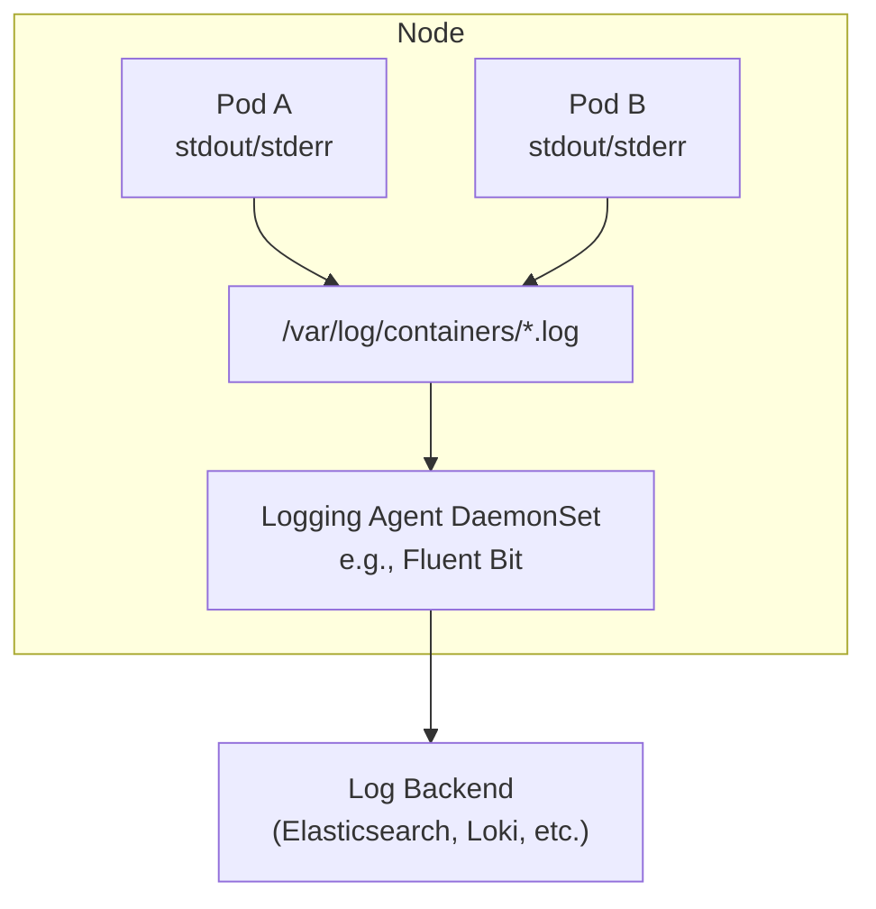

---
tags:
  - kubernetes
  - kubernetes/observability
topic: Observability
---

# Logging

## Kubernetes Logging Architecture

Kubernetes itself does not provide a built-in log aggregation solution. Instead, it provides primitives that you build upon. Understanding the architecture helps you choose the right logging strategy.



### How container logs work

1. The container runtime captures everything a container writes to **stdout** and **stderr**
2. The runtime writes these streams to log files on the node (typically under `/var/log/containers/`)
3. The files are symlinks pointing to `/var/log/pods/<namespace>_<pod>_<uid>/<container>/` and ultimately to the runtime's storage
4. `kubectl logs` reads these files through the kubelet API

This means your application should **write logs to stdout/stderr** rather than to files inside the container. This is the standard convention in containerized environments and is what the entire Kubernetes logging ecosystem expects.

## kubectl logs Commands

`kubectl logs` is the primary tool for viewing container logs during development and debugging.

### Basic usage

```bash
# Logs from a Pod (single container)
kubectl logs my-pod

# Logs from a specific container in a multi-container Pod
kubectl logs my-pod -c sidecar

# Logs from the previous instance of a container (after a restart)
kubectl logs my-pod --previous
kubectl logs my-pod -p
```

### Filtering and following

```bash
# Stream logs in real time
kubectl logs my-pod -f
kubectl logs my-pod --follow

# Show only the last N lines
kubectl logs my-pod --tail=100

# Show logs from the last hour
kubectl logs my-pod --since=1h

# Show logs since a specific time
kubectl logs my-pod --since-time="2026-03-26T10:00:00Z"

# Combine: follow the last 50 lines
kubectl logs my-pod --tail=50 -f
```

### Multi-container and multi-Pod

```bash
# Logs from all containers in a Pod
kubectl logs my-pod --all-containers=true

# Logs from all Pods matching a label selector
kubectl logs -l app=nginx

# Logs from all Pods in a Deployment (via label)
kubectl logs -l app=nginx --all-containers=true --tail=100

# Logs from a specific container in a Job
kubectl logs job/my-job -c worker
```

### Common flags summary

| Flag | Short | Description |
|---|---|---|
| `--follow` | `-f` | Stream logs in real time |
| `--previous` | `-p` | Logs from the previous container instance |
| `--tail=N` | | Show last N lines (default: all) |
| `--since=duration` | | Logs newer than a duration (e.g., `5m`, `1h`, `24h`) |
| `--since-time=timestamp` | | Logs newer than an RFC3339 timestamp |
| `--all-containers` | | Show logs from all containers in the Pod |
| `-c container` | | Target a specific container |
| `--timestamps` | | Prepend each line with a timestamp |
| `--prefix` | | Prepend each line with the Pod and container name (useful with `-l`) |

## Node-Level Log Rotation

The kubelet manages log rotation for container logs to prevent them from consuming all disk space on a node.

Key configuration flags on the kubelet:

| Flag | Default | Description |
|---|---|---|
| `--container-log-max-size` | `10Mi` | Maximum size of a container log file before rotation |
| `--container-log-max-files` | `5` | Maximum number of rotated log files to keep per container |

When a log file reaches the max size, it is rotated (renamed with a numeric suffix) and a new file is created. Older files beyond the max count are deleted.

System component logs (kubelet, kube-proxy, container runtime) are managed by the node's system logging facility (systemd/journald on most Linux distributions) and are separate from container logs.

## Cluster-Level Logging Patterns

`kubectl logs` and node-level files are useful for debugging, but they have limits: logs are lost when a node dies, there's no cross-pod search, and no long-term retention. Cluster-level logging solves these problems.

Kubernetes recommends four patterns:

### Pattern 1: Node-Level Logging Agent (DaemonSet)

The most common and recommended approach. A logging agent runs as a DaemonSet on every node, reads log files from `/var/log/containers/`, and ships them to a backend.



**Pros:** No application changes needed. Low resource overhead per node. Works for all Pods automatically.

**Cons:** Only captures stdout/stderr. Cannot capture logs written to files inside containers.

**Common agents:** Fluent Bit (lightweight, recommended), Fluentd (more plugins, heavier), Filebeat, Vector.

### Pattern 2: Sidecar Container Streaming to stdout

For applications that write logs to files instead of stdout, add a sidecar container that tails those files and writes them to its own stdout. This feeds them back into the standard logging pipeline.

```yaml
apiVersion: v1
kind: Pod
metadata:
  name: app-with-sidecar-streaming
spec:
  containers:
    - name: app
      image: registry.example.com/legacy-app:1.0
      volumeMounts:
        - name: log-volume
          mountPath: /var/log/app
    - name: log-streamer
      image: busybox:1.36
      args:
        - /bin/sh
        - -c
        - tail -F /var/log/app/application.log
      volumeMounts:
        - name: log-volume
          mountPath: /var/log/app
          readOnly: true
  volumes:
    - name: log-volume
      emptyDir: {}
```

**Pros:** Works with applications that can't log to stdout. Logs appear in `kubectl logs` for the sidecar container.

**Cons:** Doubles the log storage on the node (file + stdout). Extra container per Pod increases resource usage.

### Pattern 3: Sidecar Container with Logging Agent

Instead of streaming to stdout, the sidecar runs a logging agent that reads the file and ships directly to the backend. This avoids the double-write problem.

```yaml
apiVersion: v1
kind: Pod
metadata:
  name: app-with-agent-sidecar
spec:
  containers:
    - name: app
      image: registry.example.com/legacy-app:1.0
      volumeMounts:
        - name: log-volume
          mountPath: /var/log/app
    - name: log-agent
      image: fluent/fluent-bit:latest
      volumeMounts:
        - name: log-volume
          mountPath: /var/log/app
          readOnly: true
        - name: fluent-bit-config
          mountPath: /fluent-bit/etc
  volumes:
    - name: log-volume
      emptyDir: {}
    - name: fluent-bit-config
      configMap:
        name: fluent-bit-sidecar-config
```

**Pros:** Flexible — can parse, filter, and route logs before shipping. Doesn't double-write to node logs.

**Cons:** More resource usage per Pod. Configuration management for each sidecar. Logs not visible in `kubectl logs`.

### Pattern 4: Direct Push from Application

The application itself sends logs directly to a backend using a logging library (e.g., sending structured JSON to an HTTP endpoint, or using a Loki/Elasticsearch client library).

**Pros:** Full control over log format and destination. No extra containers.

**Cons:** Application is coupled to the logging infrastructure. Each application needs the logging library configured. Logs not visible in `kubectl logs`. Hard to standardize across teams.

### Choosing a pattern

| Pattern | Use when |
|---|---|
| Node-level agent (DaemonSet) | Default choice — works for most workloads logging to stdout |
| Sidecar streaming | Legacy apps that write to files; you want `kubectl logs` to work |
| Sidecar agent | Need per-pod log routing or transformation; can't modify the app |
| Direct push | You need absolute control and accept the coupling trade-off |

Most production clusters use **Pattern 1** (DaemonSet) as the baseline and add **Pattern 2 or 3** only for specific workloads that need it.

## Log Aggregation Tools

### EFK Stack: Elasticsearch + Fluentd + Kibana

The traditional Kubernetes logging stack:

```
  Fluentd/Fluent Bit (DaemonSet)
         │
         │ ships logs
         ▼
  Elasticsearch (StatefulSet)
         │
         │ indexed, searchable
         ▼
  Kibana (Deployment)
    web UI for search and visualization
```

| Component | Role | Notes |
|---|---|---|
| **Fluentd / Fluent Bit** | Collects, parses, and ships logs | Fluent Bit is lighter; Fluentd has more plugins |
| **Elasticsearch** | Stores and indexes logs | Resource-heavy; needs careful capacity planning |
| **Kibana** | Web UI for searching and visualizing logs | Powerful but complex query language (KQL) |

**Trade-offs:** Powerful and mature, but Elasticsearch is resource-hungry and operationally complex. Clusters often spend more compute on logging infrastructure than on the workloads they monitor.

### Loki + Grafana

A newer, lighter-weight alternative built by Grafana Labs:

```
  Promtail / Fluent Bit (DaemonSet)
         │
         │ ships logs with labels
         ▼
  Loki (StatefulSet)
         │
         │ log streams indexed by labels only
         ▼
  Grafana (Deployment)
    web UI — same dashboards as metrics
```

| Component | Role | Notes |
|---|---|---|
| **Promtail** | Collects and labels logs | Lightweight agent built for Loki |
| **Loki** | Stores logs, indexes only labels (not full text) | Much cheaper to run than Elasticsearch |
| **Grafana** | Unified UI for logs and metrics | LogQL query language, correlate logs with metrics |

**Trade-offs:** Much cheaper storage and simpler operations than EFK. Trade-off is slower full-text search since Loki doesn't index log content — it scans chunks filtered by label. Ideal when you already use Prometheus + Grafana for metrics.

## Audit Logging

The Kubernetes API server can log every request it receives. Audit logs answer the question: **who did what, when, and to which resource?**

### Audit stages

Each API request passes through these stages:

| Stage | When |
|---|---|
| `RequestReceived` | When the request is first received, before processing |
| `ResponseStarted` | After response headers are sent but before the body (long-running only) |
| `ResponseComplete` | After the response body is sent |
| `Panic` | When a panic occurs |

### Audit policy

An audit policy defines what events to record and at what detail level:

```yaml
apiVersion: audit.k8s.io/v1
kind: Policy
rules:
  # Don't log read-only requests to certain paths
  - level: None
    nonResourceURLs:
      - /healthz*
      - /version
      - /readyz*

  # Log secrets access at the Metadata level
  - level: Metadata
    resources:
      - group: ""
        resources: ["secrets"]

  # Log everything else at Request level
  - level: Request
    resources:
      - group: ""
        resources: ["pods", "services", "deployments"]
```

Audit levels, from least to most detail:

| Level | What's recorded |
|---|---|
| `None` | Nothing |
| `Metadata` | Request metadata (user, timestamp, resource, verb) — no request/response body |
| `Request` | Metadata + request body |
| `RequestResponse` | Metadata + request body + response body (most expensive) |

### Audit backends

- **Log backend:** Writes audit events to a file on the API server node. Configure with `--audit-log-path` and `--audit-log-maxage`.
- **Webhook backend:** Sends audit events to an external HTTP endpoint. Configure with `--audit-webhook-config-file`.

## Best Practices for Application Logging in Kubernetes

### Write to stdout/stderr

This is the single most important rule. Everything in the Kubernetes logging ecosystem — `kubectl logs`, log rotation, DaemonSet agents — expects logs on stdout/stderr. Writing to files inside the container means those logs are invisible to the platform unless you add sidecars.

### Use structured logging (JSON)

Structured logs are easier to parse, filter, and search in any log aggregation system:

```json
{"level":"info","ts":"2026-03-26T12:00:00Z","msg":"order placed","order_id":"abc-123","user_id":"u-456","amount":99.95}
```

Compare with unstructured:

```
2026-03-26 12:00:00 INFO order placed for user u-456, order abc-123, amount 99.95
```

The structured version lets you filter by `order_id`, aggregate by `user_id`, or alert on `level=error` without fragile regex parsing.

### Don't log sensitive data

Avoid logging passwords, tokens, API keys, PII, or credit card numbers. Sanitize or mask sensitive fields before they reach the logger. Once sensitive data is in a centralized log system, it's hard to remove and may violate compliance requirements.

### Include correlation IDs

In a microservices architecture, a single user request may touch dozens of services. Include a request/trace ID in every log line so you can follow a request across services:

```json
{"level":"info","trace_id":"abc-123","service":"order-svc","msg":"processing order"}
{"level":"info","trace_id":"abc-123","service":"payment-svc","msg":"charging card"}
```

### Set appropriate log levels

| Level | Use for |
|---|---|
| `ERROR` | Something failed and needs attention |
| `WARN` | Unexpected but recoverable situation |
| `INFO` | Normal operations worth noting (startup, shutdown, key business events) |
| `DEBUG` | Detailed diagnostic information (disable in production) |

Avoid logging at DEBUG or TRACE level in production — the volume can overwhelm your log aggregation system and increase costs significantly.

### Label your resources

Log aggregation systems use Kubernetes labels and annotations to organize logs. Consistent labeling (`app`, `component`, `version`, `team`) makes it possible to filter logs across the entire cluster:

```yaml
metadata:
  labels:
    app: order-service
    component: api
    version: v2.1.0
    team: commerce
```
