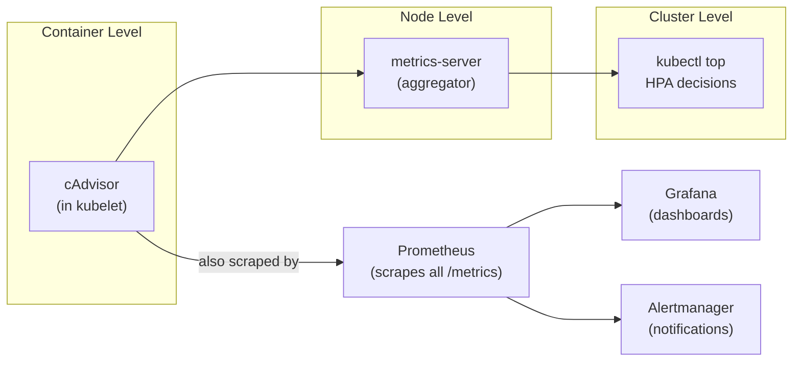

---
tags:
  - kubernetes
  - kubernetes/observability
topic: Observability
---

# Monitoring

## The Metrics Pipeline

Kubernetes monitoring is built on a pipeline that collects metrics at different levels and aggregates them for querying and alerting.



### cAdvisor

Built into the kubelet on every node. Automatically discovers all containers on the node and collects CPU, memory, filesystem, and network usage metrics. No configuration required — it exposes metrics at the kubelet's `/metrics/cadvisor` endpoint.

### Metrics Server

The lightweight, in-cluster aggregator that collects resource metrics (CPU and memory) from kubelets across all nodes. It powers `kubectl top` and the Horizontal Pod Autoscaler.

**Key points:**
- Not a long-term metrics store — holds only the latest values in memory
- Deployed as a single Deployment in `kube-system`
- Must be installed separately (not included by default in all distributions)

## Metrics Server and kubectl top

### Installation

Most managed Kubernetes services (EKS, GKE, AKS) pre-install metrics-server. For self-managed clusters:

```bash
kubectl apply -f https://github.com/kubernetes-sigs/metrics-server/releases/latest/download/components.yaml
```

### Usage

```bash
# Node resource usage
kubectl top nodes
# NAME     CPU(cores)   CPU%   MEMORY(bytes)   MEMORY%
# node-1   250m         12%    1024Mi          26%
# node-2   500m         25%    2048Mi          52%

# Pod resource usage (current namespace)
kubectl top pods
# NAME        CPU(cores)   MEMORY(bytes)
# nginx-abc   2m           10Mi
# app-xyz     150m         256Mi

# Pod resource usage in a specific namespace
kubectl top pods -n production

# Sort by CPU
kubectl top pods --sort-by=cpu

# Sort by memory
kubectl top pods --sort-by=memory

# Show container-level metrics
kubectl top pods --containers
```

`kubectl top` shows **actual usage**, not requests or limits. Compare these values against your resource requests and limits to right-size your workloads.

## Prometheus

Prometheus is the de facto standard for Kubernetes monitoring. It's a CNCF graduated project built for dynamic, cloud-native environments.

### How Prometheus works

```
  ┌─────────────────────────────────────────────────┐
  │                   Prometheus                     │
  │                                                  │
  │  ┌────────────┐  ┌────────────┐  ┌────────────┐ │
  │  │  Scrape     │  │   TSDB     │  │  Rule      │ │
  │  │  Engine     │  │  (storage) │  │  Engine    │ │
  │  └─────┬──────┘  └────────────┘  └─────┬──────┘ │
  │        │                                │        │
  └────────┼────────────────────────────────┼────────┘
           │ scrape /metrics                │ alert
           ▼                                ▼
  ┌──────────────────┐           ┌──────────────────┐
  │  Targets:         │           │  Alertmanager     │
  │  - Pods           │           │  (routes alerts)  │
  │  - Nodes          │           └──────────────────┘
  │  - Services       │
  │  - kube-apiserver │
  │  - etcd           │
  └──────────────────┘
```

**Pull-based model:** Prometheus scrapes HTTP endpoints (`/metrics`) on a configurable interval. Targets expose metrics in Prometheus exposition format.

**Service discovery:** Prometheus discovers scrape targets automatically using Kubernetes service discovery (it watches the API server for Pods, Services, Endpoints, etc.).

### PromQL basics

PromQL is the query language for Prometheus. Every metric is a time series identified by a name and a set of labels.

```promql
# Current CPU usage for all containers
container_cpu_usage_seconds_total

# Filter by namespace
container_cpu_usage_seconds_total{namespace="production"}

# Rate of CPU usage over the last 5 minutes (per-second)
rate(container_cpu_usage_seconds_total{namespace="production"}[5m])

# Total memory usage for a specific deployment
sum(container_memory_working_set_bytes{namespace="production", pod=~"myapp-.*"})

# Top 5 pods by memory usage
topk(5, container_memory_working_set_bytes{namespace="production"})

# Percentage of CPU limit used
sum(rate(container_cpu_usage_seconds_total[5m])) by (pod)
  /
sum(kube_pod_container_resource_limits{resource="cpu"}) by (pod)
  * 100

# 99th percentile request latency (if app exposes histogram)
histogram_quantile(0.99, sum(rate(http_request_duration_seconds_bucket[5m])) by (le))
```

### ServiceMonitor CRD

When using the Prometheus Operator (part of kube-prometheus-stack), you define scrape targets declaratively with `ServiceMonitor` resources instead of editing Prometheus config files:

```yaml
apiVersion: monitoring.coreos.com/v1
kind: ServiceMonitor
metadata:
  name: myapp-monitor
  namespace: production
  labels:
    release: kube-prometheus-stack     # must match Prometheus selector
spec:
  selector:
    matchLabels:
      app: myapp                       # selects Services with this label
  endpoints:
    - port: metrics                    # name of the Service port
      interval: 15s
      path: /metrics
  namespaceSelector:
    matchNames:
      - production
```

The Prometheus Operator watches for ServiceMonitor resources and automatically updates the Prometheus scrape configuration.

## Key Metrics to Monitor

### Node metrics

| Metric | What to watch | Why |
|---|---|---|
| CPU utilization | Sustained > 80% | Pods may be throttled or unschedulable |
| Memory utilization | Sustained > 85% | OOM killer may start killing processes |
| Disk usage | > 85% full | Pods may be evicted (DiskPressure taint) |
| Disk I/O | High latency or saturation | Affects etcd, logging, container pulls |
| Network | Errors, packet drops | Indicates NIC saturation or misconfig |

### Pod metrics

| Metric | What to watch | Why |
|---|---|---|
| CPU usage vs request | Usage consistently >> request | Pod is under-requested, may be throttled |
| CPU usage vs limit | Near limit | Pod is being CPU-throttled |
| Memory usage vs request | Usage >> request | Pod may be evicted under memory pressure |
| Memory usage vs limit | Approaching limit | Container will be OOM-killed |
| Restart count | > 0 and increasing | CrashLoopBackOff, liveness probe failures, OOM kills |
| Pod phase | Pending, Unknown | Scheduling problems, node issues |

### Cluster / control plane metrics

| Metric | What to watch | Why |
|---|---|---|
| API server request latency | p99 > 1s | Slow API means slow everything (deploys, scaling, probes) |
| API server request rate | Unusual spikes | May indicate a misbehaving controller or script |
| etcd latency | fsync > 10ms | etcd is the brain — slow etcd means slow cluster |
| etcd DB size | Approaching quota (default 2GB) | Cluster will become read-only |
| Scheduler queue depth | Growing backlog | Not enough resources or scheduler is overloaded |
| Scheduler latency | High e2e scheduling time | Complex affinity rules or resource fragmentation |

## Grafana Dashboards

Grafana is the standard visualization layer for Prometheus metrics. It supports PromQL natively and provides pre-built dashboards for Kubernetes.

### Useful pre-built dashboards

The kube-prometheus-stack Helm chart ships with dashboards out of the box. Community dashboards are available on [grafana.com/grafana/dashboards](https://grafana.com/grafana/dashboards/):

| Dashboard | ID | Shows |
|---|---|---|
| Kubernetes / Compute Resources / Cluster | 3119 | Cluster-wide CPU, memory, network |
| Kubernetes / Compute Resources / Namespace (Pods) | 6876 | Per-pod resource usage within a namespace |
| Node Exporter Full | 1860 | Detailed node hardware metrics |
| CoreDNS | 14981 | DNS query rate, latency, errors |
| etcd | 3070 | etcd health, latency, DB size |

### Creating a basic dashboard

```
  Grafana ← PromQL query ← Prometheus ← scraped metrics

  Example panel: "Pod Memory Usage by Namespace"

  Query:
    sum(container_memory_working_set_bytes{container!=""})
      by (namespace)

  Visualization: Stacked time series graph
```

## Alerting with Alertmanager

Alertmanager handles alerts generated by Prometheus alerting rules: deduplicates, groups, routes, and sends notifications.

### Alert flow

```
  Prometheus                   Alertmanager              Receivers
  ┌────────────┐              ┌──────────────┐          ┌──────────┐
  │ Alerting    │   fires     │ Dedup        │  routes   │ Slack    │
  │ Rules       │────────────►│ Group        │─────────►│ PagerDuty│
  │ (PromQL)    │              │ Silence      │          │ Email    │
  │             │              │ Inhibit      │          │ Webhook  │
  └────────────┘              └──────────────┘          └──────────┘
```

### Alerting rules

Alerting rules are defined in Prometheus (or via `PrometheusRule` CRD with the operator):

```yaml
apiVersion: monitoring.coreos.com/v1
kind: PrometheusRule
metadata:
  name: pod-alerts
  namespace: monitoring
  labels:
    release: kube-prometheus-stack
spec:
  groups:
    - name: pod.rules
      rules:
        - alert: PodCrashLooping
          expr: |
            increase(kube_pod_container_status_restarts_total[1h]) > 5
          for: 10m
          labels:
            severity: warning
          annotations:
            summary: "Pod {{ $labels.namespace }}/{{ $labels.pod }} is crash looping"
            description: "Pod has restarted {{ $value }} times in the last hour."

        - alert: PodMemoryNearLimit
          expr: |
            container_memory_working_set_bytes
              / on(namespace, pod, container) kube_pod_container_resource_limits{resource="memory"}
              > 0.9
          for: 5m
          labels:
            severity: warning
          annotations:
            summary: "Pod {{ $labels.namespace }}/{{ $labels.pod }} memory > 90% of limit"

        - alert: HighAPIServerLatency
          expr: |
            histogram_quantile(0.99,
              sum(rate(apiserver_request_duration_seconds_bucket{verb!="WATCH"}[5m]))
              by (le)
            ) > 1
          for: 10m
          labels:
            severity: critical
          annotations:
            summary: "API server p99 latency exceeds 1 second"
```

### Alertmanager routing example

```yaml
# alertmanager.yaml
route:
  receiver: default-slack
  group_by: [alertname, namespace]
  group_wait: 30s
  group_interval: 5m
  repeat_interval: 4h
  routes:
    - match:
        severity: critical
      receiver: pagerduty-critical
    - match:
        severity: warning
      receiver: slack-warnings

receivers:
  - name: default-slack
    slack_configs:
      - channel: "#alerts"
        send_resolved: true
  - name: pagerduty-critical
    pagerduty_configs:
      - service_key: "<key>"
  - name: slack-warnings
    slack_configs:
      - channel: "#alerts-warning"
        send_resolved: true
```

## Horizontal Pod Autoscaler Metrics

The HPA uses metrics to automatically scale Pods. It supports three categories of metrics:

| Category | Source | Example |
|---|---|---|
| **Resource metrics** | metrics-server | CPU utilization, memory utilization |
| **Custom metrics** | custom.metrics.k8s.io API (Prometheus adapter) | requests-per-second, queue depth |
| **External metrics** | external.metrics.k8s.io API | Cloud provider queue length, SQS messages |

### HPA with resource metrics

```yaml
apiVersion: autoscaling/v2
kind: HorizontalPodAutoscaler
metadata:
  name: myapp-hpa
spec:
  scaleTargetRef:
    apiVersion: apps/v1
    kind: Deployment
    name: myapp
  minReplicas: 2
  maxReplicas: 10
  metrics:
    - type: Resource
      resource:
        name: cpu
        target:
          type: Utilization
          averageUtilization: 70
    - type: Resource
      resource:
        name: memory
        target:
          type: Utilization
          averageUtilization: 80
```

### HPA with custom metrics

Requires a metrics adapter (e.g., prometheus-adapter) that translates Prometheus metrics into the Kubernetes custom metrics API:

```yaml
apiVersion: autoscaling/v2
kind: HorizontalPodAutoscaler
metadata:
  name: myapp-hpa-custom
spec:
  scaleTargetRef:
    apiVersion: apps/v1
    kind: Deployment
    name: myapp
  minReplicas: 2
  maxReplicas: 20
  metrics:
    - type: Pods
      pods:
        metric:
          name: http_requests_per_second
        target:
          type: AverageValue
          averageValue: "1000"
```

## kube-state-metrics

While cAdvisor and metrics-server provide **resource usage** metrics (how much CPU/memory is being consumed), kube-state-metrics provides **object state** metrics (what is the desired vs actual state of Kubernetes objects).

| Source | What it measures | Examples |
|---|---|---|
| cAdvisor / metrics-server | Resource consumption | Container CPU seconds, memory bytes |
| kube-state-metrics | Object state | Deployment replicas desired vs available, Pod phase, node conditions |

kube-state-metrics watches the Kubernetes API and generates metrics like:

```promql
# Number of desired replicas for a Deployment
kube_deployment_spec_replicas

# Number of available replicas
kube_deployment_status_replicas_available

# Pod restart count
kube_pod_container_status_restarts_total

# Node readiness
kube_node_status_condition{condition="Ready", status="true"}

# Resource requests and limits
kube_pod_container_resource_requests{resource="cpu"}
kube_pod_container_resource_limits{resource="memory"}
```

These metrics are essential for alerting on things like "Deployment has fewer ready replicas than desired" or "node is NotReady."

Deployed as a single Deployment — it does not run on every node:

```bash
# Typically installed as part of kube-prometheus-stack, or standalone
kubectl apply -f https://github.com/kubernetes/kube-state-metrics/releases/latest/download/examples/standard
```

## Common Monitoring Stack: kube-prometheus-stack

The `kube-prometheus-stack` Helm chart is the standard way to deploy a complete monitoring stack on Kubernetes. It bundles everything you need:

```
  kube-prometheus-stack (Helm chart)
  ├── Prometheus Operator        — manages Prometheus instances
  ├── Prometheus                 — scrapes and stores metrics
  ├── Alertmanager               — routes alerts to receivers
  ├── Grafana                    — dashboards and visualization
  ├── kube-state-metrics         — Kubernetes object state metrics
  ├── node-exporter (DaemonSet)  — node hardware/OS metrics
  └── Pre-configured:
      ├── ServiceMonitors        — scrape targets for K8s components
      ├── PrometheusRules        — alerting rules for common issues
      └── Grafana Dashboards     — cluster, node, pod, and component views
```

### Installation with Helm

```bash
helm repo add prometheus-community https://prometheus-community.github.io/helm-charts
helm repo update

helm install kube-prometheus-stack prometheus-community/kube-prometheus-stack \
  --namespace monitoring \
  --create-namespace \
  --set grafana.adminPassword=changeme
```

### Verifying the installation

```bash
# Check all components are running
kubectl get pods -n monitoring

# Access Grafana (port-forward)
kubectl port-forward -n monitoring svc/kube-prometheus-stack-grafana 3000:80

# Access Prometheus UI
kubectl port-forward -n monitoring svc/kube-prometheus-stack-prometheus 9090:9090

# Access Alertmanager
kubectl port-forward -n monitoring svc/kube-prometheus-stack-alertmanager 9093:9093
```

### What you get out of the box

| Component | What it provides |
|---|---|
| **150+ alerting rules** | Alerts for node down, Pod crash looping, high CPU, disk full, etcd issues, certificate expiry, etc. |
| **20+ Grafana dashboards** | Cluster overview, namespace resources, node details, API server, etcd, CoreDNS, etc. |
| **ServiceMonitors** | Auto-scraping of kubelet, API server, kube-scheduler, kube-controller-manager, CoreDNS, etcd |
| **node-exporter** | Hardware metrics: CPU, memory, disk, network, filesystem for every node |

### Customizing via Helm values

```yaml
# values.yaml
prometheus:
  prometheusSpec:
    retention: 30d                           # how long to keep metrics
    storageSpec:
      volumeClaimTemplate:
        spec:
          storageClassName: gp3
          resources:
            requests:
              storage: 100Gi

grafana:
  adminPassword: "changeme"
  persistence:
    enabled: true
    size: 10Gi

alertmanager:
  alertmanagerSpec:
    storage:
      volumeClaimTemplate:
        spec:
          storageClassName: gp3
          resources:
            requests:
              storage: 10Gi
```

```bash
helm upgrade kube-prometheus-stack prometheus-community/kube-prometheus-stack \
  --namespace monitoring \
  -f values.yaml
```

### Custom metrics and external metrics

To use custom application metrics with the HPA or for dashboards:

1. **Instrument your application** — expose a `/metrics` endpoint using a Prometheus client library (available for Go, Python, Java, Node.js, etc.)
2. **Create a ServiceMonitor** — tell Prometheus to scrape your application
3. **Install prometheus-adapter** (if using HPA) — translates Prometheus metrics into the Kubernetes metrics API

```
  Your App (/metrics)
       │
       │ scraped by
       ▼
  Prometheus
       │
       │ queried by
       ▼
  prometheus-adapter
       │
       │ serves via
       ▼
  custom.metrics.k8s.io API
       │
       │ consumed by
       ▼
  HPA controller
```

Example prometheus-adapter config rule:

```yaml
rules:
  - seriesQuery: 'http_requests_total{namespace!="",pod!=""}'
    resources:
      overrides:
        namespace: {resource: "namespace"}
        pod: {resource: "pod"}
    name:
      matches: "^(.*)_total$"
      as: "${1}_per_second"
    metricsQuery: 'sum(rate(<<.Series>>{<<.LabelMatchers>>}[2m])) by (<<.GroupBy>>)'
```

This makes `http_requests_per_second` available as a custom metric that the HPA can use for scaling decisions.
