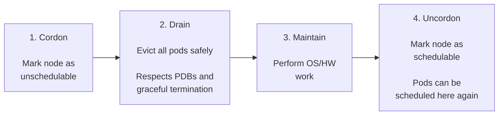

---
tags:
  - kubernetes
  - kubernetes/operations
topic: Operations
---

# Cluster Maintenance

## Node Maintenance Workflow

The standard workflow for performing maintenance on a node (OS updates, kernel patches, hardware repairs) follows a predictable pattern:



## Cordoning and Uncordoning Nodes

Cordoning marks a node as **unschedulable**. Existing Pods continue running, but no new Pods will be placed on the node.

```bash
# Cordon a node (mark as unschedulable)
kubectl cordon node-1
# node/node-1 cordoned

# Verify the node shows SchedulingDisabled
kubectl get nodes
# NAME     STATUS                     ROLES    AGE   VERSION
# node-1   Ready,SchedulingDisabled   worker   30d   v1.29.0
# node-2   Ready                      worker   30d   v1.29.0

# Uncordon a node (mark as schedulable again)
kubectl uncordon node-1
# node/node-1 uncordoned
```

## Draining Nodes

`kubectl drain` cordons the node **and** evicts all Pods, respecting Pod Disruption Budgets and graceful termination periods.

```bash
# Drain a node (evict all pods)
kubectl drain node-1 --ignore-daemonsets --delete-emptydir-data

# Common flags:
#   --ignore-daemonsets    Skip DaemonSet Pods (they cannot be evicted)
#   --delete-emptydir-data Delete Pods with emptyDir volumes (data will be lost)
#   --force                Force deletion of Pods not managed by a controller
#   --grace-period=30      Override the Pod's terminationGracePeriodSeconds
#   --timeout=300s         Abort if drain does not complete in time
#   --dry-run=client       Preview what would be evicted without actually doing it
```

What happens during a drain:

1. The node is cordoned (marked unschedulable)
2. Each Pod on the node is evicted via the Eviction API
3. The Eviction API checks Pod Disruption Budgets before allowing eviction
4. Each Pod receives a `SIGTERM` and has its `terminationGracePeriodSeconds` to shut down
5. If the Pod does not exit in time, it receives `SIGKILL`
6. The controller (Deployment, StatefulSet, etc.) creates a replacement Pod on another node

If a PDB would be violated, the drain blocks until the eviction is allowed or the timeout is reached.

## Pod Disruption Budgets (PDB)

A PDB limits how many Pods from a set can be **voluntarily disrupted** at the same time. Voluntary disruptions include draining a node, Cluster Autoscaler scale-down, and manual Pod deletion through the Eviction API.

PDBs do **not** protect against involuntary disruptions like node crashes, OOM kills, or container failures.

```yaml
apiVersion: policy/v1
kind: PodDisruptionBudget
metadata:
  name: my-app-pdb
spec:
  # Use ONE of the following (not both):
  minAvailable: 2              # at least 2 Pods must stay running
  # maxUnavailable: 1          # at most 1 Pod can be down at a time
  selector:
    matchLabels:
      app: my-app
```

| Field | Accepts | Meaning |
|---|---|---|
| `minAvailable` | Integer or percentage | Minimum number of Pods that must remain available during disruption |
| `maxUnavailable` | Integer or percentage | Maximum number of Pods that can be unavailable during disruption |

Guidelines:
- For a 3-replica Deployment, `maxUnavailable: 1` or `minAvailable: 2` both allow 1 Pod to be disrupted at a time
- Using a percentage (e.g., `minAvailable: "50%"`) scales with replica count
- Setting `maxUnavailable: 0` blocks all voluntary evictions -- avoid this as it prevents node drains

```bash
# Check PDB status
kubectl get pdb
# NAME          MIN AVAILABLE   MAX UNAVAILABLE   ALLOWED DISRUPTIONS   AGE
# my-app-pdb    2               N/A               1                     1h

# Detailed view
kubectl describe pdb my-app-pdb
```

## Upgrading Kubernetes

### Version Skew Policy

Kubernetes components have strict version compatibility requirements:

| Component | Allowed Skew from kube-apiserver |
|---|---|
| `kube-apiserver` | Must be the same minor version across HA instances (or differ by 1 during upgrade) |
| `kubelet` | May be up to **2 minor versions older** than the API server |
| `kube-controller-manager`, `kube-scheduler` | May be up to **1 minor version older** |
| `kubectl` | Within **1 minor version** (older or newer) of the API server |

Always upgrade one minor version at a time (e.g., 1.28 -> 1.29 -> 1.30). Do not skip minor versions.

### kubeadm Upgrade Process

```bash
# 1. Upgrade the control plane node

# Check available versions
sudo apt-cache policy kubeadm

# Upgrade kubeadm
sudo apt-get update
sudo apt-get install -y kubeadm=1.30.0-1.1

# Verify the upgrade plan
sudo kubeadm upgrade plan

# Apply the upgrade (first control plane node only)
sudo kubeadm upgrade apply v1.30.0
# Additional control plane nodes use: sudo kubeadm upgrade node

# Upgrade kubelet and kubectl
sudo apt-get install -y kubelet=1.30.0-1.1 kubectl=1.30.0-1.1
sudo systemctl daemon-reload
sudo systemctl restart kubelet

# 2. Upgrade each worker node (one at a time)

# From a machine with kubectl access:
kubectl drain worker-1 --ignore-daemonsets --delete-emptydir-data

# On the worker node:
sudo apt-get update
sudo apt-get install -y kubeadm=1.30.0-1.1
sudo kubeadm upgrade node
sudo apt-get install -y kubelet=1.30.0-1.1
sudo systemctl daemon-reload
sudo systemctl restart kubelet

# From a machine with kubectl access:
kubectl uncordon worker-1
```

### Managed Cluster Upgrades

| Provider | Upgrade Method |
|---|---|
| **EKS** | `aws eks update-cluster-version` upgrades the control plane. Node groups are upgraded separately via managed node group updates or by replacing nodes |
| **GKE** | `gcloud container clusters upgrade` upgrades the control plane. Node pools are upgraded separately. GKE supports auto-upgrade for both |
| **AKS** | `az aks upgrade` upgrades the control plane and node pools. Can be done together or separately |

All managed services handle control plane upgrades with zero downtime. Node upgrades use a rolling replacement strategy.

## etcd Backup and Restore

etcd stores all cluster state. Regular backups are essential for disaster recovery.

### Backup

```bash
# Snapshot the etcd database
ETCDCTL_API=3 etcdctl snapshot save /backup/etcd-snapshot.db \
  --endpoints=https://127.0.0.1:2379 \
  --cacert=/etc/kubernetes/pki/etcd/ca.crt \
  --cert=/etc/kubernetes/pki/etcd/server.crt \
  --key=/etc/kubernetes/pki/etcd/server.key

# Verify the snapshot
ETCDCTL_API=3 etcdctl snapshot status /backup/etcd-snapshot.db --write-table
# +----------+----------+------------+------------+
# |   HASH   | REVISION | TOTAL KEYS | TOTAL SIZE |
# +----------+----------+------------+------------+
# | a]b23c4d |   150432 |       1287 |     4.2 MB |
# +----------+----------+------------+------------+
```

### Restore

```bash
# 1. Stop the kube-apiserver (if using static pods, move the manifest)
sudo mv /etc/kubernetes/manifests/kube-apiserver.yaml /tmp/

# 2. Restore the snapshot to a new data directory
ETCDCTL_API=3 etcdctl snapshot restore /backup/etcd-snapshot.db \
  --data-dir=/var/lib/etcd-restored

# 3. Update the etcd static pod manifest to point to the new data directory
# Edit /etc/kubernetes/manifests/etcd.yaml:
#   Change --data-dir=/var/lib/etcd to --data-dir=/var/lib/etcd-restored
#   Update the hostPath volume to /var/lib/etcd-restored

# 4. Restart the kube-apiserver
sudo mv /tmp/kube-apiserver.yaml /etc/kubernetes/manifests/
```

For managed clusters, the cloud provider handles etcd backups automatically.

## Certificate Management and Rotation

Kubernetes components use TLS certificates for mutual authentication. Certificates generated by `kubeadm` expire after **1 year** by default.

```bash
# Check certificate expiration dates
sudo kubeadm certs check-expiration
# CERTIFICATE                EXPIRES                  RESIDUAL TIME
# admin.conf                 Mar 25, 2027 12:00 UTC   364d
# apiserver                  Mar 25, 2027 12:00 UTC   364d
# apiserver-etcd-client      Mar 25, 2027 12:00 UTC   364d
# apiserver-kubelet-client   Mar 25, 2027 12:00 UTC   364d
# ...

# Renew all certificates
sudo kubeadm certs renew all

# After renewal, restart control plane components
# (they are static pods, so moving and restoring their manifests triggers a restart)

# Update kubeconfig files after renewal
sudo cp /etc/kubernetes/admin.conf ~/.kube/config
```

The CA certificate has a 10-year validity by default and is not renewed by `kubeadm certs renew all`.

| Certificate | Used By | Default Validity |
|---|---|---|
| CA (ca.crt) | Root of trust for the cluster | 10 years |
| API server | kube-apiserver TLS serving | 1 year |
| kubelet client | kubelet authenticating to API server | 1 year |
| etcd | etcd peer and client communication | 1 year |
| front-proxy | API aggregation layer | 1 year |

For kubeadm clusters, `kubeadm upgrade` automatically renews certificates as part of the upgrade process. If you upgrade at least once a year, manual renewal is typically unnecessary.

Managed Kubernetes services handle certificate rotation automatically.
