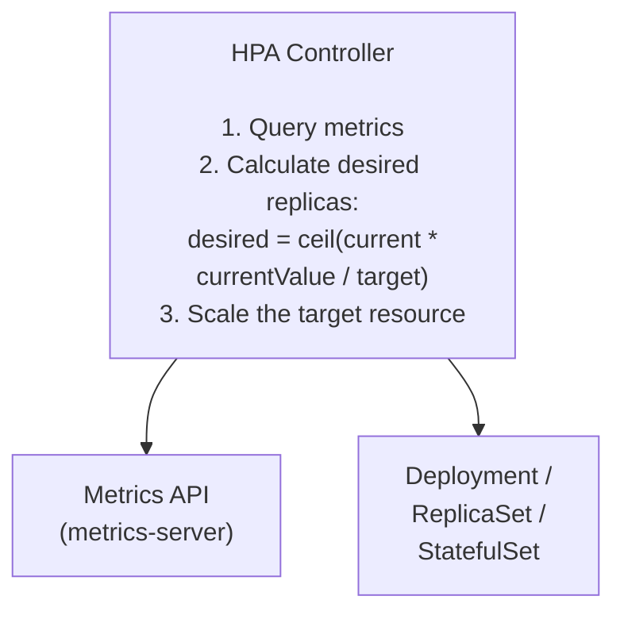
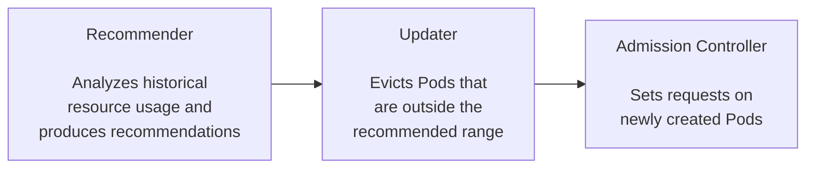
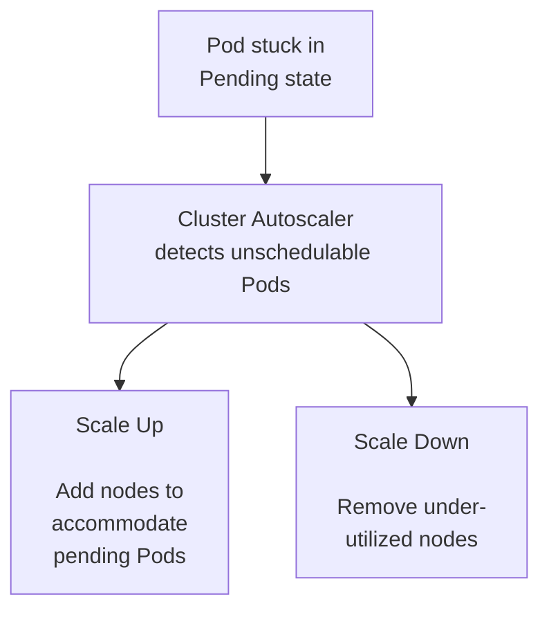

---
tags:
  - kubernetes
  - kubernetes/operations
topic: Operations
---

# Scaling

## Manual Scaling

The simplest way to scale a workload is to set the replica count directly:

```bash
# Scale a Deployment to 5 replicas
kubectl scale deployment/my-app --replicas=5

# Scale a StatefulSet
kubectl scale statefulset/my-db --replicas=3

# Scale a ReplicaSet
kubectl scale replicaset/my-app-6b7d8c9f4 --replicas=2

# Conditional scale: only if current replicas match expected value
kubectl scale deployment/my-app --current-replicas=3 --replicas=5
```

Manual scaling is immediate but requires human intervention. For production workloads, use autoscaling.

## Horizontal Pod Autoscaler (HPA)

HPA automatically adjusts the number of Pod replicas based on observed metrics. It runs as a control loop in the `kube-controller-manager`, checking metrics at a configurable interval (default: 15 seconds).



### Scaling Formula

```
desiredReplicas = ceil( currentReplicas * (currentMetricValue / desiredMetricValue) )
```

For example, if you have 2 replicas running at 80% average CPU and the target is 50%, the HPA calculates: `ceil(2 * (80/50)) = ceil(3.2) = 4` replicas.

### Metrics Types

| Metric Type | Source | Example |
|---|---|---|
| **Resource** | CPU/memory from metrics-server | Average CPU utilization across pods |
| **Pods** | Custom metrics per Pod | Requests-per-second reported by the app |
| **Object** | Metrics on a Kubernetes object | Queue length on an Ingress |
| **External** | Metrics outside the cluster | SQS queue depth, Pub/Sub backlog |

### HPA v2 YAML Manifest

```yaml
apiVersion: autoscaling/v2
kind: HorizontalPodAutoscaler
metadata:
  name: my-app-hpa
spec:
  scaleTargetRef:
    apiVersion: apps/v1
    kind: Deployment
    name: my-app
  minReplicas: 2
  maxReplicas: 20
  metrics:
    # Scale based on CPU utilization
    - type: Resource
      resource:
        name: cpu
        target:
          type: Utilization
          averageUtilization: 60      # target 60% CPU usage

    # Scale based on memory
    - type: Resource
      resource:
        name: memory
        target:
          type: AverageValue
          averageValue: 500Mi         # target 500Mi per Pod

    # Scale based on custom metric (e.g., requests per second)
    - type: Pods
      pods:
        metric:
          name: http_requests_per_second
        target:
          type: AverageValue
          averageValue: "100"         # target 100 req/s per Pod

    # Scale based on external metric (e.g., SQS queue depth)
    - type: External
      external:
        metric:
          name: sqs_queue_length
          selector:
            matchLabels:
              queue: my-queue
        target:
          type: Value
          value: "50"                 # scale up when queue > 50
```

When multiple metrics are specified, the HPA calculates desired replicas for each metric independently and uses the **highest** value.

### Scaling Behavior

The `behavior` field gives fine-grained control over scale-up and scale-down rates:

```yaml
spec:
  behavior:
    scaleUp:
      stabilizationWindowSeconds: 0        # default: 0 (scale up immediately)
      policies:
        - type: Percent
          value: 100                        # can double the replicas
          periodSeconds: 60                 # within a 60s window
        - type: Pods
          value: 4                          # or add up to 4 pods
          periodSeconds: 60
      selectPolicy: Max                     # use whichever policy allows more
    scaleDown:
      stabilizationWindowSeconds: 300       # default: 300 (wait 5 min before scaling down)
      policies:
        - type: Percent
          value: 10                         # remove at most 10% of replicas
          periodSeconds: 60
      selectPolicy: Min                     # use the most conservative policy
```

| Field | Purpose |
|---|---|
| `stabilizationWindowSeconds` | Look-back window to prevent flapping. The HPA picks the highest (scale-up) or lowest (scale-down) recommendation from this window |
| `policies` | One or more rate-limiting rules (by absolute Pod count or percentage) |
| `selectPolicy` | `Max` (most permissive), `Min` (most conservative), or `Disabled` (prevent scaling in this direction) |

### kubectl Shorthand

```bash
# Create an HPA quickly from the CLI
kubectl autoscale deployment my-app --min=2 --max=10 --cpu-percent=60

# View HPA status
kubectl get hpa
# NAME         REFERENCE           TARGETS   MINPODS   MAXPODS   REPLICAS   AGE
# my-app-hpa   Deployment/my-app   42%/60%   2         10        3          1h

# Describe for detailed info and events
kubectl describe hpa my-app-hpa
```

## Vertical Pod Autoscaler (VPA)

VPA automatically adjusts the **CPU and memory requests/limits** on containers. Instead of adding more Pods, it right-sizes existing Pods.



### VPA YAML Manifest

```yaml
apiVersion: autoscaling.k8s.io/v1
kind: VerticalPodAutoscaler
metadata:
  name: my-app-vpa
spec:
  targetRef:
    apiVersion: apps/v1
    kind: Deployment
    name: my-app
  updatePolicy:
    updateMode: "Auto"             # Off, Initial, Recreate, or Auto
  resourcePolicy:
    containerPolicies:
      - containerName: my-app
        minAllowed:
          cpu: 100m
          memory: 128Mi
        maxAllowed:
          cpu: 2
          memory: 4Gi
        controlledResources: ["cpu", "memory"]
```

### Update Modes

| Mode | Behavior |
|---|---|
| `Off` | VPA only produces recommendations (visible via `kubectl describe vpa`). No changes are applied. Useful for observing before enabling |
| `Initial` | Applies recommendations only when Pods are first created. Running Pods are not affected |
| `Recreate` | Evicts and recreates Pods when current requests are significantly outside the recommended range |
| `Auto` | Currently behaves like `Recreate`. In the future, may apply changes in-place without restarting Pods |

### VPA vs HPA

| Aspect | HPA | VPA |
|---|---|---|
| Scales by | Adding/removing Pods | Adjusting resource requests/limits |
| Best for | Stateless workloads that handle varying load | Single-replica workloads or right-sizing |
| Metric-driven | Yes (CPU, memory, custom) | Yes (historical resource usage) |
| Disruption | None (adds Pods) | Restarts Pods (except `Off`/`Initial` modes) |
| Use together? | Not on the same metric. HPA on custom metrics + VPA on CPU/memory is fine |

VPA is not installed by default. It requires deploying the VPA components separately.

## Cluster Autoscaler

The Cluster Autoscaler adjusts the **number of nodes** in a cluster. It works with cloud-provider-managed node groups (AWS Auto Scaling Groups, GCP Managed Instance Groups, Azure VM Scale Sets).



### How It Works

**Scale Up:**
1. A Pod cannot be scheduled because no node has sufficient resources
2. The Pod enters `Pending` state
3. The Cluster Autoscaler detects the pending Pod
4. It simulates scheduling against available node groups
5. It selects the best node group and provisions a new node
6. The kubelet on the new node registers with the API server
7. The scheduler places the pending Pod on the new node

**Scale Down:**
1. The autoscaler checks node utilization every 10 seconds (default)
2. A node is considered underutilized if CPU and memory requests are below 50% (configurable)
3. The autoscaler verifies all Pods on the node can be rescheduled elsewhere
4. It respects Pod Disruption Budgets and Pods that cannot be evicted (e.g., Pods with local storage, Pods without a controller)
5. After a configurable cool-down period, the node is drained and removed

### Pod Disruption Budgets and the Autoscaler

The Cluster Autoscaler respects PDBs when deciding whether it can safely remove a node. If evicting a Pod would violate its PDB, the autoscaler will not drain that node. This prevents the autoscaler from disrupting workloads that require a minimum number of available Pods.

### Cloud Provider Integration

| Provider | Node Group Type | Key Configuration |
|---|---|---|
| AWS (EKS) | Auto Scaling Groups | Set min/max on ASG; autoscaler reads ASG tags |
| GCP (GKE) | Managed Instance Groups | Enable autoscaling on node pool; set min/max nodes |
| Azure (AKS) | VM Scale Sets | Enable cluster autoscaler on node pool; set min/max |

### Annotations to Influence Behavior

```yaml
metadata:
  annotations:
    # Prevent scale-down of a specific node
    cluster-autoscaler.kubernetes.io/scale-down-disabled: "true"
```

## KEDA (Kubernetes Event-Driven Autoscaling)

KEDA extends Kubernetes autoscaling to support event-driven workloads. It acts as a bridge between external event sources and the HPA, allowing scaling based on events from message queues, databases, HTTP traffic, cron schedules, and more.

```
KEDA Architecture

┌──────────────────────────────────────────┐
│              KEDA Operator                │
│                                          │
│  ┌──────────────┐   ┌────────────────┐   │
│  │   Scaler     │   │  Metrics       │   │
│  │   (watches   │   │  Adapter       │   │
│  │   external   │   │  (exposes      │   │
│  │   sources)   │   │   metrics to   │   │
│  │              │   │   HPA)         │   │
│  └──────┬───────┘   └───────┬────────┘   │
│         │                   │            │
└─────────┼───────────────────┼────────────┘
          │                   │
          ▼                   ▼
  ┌──────────────┐    ┌──────────────┐
  │ Event Source │    │     HPA      │
  │ (Kafka, SQS, │    │ (scales the  │
  │  Redis, etc.)│    │  workload)   │
  └──────────────┘    └──────────────┘
```

### ScaledObject Example

```yaml
apiVersion: keda.sh/v1alpha1
kind: ScaledObject
metadata:
  name: my-app-scaler
spec:
  scaleTargetRef:
    name: my-app                        # Deployment to scale
  minReplicaCount: 0                    # can scale to zero
  maxReplicaCount: 50
  pollingInterval: 15                   # check every 15 seconds
  cooldownPeriod: 300                   # wait 5 min before scaling to zero
  triggers:
    - type: kafka
      metadata:
        bootstrapServers: kafka:9092
        consumerGroup: my-group
        topic: my-topic
        lagThreshold: "100"             # scale when consumer lag > 100
```

Key advantages of KEDA:
- **Scale to zero:** Unlike HPA (which requires `minReplicas >= 1`), KEDA can scale a workload down to zero Pods and spin it back up when events arrive
- **60+ built-in scalers:** Kafka, RabbitMQ, AWS SQS, Azure Service Bus, Prometheus, Cron, PostgreSQL, and many more
- **Works alongside HPA:** KEDA creates and manages HPA resources; it does not replace the HPA controller
