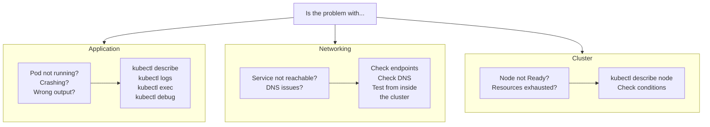

---
tags:
  - kubernetes
  - kubernetes/operations
topic: Operations
---

# Troubleshooting

## General Debugging Workflow

When something goes wrong in Kubernetes, follow a top-down approach:



Start broad and narrow down:

```bash
# 1. Get an overview of the cluster
kubectl get nodes
kubectl get pods -A | grep -v Running

# 2. Look at events for recent activity
kubectl get events --sort-by=.metadata.creationTimestamp -A

# 3. Focus on the specific resource
kubectl describe <resource> <name>
```

## Pod Debugging

### kubectl describe pod

The **Events** section at the bottom of `describe` output is the most valuable part for debugging. It shows the sequence of actions and any errors:

```bash
kubectl describe pod my-app-7d6f8c9b5-x2k4m

# Key sections to check:
#   Status:       Is it Running, Pending, or Failed?
#   Conditions:   Which conditions are True/False?
#   Containers:   What is the State and Last State?
#   Events:       What happened and in what order?
```

### kubectl logs

```bash
# View logs for the main container
kubectl logs my-app-7d6f8c9b5-x2k4m

# Follow logs in real time
kubectl logs -f my-app-7d6f8c9b5-x2k4m

# View logs from the previous container instance (after a crash)
kubectl logs my-app-7d6f8c9b5-x2k4m --previous

# View logs from a specific container in a multi-container Pod
kubectl logs my-app-7d6f8c9b5-x2k4m -c sidecar

# View logs from an init container
kubectl logs my-app-7d6f8c9b5-x2k4m -c init-db

# View last 50 lines
kubectl logs my-app-7d6f8c9b5-x2k4m --tail=50

# View logs from the last 5 minutes
kubectl logs my-app-7d6f8c9b5-x2k4m --since=5m

# View logs from all Pods with a label
kubectl logs -l app=my-app --all-containers=true
```

### kubectl exec

```bash
# Open an interactive shell in a running container
kubectl exec -it my-app-7d6f8c9b5-x2k4m -- /bin/sh

# Run a single command
kubectl exec my-app-7d6f8c9b5-x2k4m -- cat /etc/config/app.yaml

# Exec into a specific container
kubectl exec -it my-app-7d6f8c9b5-x2k4m -c sidecar -- /bin/bash
```

### Ephemeral Debug Containers

When a container does not have a shell or debugging tools (e.g., distroless images), use `kubectl debug` to attach an ephemeral container:

```bash
# Attach a debug container to a running Pod
kubectl debug -it my-app-7d6f8c9b5-x2k4m --image=busybox --target=my-app

# Create a copy of the Pod with a debug container (does not affect the original)
kubectl debug my-app-7d6f8c9b5-x2k4m -it --image=ubuntu --copy-to=debug-pod

# Debug a node by creating a privileged Pod on it
kubectl debug node/node-1 -it --image=ubuntu
```

### Common Pod Failure Reasons

| Status / Reason | What It Means | How to Fix |
|---|---|---|
| `Pending` | Pod cannot be scheduled. No node has enough resources, or node selectors/affinity rules cannot be satisfied | Check `kubectl describe pod` events. Look for insufficient CPU/memory, unmatched node selectors, or taints without tolerations |
| `ImagePullBackOff` / `ErrImagePull` | Kubernetes cannot pull the container image. Wrong image name, tag does not exist, or registry authentication failure | Verify the image name and tag. Check `imagePullSecrets`. Try `docker pull` manually on the node |
| `CrashLoopBackOff` | The container starts, crashes, restarts, crashes again. Kubernetes backs off the restart interval exponentially | Check `kubectl logs --previous` for the crash reason. Common causes: missing config, failed health checks, application bugs |
| `OOMKilled` | The container exceeded its memory limit and was killed by the kernel OOM killer | Increase the memory limit, fix memory leaks, or tune JVM/runtime heap settings. Check `kubectl describe pod` for `Last State: Terminated (OOMKilled)` |
| `CreateContainerConfigError` | A ConfigMap, Secret, or other resource referenced in the Pod spec does not exist | Verify that all ConfigMaps and Secrets referenced in `env`, `envFrom`, or `volumes` exist in the same namespace |
| `RunContainerError` | The container runtime failed to start the container | Check node-level logs (`journalctl -u kubelet`). Common causes: missing mount paths, SELinux issues, invalid securityContext |
| `Init:Error` / `Init:CrashLoopBackOff` | An init container failed | Check init container logs: `kubectl logs <pod> -c <init-container-name>` |
| `Terminating` (stuck) | Pod is stuck in terminating state | Check for finalizers: `kubectl get pod <name> -o jsonpath='{.metadata.finalizers}'`. Force delete: `kubectl delete pod <name> --grace-period=0 --force` |
| `Evicted` | The node was under resource pressure (disk, memory) and evicted the Pod | Check node conditions. Set appropriate resource requests so the scheduler places Pods on nodes with capacity |
| `FailedScheduling` | The scheduler cannot find a suitable node | Check events for the specific reason: insufficient resources, PVC not bound, topology constraints |

## Service Debugging

### Verify Endpoints Exist

A Service with no endpoints means no Pods match the Service selector:

```bash
# Check if the Service has endpoints
kubectl get endpoints my-app-svc
# NAME         ENDPOINTS                                AGE
# my-app-svc   10.244.1.5:8080,10.244.2.7:8080         1h

# If ENDPOINTS is <none>, the selector does not match any running Pods
# Compare the Service selector with Pod labels:
kubectl get svc my-app-svc -o jsonpath='{.spec.selector}'
kubectl get pods --show-labels
```

### Test DNS Resolution

```bash
# Run a temporary Pod to test DNS
kubectl run dns-test --rm -it --image=busybox --restart=Never -- nslookup my-app-svc
# Server:    10.96.0.10
# Address:   10.96.0.10:53
# Name:      my-app-svc.default.svc.cluster.local
# Address:   10.100.42.137

# If DNS fails, check CoreDNS Pods
kubectl get pods -n kube-system -l k8s-app=kube-dns
kubectl logs -n kube-system -l k8s-app=kube-dns
```

### Test Connectivity from Within the Cluster

```bash
# Test HTTP connectivity to the Service
kubectl run curl-test --rm -it --image=curlimages/curl --restart=Never -- \
  curl -s http://my-app-svc:80/health

# Test TCP connectivity
kubectl run nc-test --rm -it --image=busybox --restart=Never -- \
  nc -zv my-app-svc 80
```

Service debugging checklist:
1. Does the Service exist? (`kubectl get svc`)
2. Does it have endpoints? (`kubectl get endpoints`)
3. Do the Pod labels match the Service selector?
4. Is the `targetPort` correct (matches the container port)?
5. Can you reach the Pod directly by IP? (bypasses Service)
6. Does DNS resolve? (`nslookup <service-name>`)

## Node Debugging

### kubectl describe node

```bash
kubectl describe node node-1

# Key sections:
#   Conditions:    Is the node healthy?
#   Capacity:      Total resources on the node
#   Allocatable:   Resources available for Pods (after system reservations)
#   Allocated:     Currently allocated to Pods
#   Events:        Recent node-level events
```

### Node Conditions

| Condition | Normal Value | Meaning When True |
|---|---|---|
| `Ready` | `True` | kubelet is healthy and able to accept Pods |
| `MemoryPressure` | `False` | Node is running low on memory. kubelet will start evicting Pods |
| `DiskPressure` | `False` | Node is running low on disk space. kubelet will evict Pods and refuse new ones |
| `PIDPressure` | `False` | Too many processes running on the node |
| `NetworkUnavailable` | `False` | Node network is not configured correctly (CNI plugin issue) |

A node with `Ready: False` or `Ready: Unknown` will not receive new Pods. Existing Pods may be evicted after the `pod-eviction-timeout` (default: 5 minutes).

### SSH into the Node

When kubelet-level debugging is needed:

```bash
# Check kubelet status
sudo systemctl status kubelet

# View kubelet logs
sudo journalctl -u kubelet -f --no-pager

# Check container runtime
sudo crictl ps          # list running containers
sudo crictl pods        # list pods
sudo crictl logs <id>   # view container logs

# Check disk usage
df -h
du -sh /var/lib/kubelet /var/lib/containerd
```

## Networking Debugging

### Create a Temporary Debug Pod

```bash
# Spin up a Pod with networking tools
kubectl run tmp-shell --rm -it --image=nicolaka/netshoot --restart=Never -- /bin/bash

# Inside the Pod, you have access to:
#   curl, wget, nslookup, dig, ping, traceroute,
#   tcpdump, netstat, ss, iperf, mtr, ip, and more
```

### Common Network Tests

```bash
# DNS resolution
nslookup my-app-svc.default.svc.cluster.local

# Full DNS lookup with details
dig my-app-svc.default.svc.cluster.local

# HTTP request to a Service
curl -v http://my-app-svc.default.svc.cluster.local:80/health

# TCP port check
nc -zv my-app-svc 80

# Check connectivity to external services
curl -v https://api.example.com

# Trace the route to another Pod or node
traceroute 10.244.1.5

# Check Pod-to-Pod connectivity across nodes
ping 10.244.2.7
```

### Inspecting Network Policies

```bash
# List NetworkPolicies in a namespace
kubectl get networkpolicies

# Describe a specific policy
kubectl describe networkpolicy my-policy

# Check if a Pod is affected by any NetworkPolicy
# (Pods with no policy selecting them allow all traffic)
kubectl get networkpolicies -o json | jq '.items[].spec.podSelector'
```

## Common Scenarios and Solutions

| Scenario | Symptoms | Investigation | Solution |
|---|---|---|---|
| Pod stuck in `Pending` | Pod never starts | `kubectl describe pod` -- check Events for scheduling failures | Add more nodes, adjust resource requests, fix node selectors/taints |
| Pod in `CrashLoopBackOff` | Container repeatedly restarts | `kubectl logs --previous`, check exit code in `describe` | Fix application error, add missing config, adjust health check thresholds |
| Cannot reach Service | HTTP timeouts or connection refused | Check endpoints, DNS, targetPort, Pod readiness | Ensure Pods are Ready, labels match selector, port is correct |
| Node `NotReady` | Pods stuck in `Terminating`, new Pods stay `Pending` | `kubectl describe node`, check kubelet logs on the node | Restart kubelet, check network connectivity, check disk space |
| Persistent Volume not mounting | Pod stuck in `ContainerCreating` | `kubectl describe pod` -- look for volume attach errors | Check PV/PVC status, storage class, node affinity on the volume |
| DNS not resolving | `nslookup` fails inside Pods | Check CoreDNS pods, check `/etc/resolv.conf` inside the Pod | Restart CoreDNS, check CoreDNS ConfigMap, verify cluster DNS IP |
| OOM kills | Container restarts with exit code 137 | `kubectl describe pod` shows `OOMKilled` | Increase memory limits, profile application memory usage |
| Image pull failures | `ImagePullBackOff` | `kubectl describe pod` -- check image name and pull errors | Fix image name/tag, create or fix `imagePullSecret`, check registry access |
| RBAC permission denied | `403 Forbidden` in logs or API calls | `kubectl auth can-i <verb> <resource> --as=<user>` | Create or update Role/ClusterRole and RoleBinding/ClusterRoleBinding |
| Ingress not routing | 404 or 502 from Ingress | Check Ingress rules, backend Service, and Ingress controller logs | Verify Ingress paths, ensure backend Service has endpoints, check TLS config |
