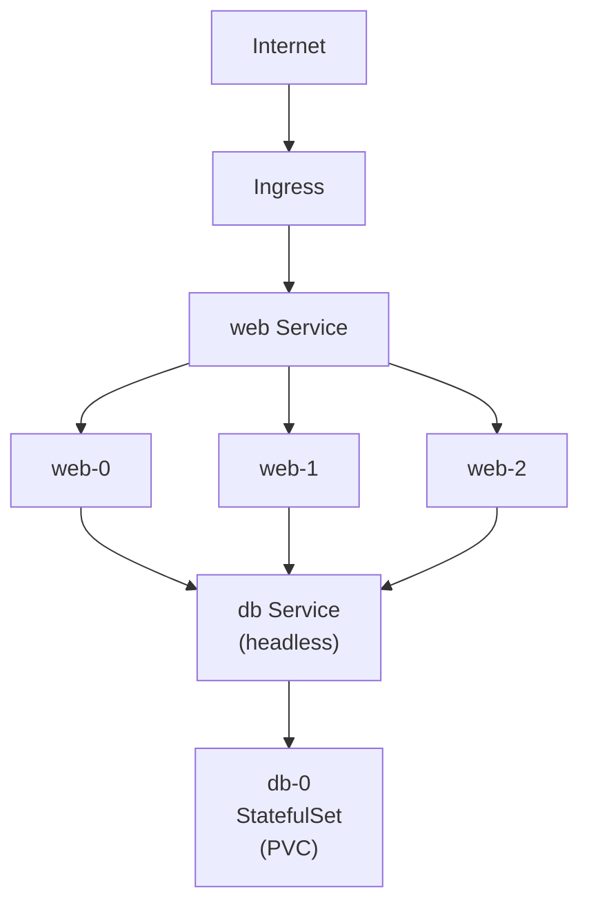
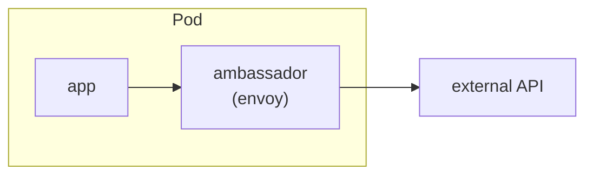

---
tags:
  - kubernetes
  - kubernetes/reference
aliases:
  - k8s-patterns
  - kubernetes-patterns
topic: Quick Reference
created: 2026-03-26
---

# Common Patterns

Real-world Kubernetes patterns with brief explanations and minimal YAML examples. These patterns solve recurring problems you will encounter when deploying and operating applications on Kubernetes.

## Web Application with Database

A typical three-tier setup: a stateless web Deployment fronted by a Service, backed by a database running as a StatefulSet with persistent storage.



**Web Deployment and Service:**

```yaml
apiVersion: apps/v1
kind: Deployment
metadata:
  name: web
spec:
  replicas: 3
  selector:
    matchLabels:
      app: web
  template:
    metadata:
      labels:
        app: web
    spec:
      containers:
        - name: web
          image: myapp:1.0
          ports:
            - containerPort: 8080
          env:
            - name: DATABASE_URL
              valueFrom:
                secretKeyRef:
                  name: db-credentials
                  key: url
---
apiVersion: v1
kind: Service
metadata:
  name: web
spec:
  selector:
    app: web
  ports:
    - port: 80
      targetPort: 8080
```

**Database StatefulSet with PVC:**

```yaml
apiVersion: v1
kind: Service
metadata:
  name: db
spec:
  clusterIP: None            # headless service for stable DNS per pod
  selector:
    app: db
  ports:
    - port: 5432
---
apiVersion: apps/v1
kind: StatefulSet
metadata:
  name: db
spec:
  serviceName: db
  replicas: 1
  selector:
    matchLabels:
      app: db
  template:
    metadata:
      labels:
        app: db
    spec:
      containers:
        - name: postgres
          image: postgres:16
          ports:
            - containerPort: 5432
          envFrom:
            - secretRef:
                name: db-credentials
          volumeMounts:
            - name: data
              mountPath: /var/lib/postgresql/data
  volumeClaimTemplates:
    - metadata:
        name: data
      spec:
        accessModes: ["ReadWriteOnce"]
        resources:
          requests:
            storage: 20Gi
```

## Background Worker

A Deployment that processes messages from a queue. No Service is needed because workers pull work rather than receiving inbound traffic.

```yaml
apiVersion: apps/v1
kind: Deployment
metadata:
  name: order-worker
spec:
  replicas: 2
  selector:
    matchLabels:
      app: order-worker
  template:
    metadata:
      labels:
        app: order-worker
    spec:
      containers:
        - name: worker
          image: myapp-worker:1.0
          env:
            - name: QUEUE_URL
              valueFrom:
                configMapKeyRef:
                  name: queue-config
                  key: url
          resources:
            requests:
              cpu: 250m
              memory: 256Mi
            limits:
              memory: 512Mi
```

> **Scaling tip:** Pair this with a KEDA ScaledObject to autoscale based on queue depth instead of CPU.

## CronJob for Cleanup Tasks

Runs a job on a schedule. Useful for log rotation, stale-data pruning, report generation, and similar periodic tasks.

```yaml
apiVersion: batch/v1
kind: CronJob
metadata:
  name: db-cleanup
spec:
  schedule: "0 3 * * *"                # daily at 03:00 UTC
  concurrencyPolicy: Forbid            # skip if previous run is still going
  successfulJobsHistoryLimit: 3
  failedJobsHistoryLimit: 5
  jobTemplate:
    spec:
      backoffLimit: 2
      activeDeadlineSeconds: 3600      # kill if running longer than 1 hour
      template:
        spec:
          restartPolicy: Never
          containers:
            - name: cleanup
              image: myapp-tools:1.0
              command: ["python", "cleanup.py"]
              env:
                - name: DATABASE_URL
                  valueFrom:
                    secretKeyRef:
                      name: db-credentials
                      key: url
```

## Init Container for Schema Migration

Init containers run to completion before application containers start. This guarantees the database schema is up to date before the app begins serving traffic.

```yaml
apiVersion: apps/v1
kind: Deployment
metadata:
  name: web
spec:
  replicas: 3
  selector:
    matchLabels:
      app: web
  template:
    metadata:
      labels:
        app: web
    spec:
      initContainers:
        - name: migrate
          image: myapp:1.0
          command: ["python", "manage.py", "migrate", "--noinput"]
          env:
            - name: DATABASE_URL
              valueFrom:
                secretKeyRef:
                  name: db-credentials
                  key: url
      containers:
        - name: web
          image: myapp:1.0
          ports:
            - containerPort: 8080
```

> **Caveat:** With multiple replicas, every pod runs the migration independently. Make sure your migration tool is idempotent, or use a separate one-off Job that runs before the Deployment rollout.

## Sidecar for Log Forwarding

A sidecar container shares a volume with the main container to ship logs to a central system. This keeps the application container unaware of the logging infrastructure.

```yaml
apiVersion: apps/v1
kind: Deployment
metadata:
  name: app-with-logging
spec:
  replicas: 2
  selector:
    matchLabels:
      app: myapp
  template:
    metadata:
      labels:
        app: myapp
    spec:
      containers:
        - name: app
          image: myapp:1.0
          volumeMounts:
            - name: log-volume
              mountPath: /var/log/app
        - name: log-forwarder
          image: fluent/fluent-bit:latest
          volumeMounts:
            - name: log-volume
              mountPath: /var/log/app
              readOnly: true
            - name: fluent-config
              mountPath: /fluent-bit/etc/
      volumes:
        - name: log-volume
          emptyDir: {}
        - name: fluent-config
          configMap:
            name: fluent-bit-config
```

## Ambassador Pattern

An ambassador container proxies outbound connections from the application container, handling concerns like TLS termination, connection pooling, or routing to the correct backend.



```yaml
apiVersion: apps/v1
kind: Deployment
metadata:
  name: app-with-ambassador
spec:
  replicas: 2
  selector:
    matchLabels:
      app: myapp
  template:
    metadata:
      labels:
        app: myapp
    spec:
      containers:
        - name: app
          image: myapp:1.0
          env:
            - name: API_ENDPOINT
              value: "http://localhost:9000"   # talks to ambassador on localhost
        - name: ambassador
          image: envoyproxy/envoy:v1.30-latest
          ports:
            - containerPort: 9000
          volumeMounts:
            - name: envoy-config
              mountPath: /etc/envoy
      volumes:
        - name: envoy-config
          configMap:
            name: envoy-ambassador-config
```

## Blue-Green Deployment

Run two identical environments (blue and green). Only one receives live traffic at a time. Switch traffic by updating the Service selector.

```
  ┌──────────────────┐
  │     Service      │
  │  selector:       │
  │    version: green│─ ─ ─ ┐
  └──────────────────┘      │
                            │
  ┌────────────┐     ┌─────▼──────┐
  │ blue (old) │     │ green (new)│
  │ Deployment │     │ Deployment │
  │ version:   │     │ version:   │
  │   blue     │     │   green    │
  └────────────┘     └────────────┘
```

**Both Deployments share the same app label but differ by version:**

```yaml
apiVersion: apps/v1
kind: Deployment
metadata:
  name: myapp-green
spec:
  replicas: 3
  selector:
    matchLabels:
      app: myapp
      version: green
  template:
    metadata:
      labels:
        app: myapp
        version: green
    spec:
      containers:
        - name: myapp
          image: myapp:2.0
          ports:
            - containerPort: 8080
```

**Service points to the active version:**

```yaml
apiVersion: v1
kind: Service
metadata:
  name: myapp
spec:
  selector:
    app: myapp
    version: green                    # flip to "blue" to rollback
  ports:
    - port: 80
      targetPort: 8080
```

**Cutover workflow:**

```bash
# deploy new version as "green"
kubectl apply -f deployment-green.yaml
# verify green is healthy
kubectl rollout status deployment/myapp-green
# switch traffic
kubectl patch svc myapp -p '{"spec":{"selector":{"version":"green"}}}'
# once confirmed, tear down old
kubectl delete deployment myapp-blue
```

## Canary Deployment

Route a small percentage of traffic to a new version. Both Deployments share the same `app` label so a single Service sends traffic to both, with the ratio controlled by replica counts.

```yaml
# Stable: 9 replicas
apiVersion: apps/v1
kind: Deployment
metadata:
  name: myapp-stable
spec:
  replicas: 9
  selector:
    matchLabels:
      app: myapp
      track: stable
  template:
    metadata:
      labels:
        app: myapp
        track: stable
    spec:
      containers:
        - name: myapp
          image: myapp:1.0
---
# Canary: 1 replica (~10% traffic)
apiVersion: apps/v1
kind: Deployment
metadata:
  name: myapp-canary
spec:
  replicas: 1
  selector:
    matchLabels:
      app: myapp
      track: canary
  template:
    metadata:
      labels:
        app: myapp
        track: canary
    spec:
      containers:
        - name: myapp
          image: myapp:2.0
---
# Service selects only on app label, so both tracks receive traffic
apiVersion: v1
kind: Service
metadata:
  name: myapp
spec:
  selector:
    app: myapp                        # matches both stable and canary pods
  ports:
    - port: 80
      targetPort: 8080
```

> **For finer control:** Use a service mesh (Istio, Linkerd) or an ingress controller with traffic-splitting support to route by percentage or headers instead of replica count.

## Leader Election

When only one pod in a set should perform a task (e.g., scheduled jobs, cache warming), leader election ensures exactly one active leader. Kubernetes provides a built-in mechanism using Lease objects.

```yaml
apiVersion: apps/v1
kind: Deployment
metadata:
  name: controller
spec:
  replicas: 3
  selector:
    matchLabels:
      app: controller
  template:
    metadata:
      labels:
        app: controller
    spec:
      serviceAccountName: controller-sa
      containers:
        - name: controller
          image: my-controller:1.0
          args:
            - "--leader-elect=true"
            - "--leader-election-id=controller-lock"
            - "--leader-election-namespace=$(POD_NAMESPACE)"
          env:
            - name: POD_NAMESPACE
              valueFrom:
                fieldRef:
                  fieldPath: metadata.namespace
```

The controller uses the `client-go` leader election library (or equivalent) that creates and renews a `coordination.k8s.io/v1` Lease resource. The ServiceAccount needs RBAC permission to get/create/update Leases:

```yaml
apiVersion: rbac.authorization.k8s.io/v1
kind: Role
metadata:
  name: leader-election
rules:
  - apiGroups: ["coordination.k8s.io"]
    resources: ["leases"]
    verbs: ["get", "create", "update"]
---
apiVersion: rbac.authorization.k8s.io/v1
kind: RoleBinding
metadata:
  name: leader-election
roleRef:
  apiGroup: rbac.authorization.k8s.io
  kind: Role
  name: leader-election
subjects:
  - kind: ServiceAccount
    name: controller-sa
```

## External Service Integration

Use Kubernetes Service abstractions to give cluster-internal DNS names to services that live outside the cluster.

**ExternalName -- DNS alias to an external host:**

```yaml
apiVersion: v1
kind: Service
metadata:
  name: external-db
spec:
  type: ExternalName
  externalName: db.prod.example.com   # CNAME-style redirect
```

Pods can now connect to `external-db.default.svc.cluster.local` and Kubernetes DNS resolves it to the external host.

**Endpoints without selector -- route to specific IPs:**

```yaml
apiVersion: v1
kind: Service
metadata:
  name: legacy-api
spec:
  ports:
    - port: 443
      targetPort: 443
---
apiVersion: v1
kind: Endpoints
metadata:
  name: legacy-api                    # must match the Service name
subsets:
  - addresses:
      - ip: 10.240.0.50
      - ip: 10.240.0.51
    ports:
      - port: 443
```

This is useful for integrating with VMs, on-prem databases, or third-party services reachable by IP.

## Graceful Shutdown

When Kubernetes terminates a pod (during scaling, deployment, or node drain), it follows a sequence. Configuring it correctly prevents dropped requests.

```
  1. Pod moves to Terminating state
  2. preStop hook executes
  3. SIGTERM sent to containers
  4. Wait up to terminationGracePeriodSeconds
  5. SIGKILL if still running
```

```yaml
apiVersion: apps/v1
kind: Deployment
metadata:
  name: web
spec:
  replicas: 3
  selector:
    matchLabels:
      app: web
  template:
    metadata:
      labels:
        app: web
    spec:
      terminationGracePeriodSeconds: 60   # total time budget (default: 30)
      containers:
        - name: web
          image: myapp:1.0
          ports:
            - containerPort: 8080
          lifecycle:
            preStop:
              exec:
                command: ["sh", "-c", "sleep 5"]
                # brief delay so endpoints controllers remove the pod
                # from Service before the app starts refusing connections
          readinessProbe:
            httpGet:
              path: /healthz
              port: 8080
            periodSeconds: 5
```

**Why the `sleep 5` in preStop?** There is a race between the kubelet sending SIGTERM and the endpoints controller removing the pod from the Service. The sleep gives the endpoints controller time to propagate the change so in-flight requests are not routed to a terminating pod.

## Pod Priority and Preemption

When cluster resources are scarce, higher-priority pods can evict lower-priority pods. This ensures critical workloads always get scheduled.

```yaml
apiVersion: scheduling.k8s.io/v1
kind: PriorityClass
metadata:
  name: critical
value: 1000000
globalDefault: false
preemptionPolicy: PreemptLowerPriority
description: "For mission-critical services"
---
apiVersion: scheduling.k8s.io/v1
kind: PriorityClass
metadata:
  name: batch
value: 100
globalDefault: false
preemptionPolicy: Never              # will not evict other pods
description: "For batch jobs that can wait"
```

**Using a priority class in a pod:**

```yaml
apiVersion: apps/v1
kind: Deployment
metadata:
  name: payment-service
spec:
  replicas: 3
  selector:
    matchLabels:
      app: payment
  template:
    metadata:
      labels:
        app: payment
    spec:
      priorityClassName: critical
      containers:
        - name: payment
          image: payment-svc:1.0
          resources:
            requests:
              cpu: 500m
              memory: 512Mi
```

| Priority Range | Typical Use |
|---------------|-------------|
| > 1,000,000 | System components (reserved by `system-cluster-critical` and `system-node-critical`) |
| 100,000 - 1,000,000 | Business-critical services |
| 1,000 - 100,000 | Standard workloads |
| < 1,000 | Best-effort / batch jobs |
