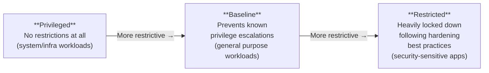
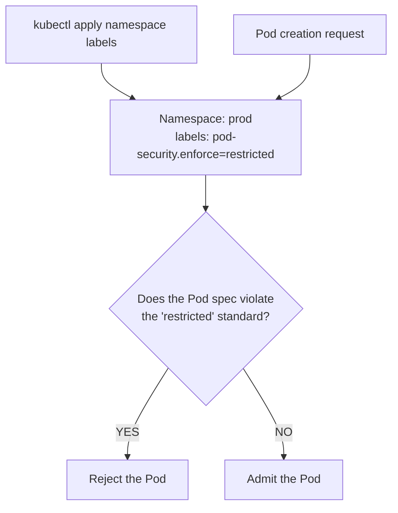

---
tags:
  - kubernetes
  - kubernetes/security
topic: Security
---

# Pod Security Standards

## Overview

**Pod Security Standards** (PSS) define three levels of security policies that cover the spectrum from permissive to heavily restricted. They are the official replacement for PodSecurityPolicy (PSP), which was deprecated in Kubernetes 1.21 and removed in 1.25.



## What Each Level Allows and Restricts

### Privileged

No restrictions at all. This level is intended for system-level workloads (CNI plugins, storage drivers, logging agents) that require elevated host access.

### Baseline

Prevents known privilege escalation vectors while remaining practical for most workloads.

### Restricted

Follows current Pod hardening best practices. Requires non-root execution, drops capabilities, and enforces seccomp profiles.

### Comparison Table

| Control | Privileged | Baseline | Restricted |
|---|---|---|---|
| **HostProcess** (Windows) | Allowed | Not allowed | Not allowed |
| **Host namespaces** (hostPID, hostIPC, hostNetwork) | Allowed | Not allowed | Not allowed |
| **Privileged containers** | Allowed | Not allowed | Not allowed |
| **Capabilities** | Anything | Drop ALL except a defined list (NET_BIND_SERVICE, etc.) | Drop ALL; may only add NET_BIND_SERVICE |
| **HostPath volumes** | Allowed | Not allowed | Not allowed |
| **Host ports** | Allowed | Not allowed | Not allowed |
| **AppArmor** | Anything | No override of default profile | RuntimeDefault or Localhost |
| **SELinux** | Anything | Cannot set type to anything custom (MCS labels OK) | Cannot set custom type |
| **`/proc` mount type** | Anything | Default | Default |
| **Seccomp profile** | Anything | Anything (no requirement) | Must be RuntimeDefault or Localhost |
| **Sysctls** | Anything | Only safe sysctls allowed | Only safe sysctls allowed |
| **Volume types** | Anything | All except hostPath | Only: configMap, csi, downwardAPI, emptyDir, ephemeral, persistentVolumeClaim, projected, secret |
| **Privilege escalation** | Allowed | Allowed | `allowPrivilegeEscalation: false` required |
| **Running as root** | Allowed | Allowed | Must run as non-root (`runAsNonRoot: true`) |
| **Root group (GID 0)** | Allowed | Allowed | Not allowed |

## Pod Security Admission (PSA)

**Pod Security Admission** is the built-in admission controller that enforces Pod Security Standards. It is enabled by default starting in Kubernetes 1.25 (beta since 1.23). No webhook or third-party tool is needed.

PSA operates at the **namespace level** -- you apply labels to a namespace to declare which security level and enforcement mode to use.



### Enforcement Modes

PSA supports three modes that can be applied independently. You can (and should) combine them.

| Mode | Behavior | Use case |
|---|---|---|
| **enforce** | Pods that violate the policy are **rejected**. They will not be created. | Production namespaces where you want hard enforcement. |
| **audit** | Violations are recorded in the **API server audit log** but the Pod is allowed. | Track violations without breaking existing workloads. |
| **warn** | Violations trigger a **warning** visible to the user (e.g., in `kubectl` output) but the Pod is allowed. | Alert developers during deployment without blocking them. |

A common rollout strategy: start with `warn` and `audit` at the Restricted level to find violations, then switch to `enforce` once workloads are compliant.

### Applying PSA to Namespaces via Labels

The labels follow the format:

```
pod-security.kubernetes.io/<MODE>: <LEVEL>
pod-security.kubernetes.io/<MODE>-version: <VERSION>
```

The version pins the policy to a specific Kubernetes release, so cluster upgrades don't silently tighten enforcement. Use `latest` to always apply the current version's definitions.

```yaml
apiVersion: v1
kind: Namespace
metadata:
  name: prod
  labels:
    pod-security.kubernetes.io/enforce: restricted
    pod-security.kubernetes.io/enforce-version: v1.28
    pod-security.kubernetes.io/audit: restricted
    pod-security.kubernetes.io/audit-version: v1.28
    pod-security.kubernetes.io/warn: restricted
    pod-security.kubernetes.io/warn-version: v1.28
```

```bash
# Apply labels to an existing namespace
kubectl label namespace prod \
  pod-security.kubernetes.io/enforce=restricted \
  pod-security.kubernetes.io/enforce-version=v1.28 \
  pod-security.kubernetes.io/audit=restricted \
  pod-security.kubernetes.io/warn=restricted
```

### Common Configuration Patterns

**Development namespace** -- Baseline enforcement with Restricted warnings:

```yaml
apiVersion: v1
kind: Namespace
metadata:
  name: dev
  labels:
    pod-security.kubernetes.io/enforce: baseline
    pod-security.kubernetes.io/warn: restricted
    pod-security.kubernetes.io/audit: restricted
```

**Production namespace** -- Full Restricted enforcement:

```yaml
apiVersion: v1
kind: Namespace
metadata:
  name: prod
  labels:
    pod-security.kubernetes.io/enforce: restricted
    pod-security.kubernetes.io/enforce-version: v1.28
    pod-security.kubernetes.io/audit: restricted
    pod-security.kubernetes.io/warn: restricted
```

**System namespace** -- Privileged (for kube-system and infrastructure):

```yaml
apiVersion: v1
kind: Namespace
metadata:
  name: kube-system
  labels:
    pod-security.kubernetes.io/enforce: privileged
```

### What Happens When a Pod Violates the Policy

```bash
# Attempting to create a privileged Pod in a restricted namespace
$ kubectl run test --image=nginx --namespace=prod \
    --overrides='{"spec":{"containers":[{"name":"test","image":"nginx",
    "securityContext":{"privileged":true}}]}}'

Error from server (Forbidden): pods "test" is forbidden:
  violates PodSecurity "restricted:v1.28":
  privileged (container "test" must not set securityContext.privileged=true),
  allowPrivilegeEscalation != false (container "test" must set
  securityContext.allowPrivilegeEscalation=false),
  unrestricted capabilities (container "test" must set
  securityContext.capabilities.drop=["ALL"]),
  runAsNonRoot != true (pod or container "test" must set
  securityContext.runAsNonRoot=true),
  seccompProfile (pod or container "test" must set
  securityContext.seccompProfile.type to "RuntimeDefault" or "Localhost")
```

The error message tells you exactly which fields need to change.

## Migration from PodSecurityPolicy

PodSecurityPolicy (PSP) was deprecated in Kubernetes 1.21 and **removed in Kubernetes 1.25**. If you are running 1.25 or later, PSPs no longer exist.

### Migration Steps

1. **Audit existing PSPs** -- Identify what your PSPs allow and map them to PSS levels (Privileged, Baseline, or Restricted).
2. **Enable PSA in dry-run mode** -- Apply `audit` and `warn` labels to namespaces to see which Pods would violate the new standards without blocking anything.
3. **Fix workloads** -- Update Pod specs to comply with the target PSS level (add security contexts, drop capabilities, etc.).
4. **Switch to enforce** -- Once all Pods in a namespace are compliant, apply the `enforce` label.
5. **Remove PSPs** -- After all namespaces are covered by PSA, delete the PodSecurityPolicy objects and their bindings.

```bash
# Step 1: Check which Pods would violate Restricted in a namespace
kubectl label namespace dev \
  pod-security.kubernetes.io/warn=restricted \
  pod-security.kubernetes.io/audit=restricted --dry-run=server

# Step 2: Inspect violations in audit logs or kubectl warnings
kubectl get pods -n dev    # warnings appear in the output
```

### PSP to PSS Mapping

| PSP Field | PSS Equivalent |
|---|---|
| `privileged: false` | Baseline or Restricted |
| `hostNetwork/hostPID/hostIPC: false` | Baseline or Restricted |
| `runAsUser: MustRunAsNonRoot` | Restricted |
| `allowPrivilegeEscalation: false` | Restricted |
| `requiredDropCapabilities: [ALL]` | Restricted |
| `volumes: [configMap, emptyDir, secret, ...]` | Restricted |
| `readOnlyRootFilesystem: true` | Not enforced by PSS (use security contexts directly) |

## Third-Party Alternatives

PSA is simple and built-in, but it has limitations -- it's namespace-scoped (no per-workload exceptions), it can only allow or deny (no mutation), and it only covers Pod security fields. For more granular control, consider policy engines.

### OPA Gatekeeper

[Open Policy Agent Gatekeeper](https://open-policy-agent.github.io/gatekeeper/) runs as an admission webhook and evaluates Pods against policies written in **Rego** (OPA's policy language).

| Aspect | Detail |
|---|---|
| **Policy language** | Rego |
| **Mutation support** | Yes (via assign/modify resources) |
| **Audit mode** | Yes (reports violations without blocking) |
| **Scope** | Any Kubernetes resource, not just Pods |
| **Exemptions** | Per-namespace, per-resource, per-process |
| **Community** | CNCF graduated project, widely adopted |

```yaml
# Example: ConstraintTemplate requiring non-root containers
apiVersion: templates.gatekeeper.sh/v1
kind: ConstraintTemplate
metadata:
  name: k8srequirenonroot
spec:
  crd:
    spec:
      names:
        kind: K8sRequireNonRoot
  targets:
    - target: admission.k8s.gatekeeper.sh
      rego: |
        package k8srequirenonroot
        violation[{"msg": msg}] {
          container := input.review.object.spec.containers[_]
          not container.securityContext.runAsNonRoot
          msg := sprintf("Container %v must set runAsNonRoot=true", [container.name])
        }
```

### Kyverno

[Kyverno](https://kyverno.io/) is a Kubernetes-native policy engine that uses YAML for policies -- no new language to learn.

| Aspect | Detail |
|---|---|
| **Policy language** | YAML (Kubernetes-native) |
| **Mutation support** | Yes (can inject sidecar containers, add labels, set defaults) |
| **Audit mode** | Yes |
| **Scope** | Any Kubernetes resource |
| **Exemptions** | Per-namespace, per-resource, per-user |
| **Community** | CNCF incubating project |

```yaml
# Example: Require non-root containers
apiVersion: kyverno.io/v1
kind: ClusterPolicy
metadata:
  name: require-non-root
spec:
  validationFailureAction: Enforce
  rules:
    - name: check-non-root
      match:
        any:
          - resources:
              kinds:
                - Pod
      validate:
        message: "Containers must run as non-root"
        pattern:
          spec:
            containers:
              - securityContext:
                  runAsNonRoot: true
```

### Choosing Between PSA, Gatekeeper, and Kyverno

| Feature | PSA | Gatekeeper | Kyverno |
|---|---|---|---|
| **Built-in** | Yes | No (webhook) | No (webhook) |
| **Policy language** | Labels only | Rego | YAML |
| **Mutation** | No | Yes | Yes |
| **Granularity** | Namespace-level only | Any resource, any field | Any resource, any field |
| **Exemptions** | None (whole namespace) | Per-resource | Per-resource |
| **Learning curve** | Minimal | Moderate (Rego) | Low (YAML) |
| **Resource overhead** | None | Webhook pods + audit | Webhook pods + audit |
| **Recommendation** | Good default baseline | Complex enterprise environments | Teams that prefer YAML-native tooling |

You can combine PSA with a policy engine: use PSA labels as a baseline and layer Gatekeeper or Kyverno on top for fine-grained policies and mutation.
