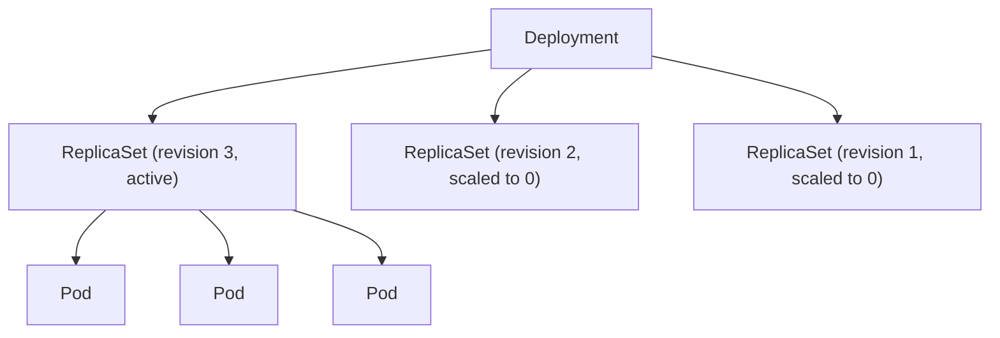

---
tags:
  - kubernetes
  - kubernetes/workloads
topic: Workloads
---

# Deployments

## What Deployments Manage

A Deployment is the standard way to run stateless applications in Kubernetes. It manages a hierarchy:



The Deployment controller creates and manages **ReplicaSets**, which in turn manage **Pods**. When you update a Deployment (e.g., change the container image), the Deployment creates a new ReplicaSet and gradually scales it up while scaling the old one down.

## Complete YAML Manifest

```yaml
apiVersion: apps/v1
kind: Deployment
metadata:
  name: web-app
  namespace: default
  labels:
    app: web-app
  annotations:
    kubernetes.io/change-cause: "Update to v1.1.0"   # recorded in rollout history
spec:
  replicas: 3
  revisionHistoryLimit: 10             # number of old ReplicaSets to keep (default: 10)
  progressDeadlineSeconds: 600         # seconds before a rollout is marked as failed
  minReadySeconds: 5                   # wait time after a pod is ready before considering it available
  selector:
    matchLabels:
      app: web-app
  strategy:
    type: RollingUpdate                # RollingUpdate | Recreate
    rollingUpdate:
      maxSurge: 1                      # max pods above desired count during update
      maxUnavailable: 0                # max pods that can be unavailable during update
  template:
    metadata:
      labels:
        app: web-app
        version: v1.1.0
    spec:
      containers:
        - name: web
          image: my-app:1.1.0
          ports:
            - containerPort: 8080
          env:
            - name: APP_ENV
              value: "production"
          resources:
            requests:
              cpu: "250m"
              memory: "128Mi"
            limits:
              cpu: "500m"
              memory: "256Mi"
          readinessProbe:
            httpGet:
              path: /ready
              port: 8080
            initialDelaySeconds: 5
            periodSeconds: 5
          livenessProbe:
            httpGet:
              path: /healthz
              port: 8080
            initialDelaySeconds: 15
            periodSeconds: 10
      terminationGracePeriodSeconds: 30
```

## Rolling Update Strategy

The default strategy. New Pods are gradually created while old Pods are gradually terminated:

```
Time ──►

ReplicaSet v1:  ███ ███ ███             (3 pods)
                                         maxSurge=1, maxUnavailable=0
ReplicaSet v1:  ███ ███ ███             (still 3 — no unavailable allowed)
ReplicaSet v2:  ░░░                     (1 new pod starting)

ReplicaSet v1:  ███ ███                 (v2 pod ready, scale down v1)
ReplicaSet v2:  ███ ░░░                 (1 ready, 1 starting)

ReplicaSet v1:  ███                     (continue scaling down)
ReplicaSet v2:  ███ ███ ░░░            (2 ready, 1 starting)

ReplicaSet v1:                          (fully scaled down)
ReplicaSet v2:  ███ ███ ███            (3 pods, rollout complete)
```

### maxSurge and maxUnavailable

| Parameter | Accepts | Default | Effect |
|---|---|---|---|
| `maxSurge` | Integer or percentage | 25% | Maximum number of Pods **above** `replicas` during an update. Higher = faster rollout but more resource usage. |
| `maxUnavailable` | Integer or percentage | 25% | Maximum number of Pods **below** `replicas` during an update. Higher = faster rollout but reduced capacity. |

Common configurations:

| Scenario | maxSurge | maxUnavailable | Behavior |
|---|---|---|---|
| Zero downtime | 1 | 0 | Never fewer than desired; slower rollout |
| Fast rollout | 50% | 50% | Half old, half new simultaneously |
| Resource-constrained | 0 | 1 | No extra pods; one at a time swap |

## Recreate Strategy

Terminates **all existing Pods** before creating new ones. Results in downtime but guarantees no two versions run simultaneously:

```yaml
spec:
  strategy:
    type: Recreate
```

Use Recreate when your application cannot tolerate running two versions at the same time (e.g., a database migration that changes the schema).

## Rollout Commands

```bash
# Check the status of a rollout
kubectl rollout status deployment/web-app

# View rollout history
kubectl rollout history deployment/web-app
# REVISION  CHANGE-CAUSE
# 1         Initial deployment
# 2         Update to v1.1.0

# View details of a specific revision
kubectl rollout history deployment/web-app --revision=2

# Undo to the previous revision
kubectl rollout undo deployment/web-app

# Undo to a specific revision
kubectl rollout undo deployment/web-app --to-revision=1

# Pause a rollout (useful for canary testing)
kubectl rollout pause deployment/web-app

# Resume a paused rollout
kubectl rollout resume deployment/web-app

# Restart all pods (triggers a new rollout with the same spec)
kubectl rollout restart deployment/web-app
```

## Revision History and Rollback

Every time you update the Pod template (`spec.template`), the Deployment creates a new ReplicaSet and increments the revision number. Old ReplicaSets are kept (scaled to 0) based on `spec.revisionHistoryLimit` (default: 10).

**What triggers a new revision:**

- Changing the container image
- Changing environment variables
- Changing resource limits
- Any change to `spec.template`

**What does NOT trigger a new revision:**

- Changing `spec.replicas` (scaling)
- Changing `spec.strategy`
- Changing labels or annotations on the Deployment itself

To record the reason for a rollout, annotate the Deployment:

```bash
kubectl annotate deployment/web-app kubernetes.io/change-cause="Update image to v1.2.0"
```

Or set the annotation in the manifest's `metadata.annotations`.

## Deployment Conditions

Kubernetes tracks the state of a Deployment through conditions in `status.conditions`:

| Condition | Status | Meaning |
|---|---|---|
| **Available** | True | Minimum required Pods are available |
| **Progressing** | True | Rollout is in progress or recently completed |
| **Progressing** | False | Rollout stalled (e.g., stuck pulling image, failing readiness) |
| **ReplicaFailure** | True | Could not create Pods (quota exceeded, image pull error, etc.) |

If a rollout does not complete within `progressDeadlineSeconds` (default 600s), the Progressing condition is set to `False`. The Deployment does **not** automatically roll back; you must intervene.

```bash
# Check conditions
kubectl describe deployment web-app
kubectl get deployment web-app -o jsonpath='{.status.conditions}'
```

## Scaling Deployments

```bash
# Scale imperatively
kubectl scale deployment web-app --replicas=5

# Enable Horizontal Pod Autoscaler
kubectl autoscale deployment web-app --min=3 --max=10 --cpu-percent=70
```

The HPA adjusts `spec.replicas` automatically based on observed CPU utilization (or custom metrics).

## Canary Deployments Pattern

Canary deployments route a small percentage of traffic to a new version to test it before rolling out fully. Kubernetes does not have native canary support, but you can implement it using multiple Deployments and a shared Service:

```yaml
# Service selects all pods with app=web (both versions)
apiVersion: v1
kind: Service
metadata:
  name: web-service
spec:
  selector:
    app: web                  # matches both canary and stable
  ports:
    - port: 80
      targetPort: 8080
---
# Stable deployment (90% of pods)
apiVersion: apps/v1
kind: Deployment
metadata:
  name: web-stable
spec:
  replicas: 9
  selector:
    matchLabels:
      app: web
      track: stable
  template:
    metadata:
      labels:
        app: web
        track: stable
    spec:
      containers:
        - name: web
          image: my-app:1.0.0
---
# Canary deployment (10% of pods)
apiVersion: apps/v1
kind: Deployment
metadata:
  name: web-canary
spec:
  replicas: 1
  selector:
    matchLabels:
      app: web
      track: canary
  template:
    metadata:
      labels:
        app: web
        track: canary
    spec:
      containers:
        - name: web
          image: my-app:1.1.0
```

Traffic distribution is approximate (based on replica ratio). For precise traffic splitting, use a service mesh (Istio, Linkerd) or an ingress controller with weighted routing.

## Blue-Green Deployments Pattern

Blue-green maintains two identical environments. Only one receives live traffic at a time. Switch traffic by updating the Service selector:

```yaml
# Service points to the "blue" version
apiVersion: v1
kind: Service
metadata:
  name: web-service
spec:
  selector:
    app: web
    version: blue              # <-- change to "green" to switch
  ports:
    - port: 80
      targetPort: 8080
---
# Blue deployment (currently live)
apiVersion: apps/v1
kind: Deployment
metadata:
  name: web-blue
spec:
  replicas: 3
  selector:
    matchLabels:
      app: web
      version: blue
  template:
    metadata:
      labels:
        app: web
        version: blue
    spec:
      containers:
        - name: web
          image: my-app:1.0.0
---
# Green deployment (new version, being tested)
apiVersion: apps/v1
kind: Deployment
metadata:
  name: web-green
spec:
  replicas: 3
  selector:
    matchLabels:
      app: web
      version: green
  template:
    metadata:
      labels:
        app: web
        version: green
    spec:
      containers:
        - name: web
          image: my-app:1.1.0
```

Switch traffic instantly:

```bash
kubectl patch service web-service -p '{"spec": {"selector": {"version": "green"}}}'
```

Rollback is just as fast — patch the selector back to `blue`. After verifying the green deployment, scale down or delete the blue one.

## Common Deployment Scenarios

### Update a container image

```bash
kubectl set image deployment/web-app web=my-app:1.2.0
```

### Scale up before a traffic spike

```bash
kubectl scale deployment/web-app --replicas=10
```

### Roll back a bad deploy

```bash
kubectl rollout undo deployment/web-app
```

### Pause rollout to inspect the canary pod

```bash
kubectl set image deployment/web-app web=my-app:2.0.0
kubectl rollout pause deployment/web-app
# Inspect the new pod, check logs, run tests
kubectl rollout resume deployment/web-app
```

### Force a restart without changing the spec

```bash
kubectl rollout restart deployment/web-app
```
